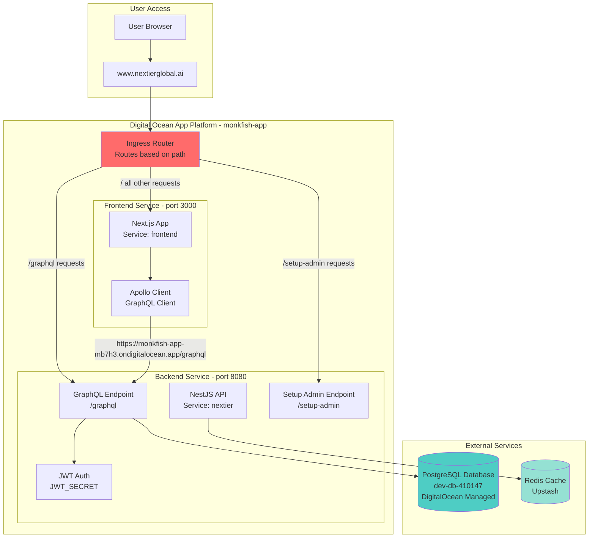
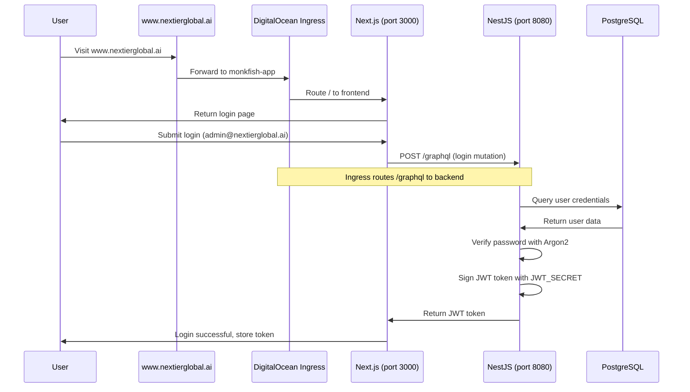
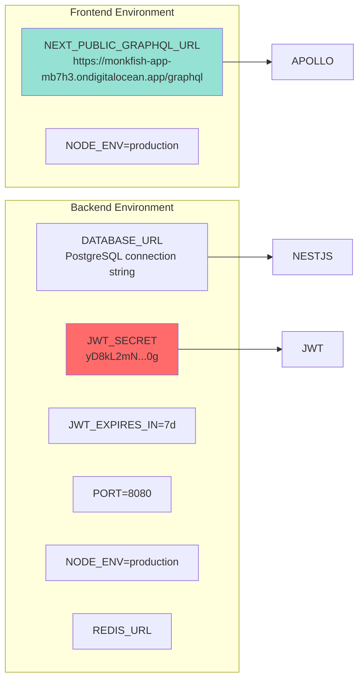
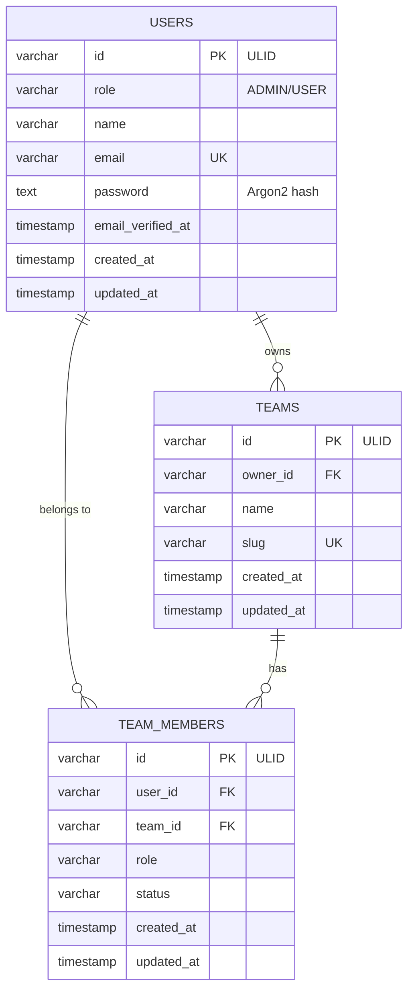
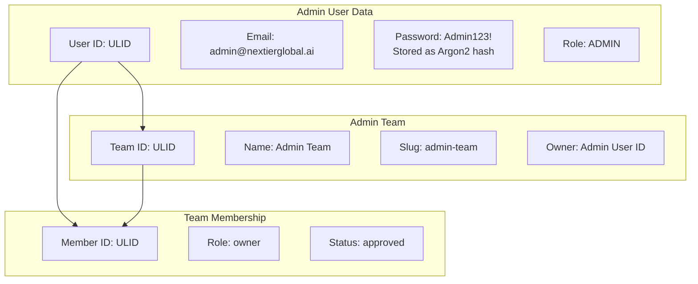
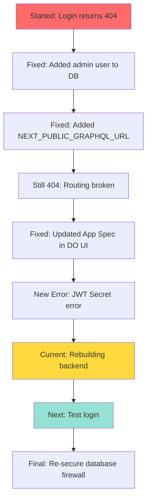

# System Architecture Overview

## Current Architecture Diagram

## Routing Flow

## Environment Variables Flow

## Database Schema

## Current Admin User

## Current Issue Timeline

## What Each Component Does

### **Frontend (Next.js)**
- Serves the website at www.nextierglobal.ai
- Runs on port 3000
- Uses Apollo Client to call GraphQL API
- Stores JWT token in localStorage after login
- Environment variable: `NEXT_PUBLIC_GRAPHQL_URL` tells it where to find the backend

### **Backend (NestJS)**
- Provides GraphQL API at /graphql endpoint
- Runs on port 8080
- Handles authentication using JWT tokens
- Connects to PostgreSQL database for user data
- Uses Argon2 to verify password hashes
- Environment variable: `JWT_SECRET` used to sign/verify tokens

### **Ingress Router (DigitalOcean)**
- Receives all requests to monkfish-app-mb7h3.ondigitalocean.app
- Routes /graphql → Backend
- Routes /setup-admin → Backend
- Routes everything else → Frontend
- **This was broken and just got fixed by updating App Spec**

### **PostgreSQL Database**
- Stores users, teams, and team_members tables
- Managed by DigitalOcean
- Contains the admin user we just created
- Firewall currently wide open (needs to be secured after login works)

### **Current State**
1. ✅ Database has admin user
2. ✅ Frontend has correct GraphQL URL variable
3. ✅ App Spec routing is fixed
4. ⏳ Backend is rebuilding to pick up changes
5. ❌ Login not yet tested with new configuration

### **Why the Rebuild?**
When we updated the App Spec, only the frontend redeployed. The backend service didn't restart, so it wasn't using the new routing properly and the JWT_SECRET wasn't being read correctly. The "Force rebuild and deploy" with "Clear build cache" will rebuild BOTH services from scratch, ensuring:
- Backend picks up the App Spec routing changes
- Backend loads all environment variables fresh (including JWT_SECRET)
- Frontend is rebuilt with correct environment variables
