# The Blue Collar Terminal

## Deal Sourcing Intelligence for the $10 Trillion Wealth Transfer

> *"While Wall Street chases tech unicorns, the real money is being made buying HVAC companies from 67-year-old owners who just want to go fishing."*

---

# The Opportunity Nobody's Talking About

```
┌────────────────────────────────────────────────────────────────────┐
│                                                                    │
│   10,000 BABY BOOMERS TURN 65 EVERY SINGLE DAY                    │
│                                                                    │
│   70% of small businesses have NO succession plan                  │
│                                                                    │
│   $1-50M revenue blue collar = HIGHEST multiple compression       │
│                                                                    │
│   Average owner age in trades: 58 years old                       │
│                                                                    │
│   85% will "sell" by closing the doors (value destruction)        │
│                                                                    │
└────────────────────────────────────────────────────────────────────┘

              YOUR ARBITRAGE: FIND THEM FIRST.
```

---

# Table of Contents

1. [The Blue Collar Thesis](#the-blue-collar-thesis)
2. [Target Industries](#target-industries)
3. [The Age + Demographics Play](#the-age--demographics-play)
4. [Cross-Enrichment Engine](#cross-enrichment-engine)
5. [Deal Sourcing Workflows](#deal-sourcing-workflows)
6. [Persona Playbooks](#persona-playbooks)
7. [Outreach Sequences](#outreach-sequences)
8. [The Terminal Dashboard](#the-terminal-dashboard)

---

# The Blue Collar Thesis

## Why Blue Collar? Why Now?

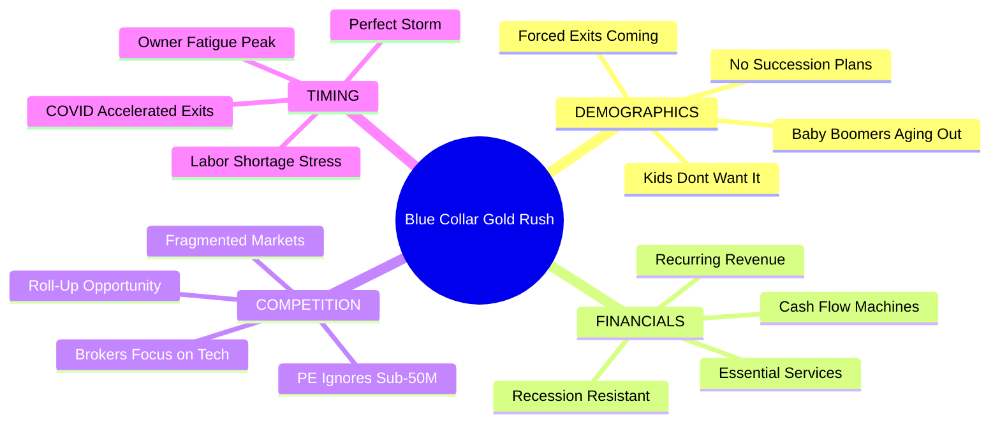

## The Math That Makes Millionaires

| Metric | Tech Startup | Blue Collar Trade Business |
|--------|-------------|---------------------------|
| Revenue | $5M ARR | $5M Revenue |
| EBITDA Margin | -20% (burning cash) | 15-25% (printing cash) |
| Valuation Multiple | 10-20x Revenue | 3-5x EBITDA |
| Acquisition Cost | $50M-100M | $2M-6M |
| Competition for Deal | 50+ buyers | 2-3 buyers |
| Owner Sophistication | Harvard MBA | High school + hustle |
| Due Diligence | 6 months | 6 weeks |
| Deal Certainty | 20% close rate | 70% close rate |

> *"A plumbing company doing $800K EBITDA trades for $2.4M. A SaaS company doing $800K ARR trades for $8M+ and loses money. One prints cash. One burns it. Choose wisely."*

---

# Target Industries

## The Blue Collar Big 20

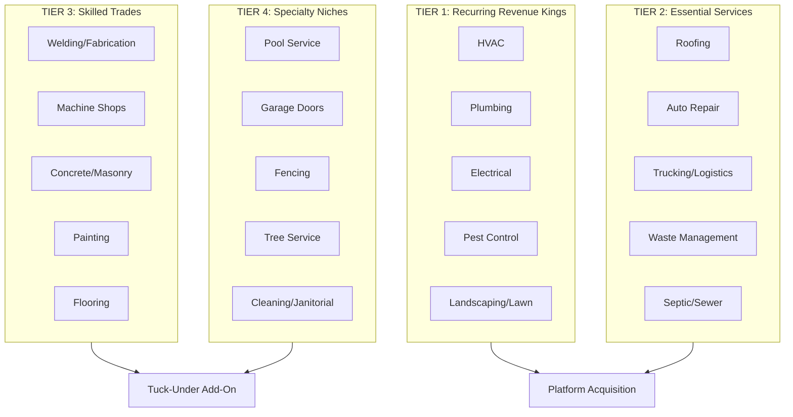

## Industry Scoring Matrix

| Industry | Recurring % | Margin | Fragmentation | Owner Age Avg | Deal Score |
|----------|-------------|--------|---------------|---------------|------------|
| HVAC | 40-60% | 18-25% | Very High | 59 | **95/100** |
| Plumbing | 30-50% | 15-22% | Very High | 61 | **92/100** |
| Pest Control | 70-85% | 20-30% | High | 57 | **94/100** |
| Electrical | 20-40% | 15-20% | Very High | 58 | **88/100** |
| Landscaping | 60-80% | 12-18% | Extreme | 54 | **85/100** |
| Roofing | 5-15% | 18-28% | Very High | 56 | **80/100** |
| Auto Repair | 40-60% | 15-22% | Extreme | 62 | **87/100** |
| Trucking | 50-70% | 8-15% | High | 58 | **75/100** |
| Waste Mgmt | 80-95% | 20-35% | Medium | 55 | **90/100** |

---

# The Age + Demographics Play

## The Silver Tsunami Opportunity

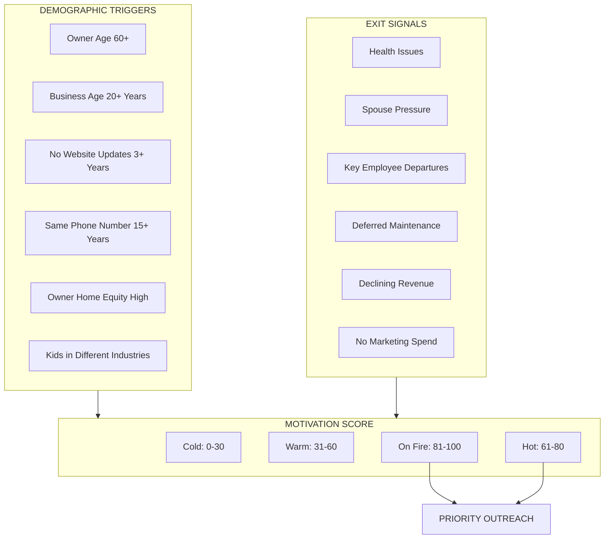

## Age-Based Targeting Logic

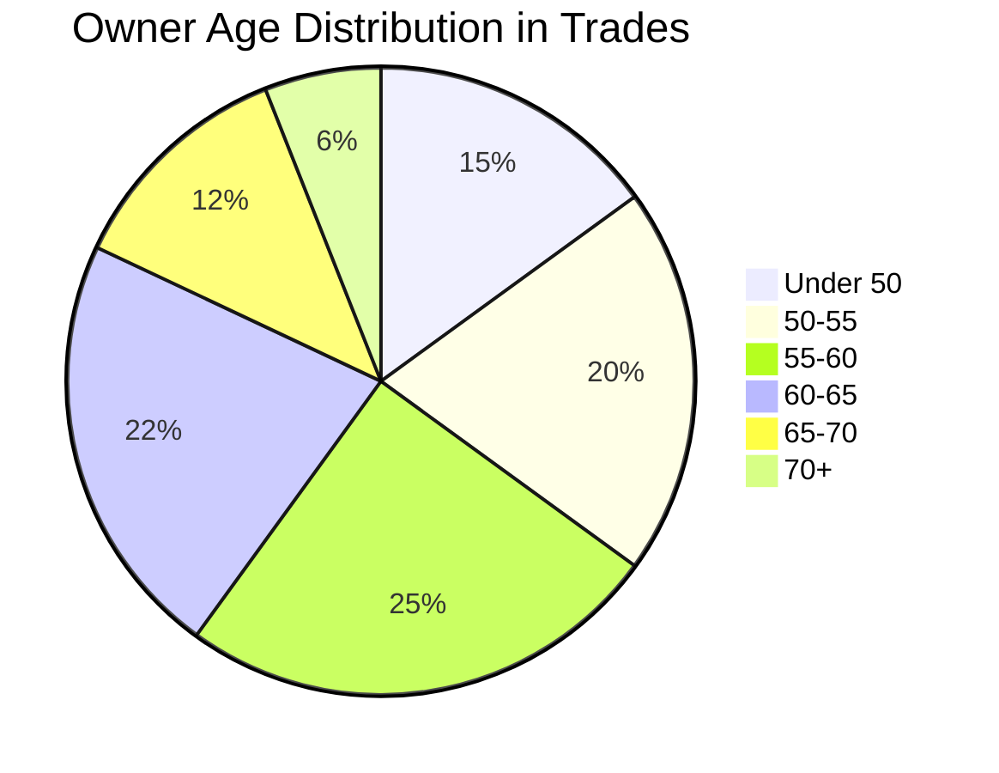

### The Sweet Spot: 58-67 Years Old

| Age Bracket | Mindset | Outreach Angle | Urgency |
|-------------|---------|----------------|---------|
| **50-55** | "I've got time" | Plant seeds, build relationship | Low |
| **55-60** | "Starting to think about it" | Education on options | Medium |
| **58-63** | "Ready to explore" | Active deal discussion | **HIGH** |
| **63-67** | "Need to do something" | Urgency + solution | **VERY HIGH** |
| **67-72** | "Should've done this years ago" | Rescue narrative | Critical |
| **72+** | "Just want out" | Speed + simplicity | Emergency |

---

# USBizData Data Lake Architecture

## The Foundation: 75+ Specialty Databases

> *"Own the data, control the costs. Enrich on demand, not in bulk."*

### Data Lake Strategy

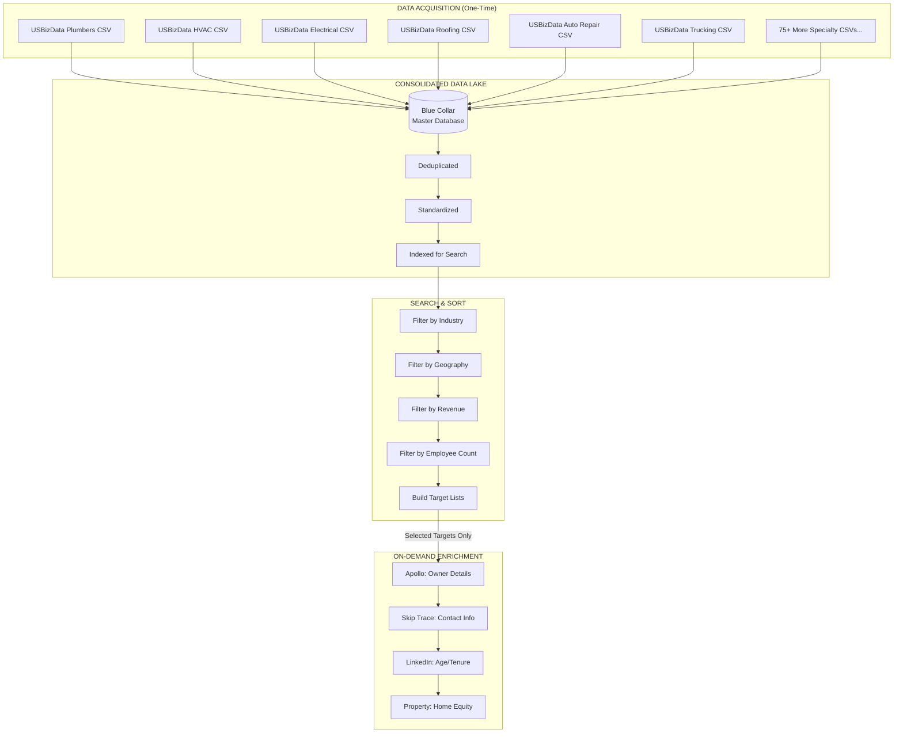

### USBizData Industry Categories

| Category | Databases Available | Blue Collar Score |
|----------|--------------------|--------------------|
| **Home Services** | Plumbers, HVAC, Electrical, Roofing, Landscaping, Carpet Cleaners | **TIER 1** |
| **Automotive** | Auto Repair, Auto Dealers, Motorcycle, RV Dealers | **TIER 1** |
| **Transportation** | Trucking Companies, Aircraft Services | **TIER 2** |
| **Construction** | General Contractors, Specialty Trades | **TIER 1** |
| **Property Services** | Self-Storage, Apartment Buildings | **TIER 2** |
| **Food & Hospitality** | Restaurants, Pizza, Hotels/Motels, Bars | **TIER 2** |
| **Healthcare Services** | Home Health Care, Medical Equipment | **TIER 3** |
| **Professional** | Accountants, Attorneys, Engineers | Reference Only |

### Cost Control: Enrich on Demand

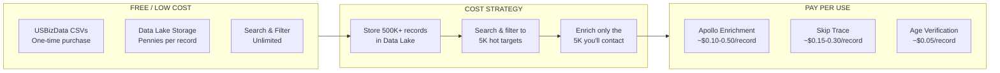

### The Math: Why This Architecture Wins

```
TRADITIONAL APPROACH (Expensive):
├── Buy 100K enriched records upfront
├── Cost: $0.50/record x 100K = $50,000
├── Waste: 80% never contacted
└── Effective cost per contact: $2.50

DATA LAKE APPROACH (Smart):
├── Buy 100K USBizData records: $2,000
├── Store in Data Lake: ~$10/month
├── Filter to 10K targets: FREE
├── Enrich 10K on-demand: $3,000
├── Total: $5,010
└── Effective cost per contact: $0.50

SAVINGS: 80% cost reduction
```

### Data Lake Schema

```
┌─────────────────────────────────────────────────────────────────────┐
│  BLUE COLLAR DATA LAKE - MASTER SCHEMA                             │
├─────────────────────────────────────────────────────────────────────┤
│                                                                     │
│  CORE FIELDS (from USBizData CSVs):                                │
│  ─────────────────────────────────                                  │
│  • company_name          VARCHAR                                   │
│  • dba_name              VARCHAR                                   │
│  • address               VARCHAR                                   │
│  • city                  VARCHAR                                   │
│  • state                 VARCHAR(2)                                │
│  • zip                   VARCHAR(10)                               │
│  • phone                 VARCHAR                                   │
│  • industry_code         VARCHAR (NAICS/SIC)                       │
│  • industry_category     VARCHAR (our classification)              │
│  • employee_count        INTEGER                                   │
│  • revenue_estimate      DECIMAL                                   │
│  • year_established      INTEGER                                   │
│  • source_file           VARCHAR (which CSV)                       │
│  • imported_at           TIMESTAMP                                 │
│                                                                     │
│  ENRICHMENT FIELDS (populated on-demand):                          │
│  ────────────────────────────────────────                          │
│  • owner_name            VARCHAR (from Apollo)                     │
│  • owner_title           VARCHAR                                   │
│  • owner_email           VARCHAR                                   │
│  • owner_cell            VARCHAR (from Skip Trace)                 │
│  • owner_linkedin        VARCHAR                                   │
│  • owner_age_estimate    INTEGER (from LinkedIn)                   │
│  • owner_tenure_years    INTEGER                                   │
│  • home_address          VARCHAR (from Skip Trace)                 │
│  • home_equity_estimate  DECIMAL (from RealEstateAPI)              │
│  • enriched_at           TIMESTAMP                                 │
│  • enrichment_source     VARCHAR                                   │
│                                                                     │
│  SCORING FIELDS (calculated):                                       │
│  ───────────────────────────                                        │
│  • motivation_score      INTEGER (0-100)                           │
│  • valuation_estimate    DECIMAL                                   │
│  • priority_tier         VARCHAR (HOT/WARM/COLD)                   │
│  • last_scored_at        TIMESTAMP                                 │
│                                                                     │
│  CAMPAIGN FIELDS (tracking):                                        │
│  ────────────────────────                                           │
│  • outreach_status       VARCHAR                                   │
│  • last_contacted        TIMESTAMP                                 │
│  • response_received     BOOLEAN                                   │
│  • deal_stage            VARCHAR                                   │
│                                                                     │
└─────────────────────────────────────────────────────────────────────┘
```

### CSV Import Workflow

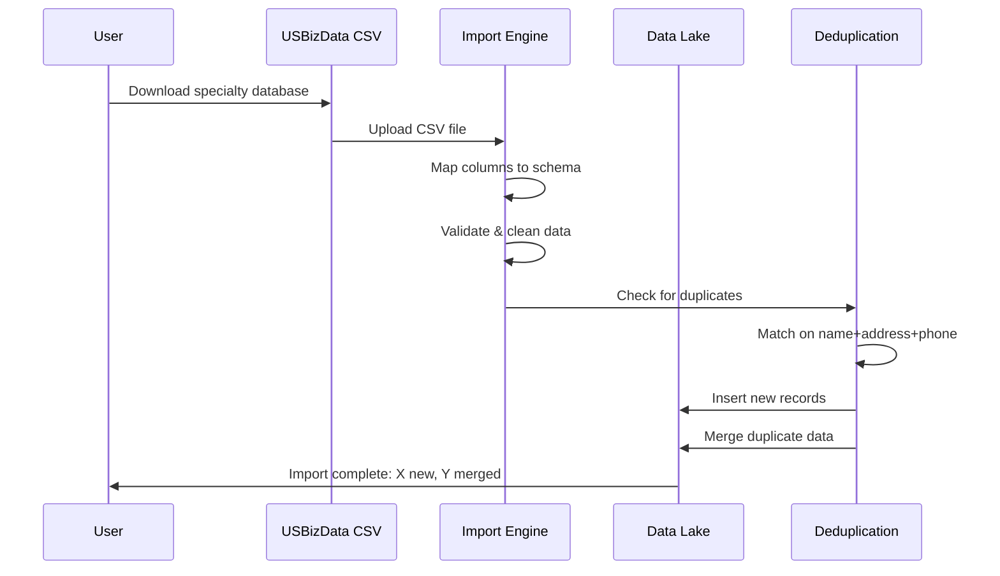

---

# Cross-Enrichment Engine

## The Data Stack That Wins Deals

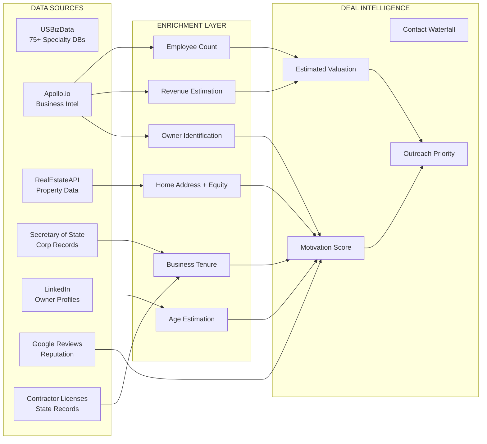

## Cross-Enrichment Query Flow

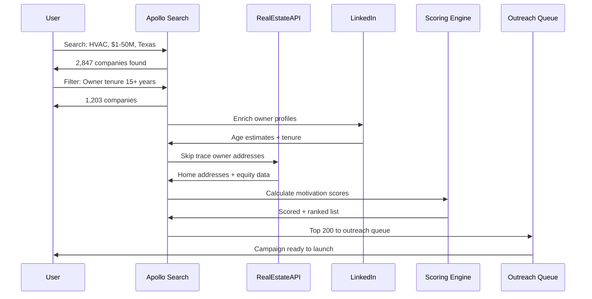

## The Enrichment Waterfall

| Data Point | Source 1 | Source 2 | Source 3 | Confidence |
|------------|----------|----------|----------|------------|
| Owner Name | Apollo | Secretary of State | LinkedIn | 98% |
| Owner Age | LinkedIn (graduation year) | Voter Records | Estimated from tenure | 85% |
| Business Phone | Apollo | Google Business | Website | 95% |
| Owner Cell | Skip Trace | Apollo Mobile | LinkedIn | 75% |
| Owner Email | Apollo | Website Scrape | Pattern Match | 80% |
| Home Address | Skip Trace | Property Records | Voter Records | 90% |
| Home Equity | RealEstateAPI | Zillow Estimate | Tax Records | 85% |
| Revenue | Apollo | D&B | Employee-based estimate | 70% |
| Employee Count | Apollo | LinkedIn | Google Reviews volume | 80% |

---

# Deal Sourcing Workflows

## The Complete Pipeline

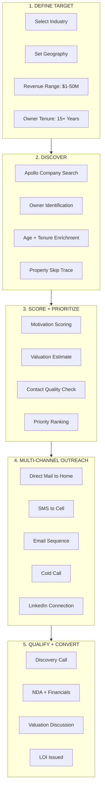

## Weekly Deal Sourcing Cadence

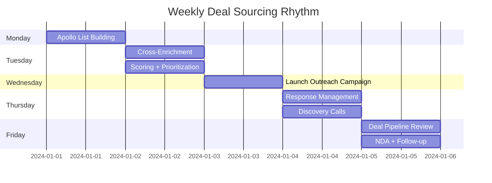

---

# Persona Playbooks

---

## For Business Advisors & M&A Intermediaries

> *"The best deals never hit the market. They're found in the garages and warehouses of 62-year-old owners who don't know their business is worth 4x EBITDA."*

### Your Edge with Blue Collar Terminal


### Advisor Success Metrics

| Before Blue Collar Terminal | After Blue Collar Terminal |
|-----------------------------|----------------------------|
| 5 deals/year from referrals | 20+ deals/year from outreach |
| Competing with 10 brokers | First-mover advantage |
| Reactive deal flow | Proactive deal sourcing |
| Random industry exposure | Thesis-driven targeting |
| Owner finds you | You find the owner |

### The Advisor Outreach Stack

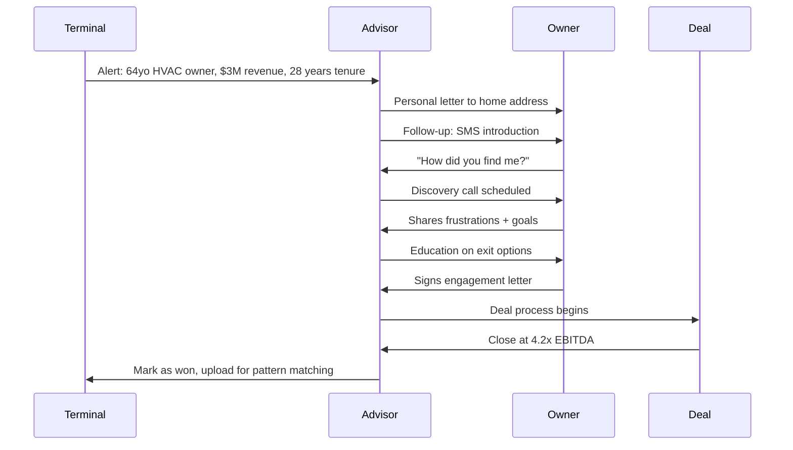

---

## For Family Offices

> *"The Rockefellers didn't build generational wealth chasing unicorns. They bought boring, essential businesses that printed cash through every economic cycle."*

### Family Office Investment Thesis

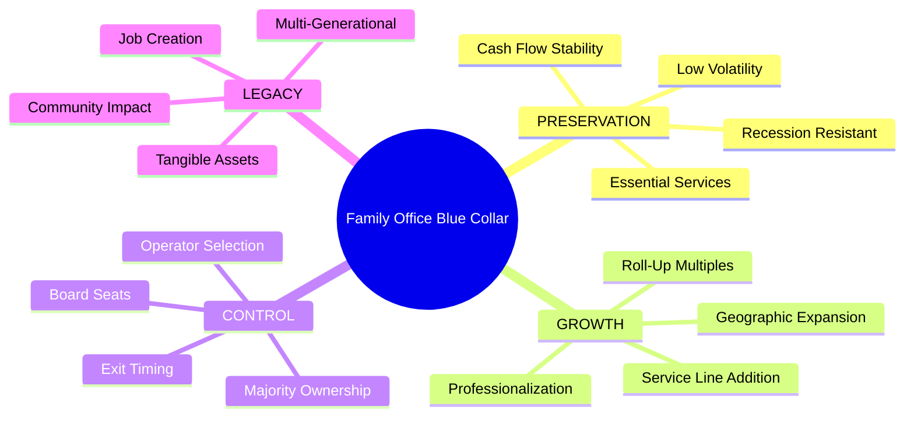

### Platform + Tuck-Under Strategy

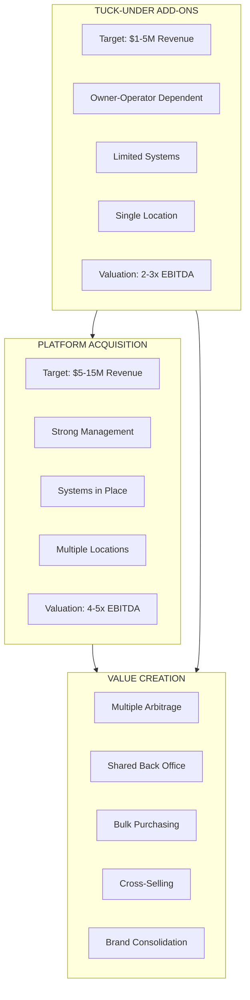

### Family Office Deal Flow Dashboard

| Metric | Target | Current Pipeline |
|--------|--------|------------------|
| Deals Sourced/Month | 50 | Track in Terminal |
| Discovery Calls/Week | 10 | Schedule from Inbox |
| NDAs Signed/Month | 8 | Legal template ready |
| LOIs Issued/Quarter | 4 | Valuation model integrated |
| Deals Closed/Year | 6-10 | From first contact to close |

---

## For Private Equity (Lower Middle Market)

> *"Bain and KKR are fighting over the same 500 deals. There are 500,000 blue collar businesses with no succession plan. Do the math."*

### PE Blue Collar Thesis

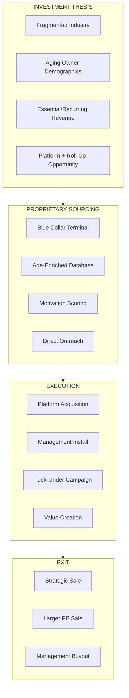

### PE Deal Velocity Metrics

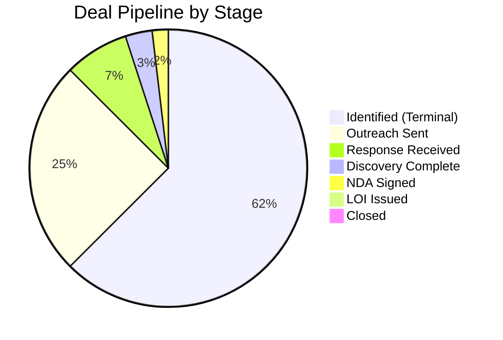

### The PE Roll-Up Math

```
PLATFORM ACQUISITION:
├── Revenue: $12M
├── EBITDA: $2.4M (20% margin)
├── Multiple: 5.0x
├── Enterprise Value: $12M
└── Investment: $4M equity + $8M debt

YEAR 1-3 ADD-ONS (via Blue Collar Terminal):
├── 6 tuck-unders at avg $800K EBITDA each
├── Acquired at avg 3.0x = $14.4M total
├── Combined EBITDA: $2.4M + $4.8M = $7.2M
├── Pro forma with synergies: $8.5M EBITDA
└── Total invested: ~$20M

EXIT AT YEAR 5:
├── EBITDA grown to $12M (organic + add-ons)
├── Exit multiple: 7.0x (platform premium)
├── Enterprise Value: $84M
├── Return: 4.2x MOIC
└── IRR: 33%

THE EDGE: Proprietary sourcing of add-ons via Terminal
```

---

# Outreach Sequences

## The Blue Collar Owner Sequence

> **Key Insight:** These owners get spam from brokers. They DON'T get thoughtful, personalized outreach to their HOME addressing their specific situation.

### Channel Priority


### The 12-Touch Sequence

| Day | Channel | Message Theme |
|-----|---------|---------------|
| 1 | Direct Mail | Personal letter, acknowledge their legacy |
| 3 | SMS | "Got my letter? Would love 15 mins" |
| 5 | Voicemail | Warm, acknowledging their success |
| 7 | Email | Industry-specific value add |
| 10 | SMS | "No pressure, just curious about your plans" |
| 14 | Direct Mail | Case study of similar owner exit |
| 17 | Cold Call | Direct conversation attempt |
| 21 | Email | Exit planning educational content |
| 28 | SMS | "One more try - then I'll leave you alone" |
| 35 | LinkedIn | Connection request + note |
| 45 | Direct Mail | Final "door always open" letter |
| 60 | Email | Quarterly check-in (ongoing) |

### Message Templates by Owner Age

#### Age 58-63: "Exploring Options"
```
Subject: Your 25 years building [COMPANY] - what's next?

[FIRST_NAME],

I've been researching successful [INDUSTRY] companies in [CITY],
and [COMPANY] keeps coming up as one of the best.

25 years of building something from nothing - that's rare.

I work with business owners like you who are starting to think
about what comes next. Not rushing anything, just exploring options
while the business is strong.

Would you be open to a 15-minute call? No pitch, just curious
about your story and where you see things heading.

[SIGNATURE]
```

#### Age 64-68: "Ready to Discuss"
```
Subject: Confidential inquiry about [COMPANY]

[FIRST_NAME],

I'll be direct - I work with buyers specifically looking for
established [INDUSTRY] businesses like [COMPANY].

After [YEARS] years, you've built something valuable. The question
is whether you want to:
- Keep grinding for another 5-10 years
- Bring in management and step back
- Exit on your terms while the business is strong

Most owners I talk to just want to understand their options.
No commitment, just information.

15 minutes. Completely confidential.

[SIGNATURE]
```

#### Age 69+: "Urgency + Respect"
```
Subject: A respectful inquiry, [FIRST_NAME]

[FIRST_NAME],

I'll be honest - I specifically look for owners who've built
great businesses over decades, like you have with [COMPANY].

After [YEARS] years, you deserve options that respect what
you've created:
- Fair valuation for your life's work
- Transition that protects your employees
- Timing that works for YOU

I've helped owners in similar situations find the right path
forward. If you're even slightly curious, let's talk.

[SIGNATURE]
```

---

# The Terminal Dashboard

## Deal Intelligence Dashboard

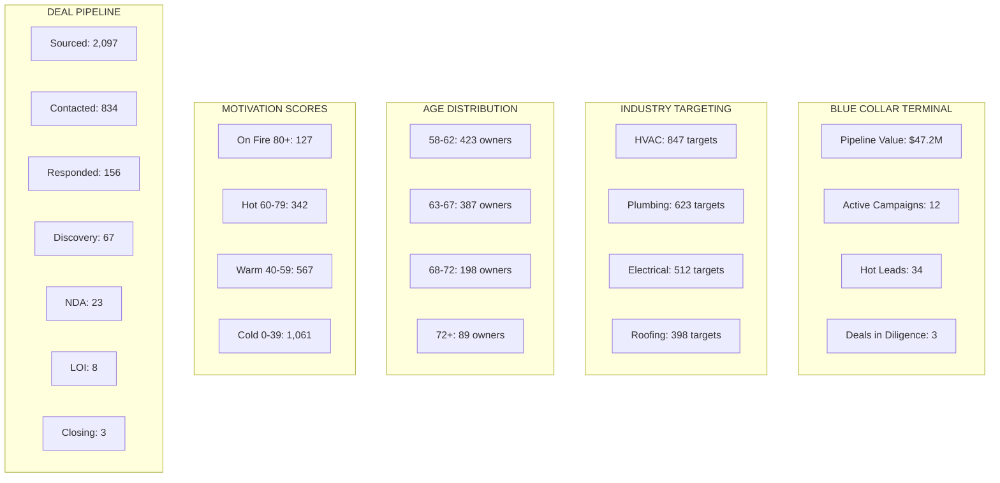

## Target Search Interface

```
┌─────────────────────────────────────────────────────────────────────┐
│  BLUE COLLAR TERMINAL - TARGET SEARCH                               │
├─────────────────────────────────────────────────────────────────────┤
│                                                                     │
│  INDUSTRY          [HVAC ▼] [Plumbing ▼] [Electrical ▼]            │
│                                                                     │
│  GEOGRAPHY         [Texas ▼] [Florida ▼] [Arizona ▼]               │
│                                                                     │
│  REVENUE RANGE     [$1M ────────●──────── $50M]                    │
│                                                                     │
│  OWNER AGE         [55 ──────────●────── 75]                       │
│                                                                     │
│  BUSINESS AGE      [15 ────────●──────── 40] years                 │
│                                                                     │
│  MOTIVATION SCORE  [60 ─────────●─────── 100]                      │
│                                                                     │
│  ENRICHMENT        [x] Skip Trace  [x] Age Verify  [x] Home Equity │
│                                                                     │
│  ┌─────────────────────────────────────────────────────────────┐   │
│  │  [  SEARCH  ]                    Results: 847 targets       │   │
│  └─────────────────────────────────────────────────────────────┘   │
│                                                                     │
└─────────────────────────────────────────────────────────────────────┘
```

## Sample Target Profile

```
┌─────────────────────────────────────────────────────────────────────┐
│  TARGET PROFILE                                    SCORE: 87/100   │
├─────────────────────────────────────────────────────────────────────┤
│                                                                     │
│  COMPANY:        Johnson's Heating & Cooling, Inc.                 │
│  INDUSTRY:       HVAC - Residential & Commercial                   │
│  LOCATION:       Dallas, TX                                        │
│  REVENUE:        $4.2M (estimated)                                 │
│  EMPLOYEES:      18                                                │
│  YEARS IN BIZ:   27 years (founded 1997)                          │
│                                                                     │
│  ─────────────────────────────────────────────────────────────────  │
│                                                                     │
│  OWNER:          Robert "Bob" Johnson                              │
│  AGE:            64 (estimated from LinkedIn)                      │
│  TENURE:         27 years (founder)                                │
│  HOME ADDRESS:   4521 Oak Valley Dr, Plano, TX 75024              │
│  HOME EQUITY:    $487,000 (est.)                                   │
│  CELL PHONE:     (214) 555-XXXX (skip traced)                     │
│  EMAIL:          bob@johnsonsheating.com                          │
│                                                                     │
│  ─────────────────────────────────────────────────────────────────  │
│                                                                     │
│  MOTIVATION SIGNALS:                                               │
│  [+15] Owner age 64 (prime exit window)                           │
│  [+12] Business age 27 years (established)                        │
│  [+10] High home equity (financially secure)                      │
│  [+8]  No website updates in 2 years                              │
│  [+7]  Google reviews declining last 12 months                    │
│  [+5]  No succession mentioned in company info                    │
│  ────────────────────────────────────                              │
│  TOTAL MOTIVATION SCORE: 87/100                                    │
│                                                                     │
│  VALUATION ESTIMATE: $1.8M - $2.4M (at 3-4x EBITDA)               │
│                                                                     │
│  ┌──────────────┐  ┌──────────────┐  ┌──────────────┐             │
│  │ ADD TO LIST  │  │ START OUTREACH│  │ VIEW SIMILAR │             │
│  └──────────────┘  └──────────────┘  └──────────────┘             │
│                                                                     │
└─────────────────────────────────────────────────────────────────────┘
```

---

# Quick Reference

```
┌─────────────────────────────────────────────────────────────────────┐
│           BLUE COLLAR TERMINAL - QUICK REFERENCE                    │
├─────────────────────────────────────────────────────────────────────┤
│                                                                     │
│  TARGET PROFILE                                                     │
│  ─────────────                                                      │
│  • Industry: HVAC, Plumbing, Electrical, Roofing, Pest Control     │
│  • Revenue: $1M - $50M                                             │
│  • Owner Age: 58-70 (sweet spot: 62-66)                           │
│  • Business Age: 15+ years                                         │
│  • Geography: Sunbelt states preferred                             │
│                                                                     │
│  ENRICHMENT STACK                                                   │
│  ────────────────                                                   │
│  • Apollo.io: Company data, owner ID, revenue estimate             │
│  • RealEstateAPI: Skip trace, home address, equity                 │
│  • LinkedIn: Age verification, tenure, connections                 │
│  • Google: Reviews, reputation, activity signals                   │
│                                                                     │
│  MOTIVATION SCORING                                                 │
│  ─────────────────                                                  │
│  • 80-100: ON FIRE - Immediate priority                           │
│  • 60-79:  HOT - High priority outreach                           │
│  • 40-59:  WARM - Standard sequence                               │
│  • 0-39:   COLD - Long-term nurture                               │
│                                                                     │
│  OUTREACH PRIORITY                                                  │
│  ─────────────────                                                  │
│  1. Direct mail to home (highest response)                         │
│  2. SMS to cell phone                                              │
│  3. Voicemail drop                                                 │
│  4. Email                                                          │
│  5. LinkedIn                                                       │
│  6. Cold call                                                      │
│                                                                     │
│  VALUATION RULES OF THUMB                                          │
│  ────────────────────────                                          │
│  • Owner-dependent: 2.0-3.0x EBITDA                               │
│  • Management in place: 3.5-4.5x EBITDA                           │
│  • Platform quality: 4.5-6.0x EBITDA                              │
│  • Add recurring revenue premium: +0.5-1.0x                       │
│                                                                     │
└─────────────────────────────────────────────────────────────────────┘
```

---

# The Bottom Line


> *"While everyone else is chasing the same broker-listed deals, you're having coffee with a 64-year-old plumber who doesn't know his business is worth $2.5 million. That's the edge."*

---

*Document Version: 1.0 | December 2024*

**THE BLUE COLLAR TERMINAL**
*Proprietary Deal Sourcing for the $10 Trillion Wealth Transfer*
