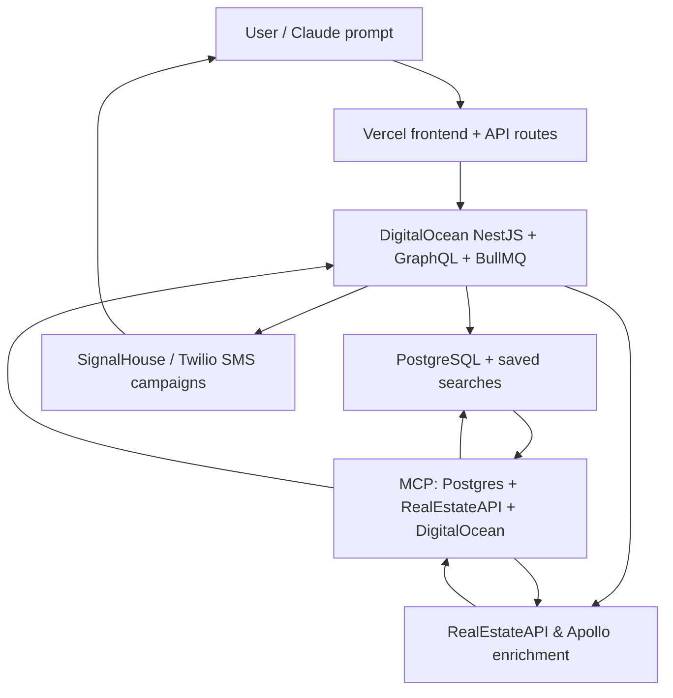

# Claude Code Reference

This page is the single stop for Claude Code / devs who need to understand how OutreachGlobal is split, where the MCP endpoints live, and how the AI SDR workflows run through the instrumentation layer.

## 1. Architectural snapshot

- **NX / monorepo governance** - `pnpm` + `nx` run everything under `apps/` and `packages/`. Use `nx run` / `nx affected` for builds, tests, and storybook so caching works across `front` (Next.js) and `api` (NestJS). Shared DTOs and configs live in `packages/`.
- **Vercel (frontend / API surface)** - `apps/front` is a Next.js 15 App Router site with ~61 pages plus ~29 API routes (`/api/property-search`, `/api/property-detail`, `/api/skip-trace`, `/api/signalhouse/*`, `/api/apollo/*`, etc.). Claude, admins, and SDRs all talk to those routes for saved searches, property exports, and signalhouse campaigns.
- **DigitalOcean (backend infrastructure)** - `apps/api` runs NestJS v11 + Fastify + Apollo Server + Drizzle over managed PostgreSQL. It owns auth, scheduling, BullMQ queues, SignalHouse/Twilio, SendGrid, RealEstateAPI, Apollo.io, and the GraphQL mutations that persist leads, campaigns, and saved searches.
- **External services** - RealEstateAPI (property search + skip trace), Apollo.io (B2B enrichment), SignalHouse/Twilio (bulk SMS), SendGrid, and DigitalOcean-managed Redis/Postgres. Saved-search exports write CSV/object buckets while Claude inspects these surfaces via MCP.

## 2. MCP access points

The new `.mcp.json` registers four servers so Claude Code can orchestrate data, property APIs, and DigitalOcean deployments:

| Server | Purpose | Notes |
|--------|---------|-------|
| `postgres` | Direct access to the DigitalOcean PostgreSQL database (saved searches, leads, campaigns, users). | Runs `npx @modelcontextprotocol/server-postgres` with the DO connection string. |
| `realestate-api-mcp` | Property search, MLS details, and skip-trace enrichment through SSE. | `https://mcp.realestateapi.com/sse` with `X-API-Key`. |
| `reapi-developer` | RealEstateAPI documentation stream. | `https://developer.mcp.realestateapi.com/sse`. |
| `digitalocean` | Deployments, job queues, and runtime control over DO services. | `npx @modelcontextprotocol/server-fetch` + `DIGITALOCEAN_API_TOKEN` (replace the placeholder with your secret before running Claude). |

### Verifying MCP health

1. The admin MCP dashboard (`apps/front/src/components/admin/mcp-dashboard.tsx`) simulates connection checks for all four servers.
2. Once the DO token is injected (set `DIGITALOCEAN_API_TOKEN` locally or via secrets), run `curl -H "Authorization: Bearer $DIGITALOCEAN_API_TOKEN" https://api.digitalocean.com/v2/account` to confirm the token can reach `api.digitalocean.com`.
3. If tokens rotate, update `.mcp.json` plus Claude’s secrets before rerunning the same health check or the `server-fetch` process.

## 3. AI SDR workflows through MCP

Claude-driven SDR flows stay inside the MCP stack:

1. **List building** - Claude queries saved searches (Postgres) or runs `/api/property-search` to capture geos, MLS flags, ownership filters, and the resulting bucket of IDs. Saved filters come from `docs/REAL_ESTATE_SEARCH.md`.
2. **Enrichment** - Use `/api/skip-trace` (POST handler in `apps/front/src/app/api/skip-trace/route.ts`) and `/api/property-detail` (GET for one ID, POST for batches) to append phones/emails. Apollo routes under `/api/apollo/*` run firmographic enrichment for B2B leads.
3. **Lead prep & campaigns** - The enriched leads use GraphQL mutations in `apps/api` (see `apps/api/src/app/lead/resolvers/lead.resolver.ts`). Once leads are labeled for 'initial', 'retarget', or 'follow-up', Claude hits `/api/signalhouse/send` (SignalHouse/Twilio) to queue the SMS blast.
4. **DigitalOcean ops** - When workflows need batch jobs, queue trims, or deployments (e.g., refreshing exports before a campaign), Claude uses the DO MCP entry to call REST endpoints via `@modelcontextprotocol/server-fetch`.

## 4. Key HTTP endpoints

| Route | Purpose |
|-------|---------|
| `POST /api/property-search` | Sends the filter object (states, zoning, MLS, lot size, equity) to RealEstateAPI `/v2/PropertySearch`. |
| `GET /api/property-detail?id=<id>` | Retrieves one property’s valuation, ownership, and skip-trace data. |
| `POST /api/property-detail` | Batch property-detail requests (used by skip-trace/enrichment). |
| `POST /api/skip-trace` | Accepts an `ids` array (max 250 per call, 5k/day) and returns phones/emails from `/v2/PropertyDetail`. |
| `GET /api/skip-trace` | Returns the current daily usage counters for skip trace. |
| `/api/signalhouse/*`, `/api/apollo/*`, `/api/saved-searches` | SignalHouse bulk SMS, Apollo enrichment, and saved-search CRUD are documented in their respective route files. |

## 5. Deployment & monitoring roles

- **Vercel** hosts `apps/front`, the Next.js UI API layer that surfaces RealEstateAPI, SignalHouse, and Claude interactions.
- **DigitalOcean** hosts `apps/api`, the GraphQL server, BullMQ workers, and the managed PostgreSQL/Redis clusters that Claude inspects via MCP.
- **Claude Code** operates through the MCP layer, using the SSE endpoints plus `server-postgres`/`server-fetch`. When the DO token lives in the env, Claude can trigger deployments, inspect job queues, and run ad-hoc SQL.
- **RealEstateAPI / Apollo / SignalHouse** remain the enrichment and outreach partners that the backend calls on behalf of Claude/SDRs.

## 6. Process flow (Mermaid)

## 7. Next actions

1. Replace the `DIGITALOCEAN_API_TOKEN` placeholder in `.mcp.json` with your secret (Claude should never ship the real token in git).
2. After the secret is set, rerun the MCP dashboard and `curl -H "Authorization: Bearer $DIGITALOCEAN_API_TOKEN" https://api.digitalocean.com/v2/account` to confirm deployments and queue commands succeed.
3. Use this reference plus `docs/REAL_ESTATE_SEARCH.md` and `docs/REALESTATE_API_COOKBOOK.md` for prompt templates covering search -> enrichment -> SignalHouse campaigns.
