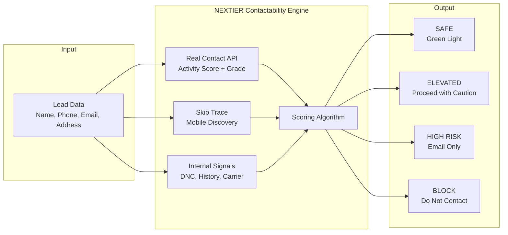
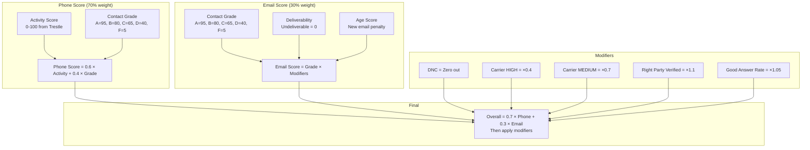
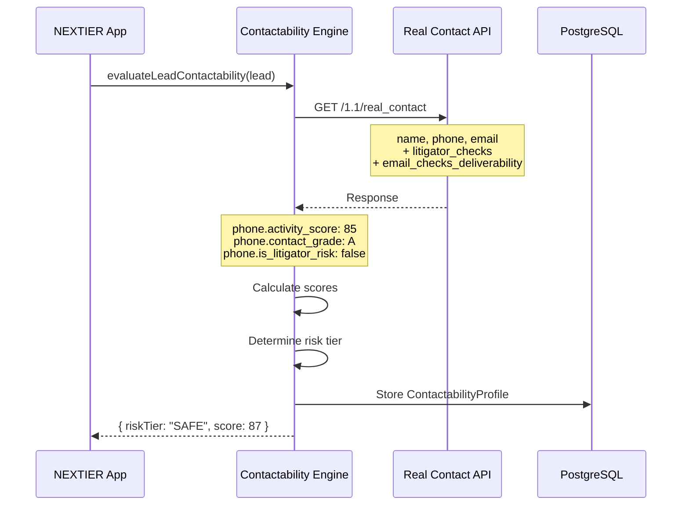
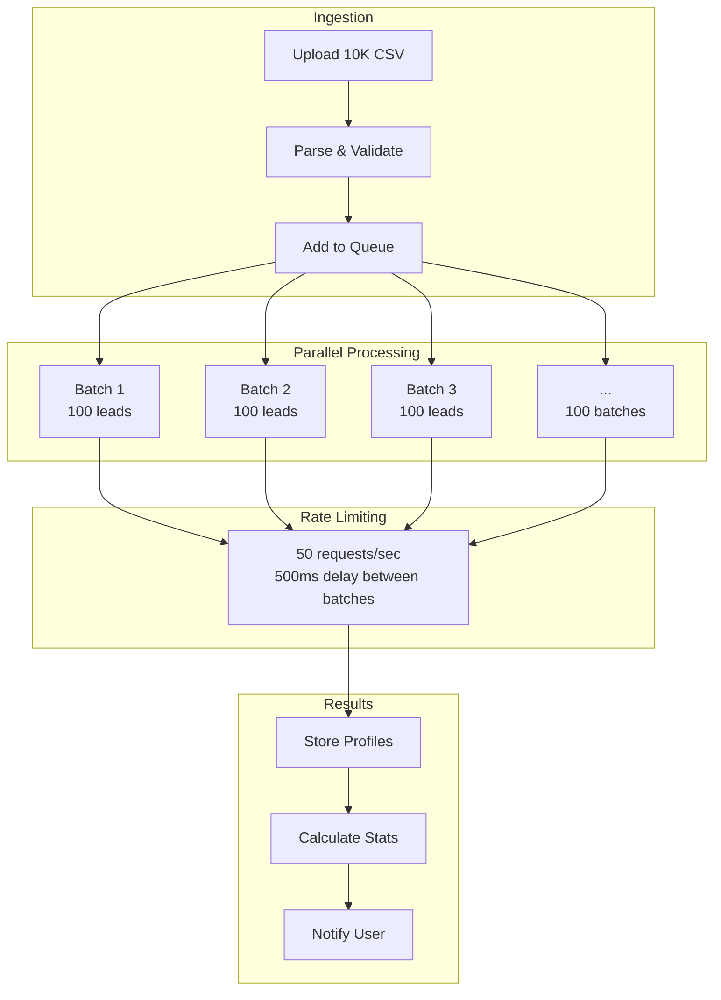
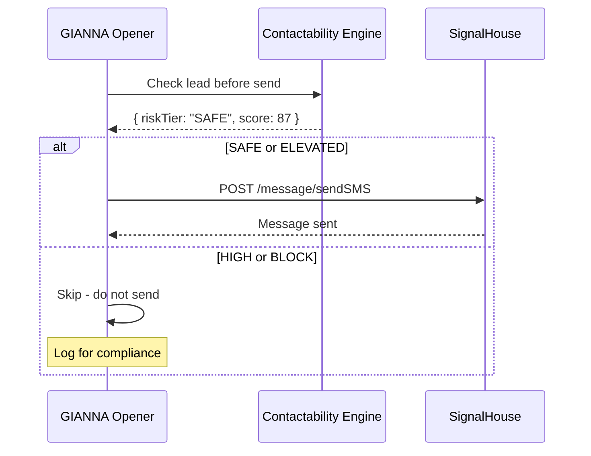
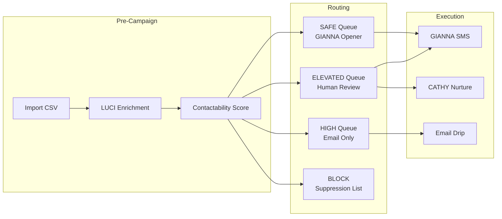

# NEXTIER Contactability Engine

> **Version**: 2.0.0
> **Date**: January 16, 2026
> **Status**: Production Ready
> **Capacity**: 10,000+ leads/batch

---

## Enterprise Contactability at Scale

NEXTIER's Contactability Engine is a proprietary scoring system that combines multiple data sources to answer one critical question: **Will this person answer?**



---

## Risk Tier Classification

### SAFE (Score 60-100)

```
┌─────────────────────────────────────────────────────┐
│  SAFE                                               │
│  ═════                                              │
│                                                     │
│  Phone: Valid, Activity 70+, Grade A-B             │
│  Email: Deliverable, Grade A-B                     │
│  History: No complaints, good answer rate          │
│                                                     │
│  ACTION: All channels available                    │
│  - SMS via GIANNA                                  │
│  - Email campaigns                                 │
│  - Power dialer queue                              │
│  - Automated sequences                             │
│                                                     │
└─────────────────────────────────────────────────────┘
```

### ELEVATED (Score 30-59)

```
┌─────────────────────────────────────────────────────┐
│  ELEVATED                                           │
│  ════════                                           │
│                                                     │
│  Phone: Valid but moderate activity (50-69)        │
│  Email: Grade C or deliverability uncertain        │
│  History: Some flags but not critical              │
│                                                     │
│  ACTION: Proceed with manual review                │
│  - SMS with human approval                         │
│  - Email nurture (low frequency)                   │
│  - No automated sequences                          │
│                                                     │
└─────────────────────────────────────────────────────┘
```

### HIGH RISK (Score 1-29)

```
┌─────────────────────────────────────────────────────┐
│  HIGH RISK                                          │
│  ═════════                                          │
│                                                     │
│  Phone: Low activity (<50) or Grade D              │
│  Email: Grade D-F or undeliverable                 │
│  History: Multiple complaints or high carrier risk │
│                                                     │
│  ACTION: Email only, no SMS/Call                   │
│  - Email nurture only                              │
│  - No SMS or calls                                 │
│  - Flag for data quality review                    │
│                                                     │
└─────────────────────────────────────────────────────┘
```

### BLOCK (Score 0)

```
┌─────────────────────────────────────────────────────┐
│  BLOCK                                              │
│  ═════                                              │
│                                                     │
│  Litigator Risk: TRUE                              │
│  DNC List: TRUE                                    │
│  Invalid Phone: TRUE                               │
│                                                     │
│  ACTION: DO NOT CONTACT                            │
│  - No SMS, Email, or Calls                         │
│  - Add to suppression list                         │
│  - Log for compliance audit                        │
│                                                     │
└─────────────────────────────────────────────────────┘
```

---

## Scoring Algorithm

### Overall Score Formula



### Code Implementation

```typescript
// Phone Score: 60% activity + 40% grade
const phoneScore = 0.6 * activityScore + 0.4 * gradeToScore(contactGrade);

// Email Score: Grade with penalties
let emailScore = gradeToScore(emailGrade);
if (!isDeliverable) emailScore = 0;
if (ageScore < 20) emailScore *= 0.5;  // New email penalty

// Overall: 70% phone + 30% email
let overall = 0.7 * phoneScore + 0.3 * emailScore;

// Apply Tracerfy modifiers
if (dnc) overall = 0;
if (carrierRisk === "HIGH") overall *= 0.4;
if (rightPartyVerified) overall *= 1.1;
```

---

## Real Contact API Integration

### Request Flow



### Response Fields Used

| Field | Description | Weight |
|-------|-------------|--------|
| `phone.is_valid` | Phone number validity | Gate (0 if false) |
| `phone.activity_score` | 0-100 activity level | 60% of phone score |
| `phone.contact_grade` | A-F quality grade | 40% of phone score |
| `phone.line_type` | Mobile/Landline/VoIP | SMS routing |
| `phone.name_match` | Name verification | Trust boost |
| `email.is_valid` | Email validity | Gate (0 if false) |
| `email.contact_grade` | A-F quality grade | Email score base |
| `litigator_checks.phone.is_litigator_risk` | TCPA litigator | BLOCK trigger |
| `email_checks.email.is_deliverable` | Deliverability | Gate (0 if false) |
| `email_checks.email.age_score` | Email age (0-100) | Penalty for new |

---

## Batch Processing

### 10K Lead Processing Pipeline



### Performance Metrics

| Metric | Value |
|--------|-------|
| Batch size | 100 leads |
| Concurrent batches | 5 |
| API rate limit | 50/sec |
| 10K processing time | ~7 minutes |
| Cost per 10K | ~$600 |

---

## Integration with SignalHouse

### Pre-Send Validation



### Campaign Flow



---

## Compliance Features

### TCPA Litigator Detection

```typescript
// Every lead checked for litigator risk
const isLitigator = response.addOns?.litigatorChecks?.phone.is_litigator_risk;

if (isLitigator) {
  // Automatic BLOCK
  profile.riskTier = "BLOCK";
  profile.overallContactabilityScore = 0;

  // Add to permanent suppression list
  await addToSuppressionList(lead.phone, "LITIGATOR");

  // Audit log for compliance
  await logComplianceEvent({
    type: "LITIGATOR_DETECTED",
    leadId: lead.id,
    phone: lead.phone,
    timestamp: new Date(),
  });
}
```

### DNC List Integration

```typescript
// Check internal DNC before any outreach
const isDNC = await checkDNCList(lead.phone);

if (isDNC) {
  profile.riskTier = "BLOCK";
  profile.overallContactabilityScore = 0;
  // No SMS, no calls, no exceptions
}
```

### Audit Trail

| Event | Data Logged |
|-------|-------------|
| Lead scored | leadId, score, tier, timestamp |
| Litigator detected | leadId, phone, source, timestamp |
| DNC match | leadId, phone, list_source, timestamp |
| Message blocked | leadId, reason, timestamp |
| Manual override | leadId, userId, reason, timestamp |

---

## API Reference

### Evaluate Single Lead

```typescript
import { evaluateLeadContactability } from "@/lib/services/contactability-engine";

const result = await evaluateLeadContactability({
  leadId: "lead_123",
  name: "John Smith",
  phone: "5125551234",
  email: "john@example.com",
  address: {
    street: "123 Main St",
    city: "Austin",
    state: "TX",
    zip: "78701",
  },
});

if (result.success) {
  console.log(result.profile.riskTier);  // "SAFE"
  console.log(result.profile.overallContactabilityScore);  // 87
}
```

### Evaluate Batch

```typescript
import { evaluateBatchContactability, calculateBatchStats } from "@/lib/services/contactability-engine";

const result = await evaluateBatchContactability(leads, 5, 500);

const stats = calculateBatchStats(result.profiles);
console.log(stats);
// {
//   total: 10000,
//   averageScore: 72,
//   tierBreakdown: { SAFE: 4200, ELEVATED: 2800, HIGH: 2000, BLOCK: 1000 },
//   contactableCount: 7000,
//   blockRate: 10
// }
```

### Quick Checks

```typescript
import { isBlocked, isSafe, meetsMinimumThreshold } from "@/lib/services/contactability-engine";

if (isBlocked(profile)) {
  // Never contact
}

if (isSafe(profile)) {
  // All channels green light
}

if (meetsMinimumThreshold(profile, 50)) {
  // Meets minimum bar for outreach
}
```

---

## Dashboard Metrics

### Lead Lab Overview

```
╔═══════════════════════════════════════════════════════════════════════╗
║  LEAD LAB - CONTACTABILITY ASSESSMENT                                  ║
╠═══════════════════════════════════════════════════════════════════════╣
║                                                                        ║
║  10,000 LEADS PROCESSED                                                ║
║                                                                        ║
║  ┌─────────────┬─────────────┬─────────────┬─────────────┐            ║
║  │   SAFE      │  ELEVATED   │  HIGH RISK  │   BLOCK     │            ║
║  │   4,200     │   2,800     │   2,000     │   1,000     │            ║
║  │   (42%)     │   (28%)     │   (20%)     │   (10%)     │            ║
║  │ ██████████  │ ███████     │ █████       │ ███         │            ║
║  └─────────────┴─────────────┴─────────────┴─────────────┘            ║
║                                                                        ║
║  Campaign Ready: 7,000 (70%)     Avg Score: 72                        ║
║                                                                        ║
║  [Create Campaign from SAFE]  [Export Profiles]  [View Details]       ║
║                                                                        ║
╚═══════════════════════════════════════════════════════════════════════╝
```

---

## Cost Model

### Per-Lead Costs

| Service | Cost | Notes |
|---------|------|-------|
| Skip Trace | $0.02 | Mobile discovery |
| Real Contact | $0.03 | Validation + scoring |
| Litigator Check | Included | With Real Contact |
| Email Deliverability | Included | With Real Contact |

### Volume Pricing

| Volume | Per Lead | Monthly Est. |
|--------|----------|--------------|
| 1-1,000 | $0.05 | $50 |
| 1,001-10,000 | $0.045 | $450 |
| 10,001-50,000 | $0.04 | $2,000 |
| 50,001+ | Custom | Contact sales |

---

## Support

**Technical Lead**: tb@outreachglobal.io
**Status Page**: https://status.nextier.io
**Documentation**: https://docs.nextier.io

---

*Built on Trestle Real Contact API + SignalHouse 10DLC Infrastructure*
