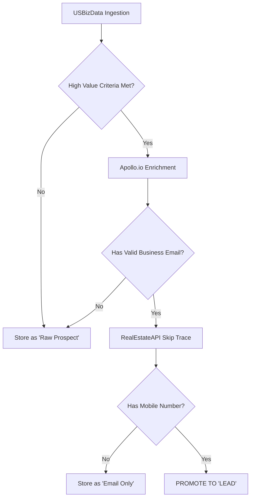

# PROMPT: ENRICHMENT REACTOR AUDIT (APOLLO + REALESTATE API)

**CONTEXT**:  
This system is a "High-Frequency Lead Gen Terminal". Raw code is liability; enriched data is asset.  
We operate a distinct "Enrichment Cascade" to transform raw `USBizData` records into actionable `Lead` entities (with phone numbers).  
We currently use **Apollo.io** for Business Data Enrichment and **RealEstateAPI** for Contactability (Skip Tracing/Mobile Phones).

**THREAT MODEL**:  
- **Infinite Loops**: Unbounded enrichment logic burning API credits ($50/run risks).  
- **Low Yield**: Paying to skip-trace leads that have no business value.  
- **Stale Data**: Overwriting fresh USBizData fields with stale API results.  

**YOUR MISSION**:  
Act as the **Data Operations Architect**. You will audit and refactor the `apps/api/src/modules/enrichment` (or equivalent) to enforce a strict "Yield-Based" enrichment pipeline.

---

## TASK 1: ARCHITECTURE DISCOVERY & MAPPING
1.  **Locate the Services**: 
    - `apps/api/src/app/enrichment` (General Enrichment Logic)
    - `apps/api/src/app/apollo` (Apollo Specifics)
    - Look for "RealEstateAPI" integration (likely inside enrichment or common).
2.  **Map the Flow**: Identify the "Trigger" for enrichment. Is it:  
    - On Ingestion? (Expensive)  
    - On Button Click? (Too slow)  
    - Cron Job? (Hard to control)  
3.  **Check for "Kill Switches"**: Are there Redis keys or flags to `STOP_ENRICHMENT` immediately if costs spike?

## TASK 2: THE "CASCADE" LOGIC AUDIT
We need to verify (or implement) the following **Cost-Efficiency Cascade**:

**Audit Questions for the Codebase**:
- Does the code allow us to skip `RealEstateAPI` if `Apollo` fails? (Don't skip trace a ghost).
- Do we have `skip_tracing_recipes` defined? (e.g., "Owner First", then "Corporate Officer").
- Where is the "Credit Budget" checked?

## TASK 3: REALESTATE API (SKIP TRACING) INTEGRATION
- **Endpoint verification**: specific endpoints for "Skip Trace".
- **Recipe Logic**: Ensure we are asking for "Mobile Phones" specifically (High contactability) vs just "Landlines".
- **Storage**: Ensure the returned `phone_numbers` are stored in a normalized `ContactPoint` table, not just a comma-separated string `phone` column.

## TASK 4: APOLLO.IO INTEGRATION (DATA ENRICHMENT)
- **Field Mapping**: Ensure `Apollo` fields (Industry, Revenue, Employee Count) do NOT overwrite `USBizData` fields if `USBizData` is marked as "Source Truth". 
- Implement a `strategies` pattern: `MergeStrategy.TRUST_SOURCE` vs `MergeStrategy.TRUST_ENRICHMENT`.

## TASK 5: IMPLEMENT "THE GATEKEEPER"
Write/Refactor a `EnrichmentGatekeeperService`:
1.  **Budget Check**: `Redis.get('DAILY_SPEND') < LIMIT`.
2.  **Dupe Check**: Hash the address/name before sending to API (Prevent double-paying for the same lead).
3.  **Optimistic UI Signal**: If the frontend requests enrichment, return "Processing" immediately via WebSocket, don't hang the HTTP request.

---

**OUTPUT EXPECTATIONS**:
1.  `EnrichmentPipelineMap`: A file showing exactly which function calls which API.
2.  `CostLeakReport`: Places where we might be calling APIs unintentionally (loops, `useEffect`, etc).
3.  `The_Cascade.ts`: A proposed Service class that strictly enforces the logic flow above.
