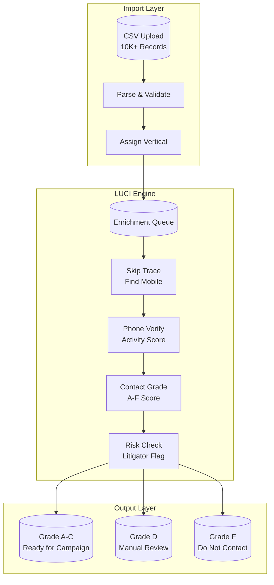
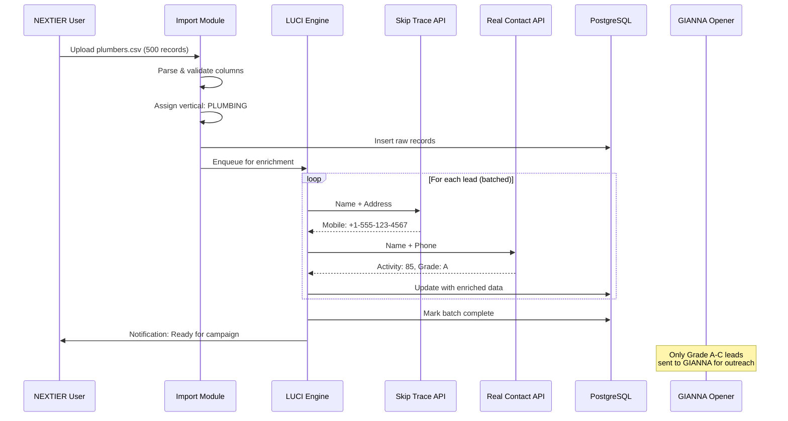
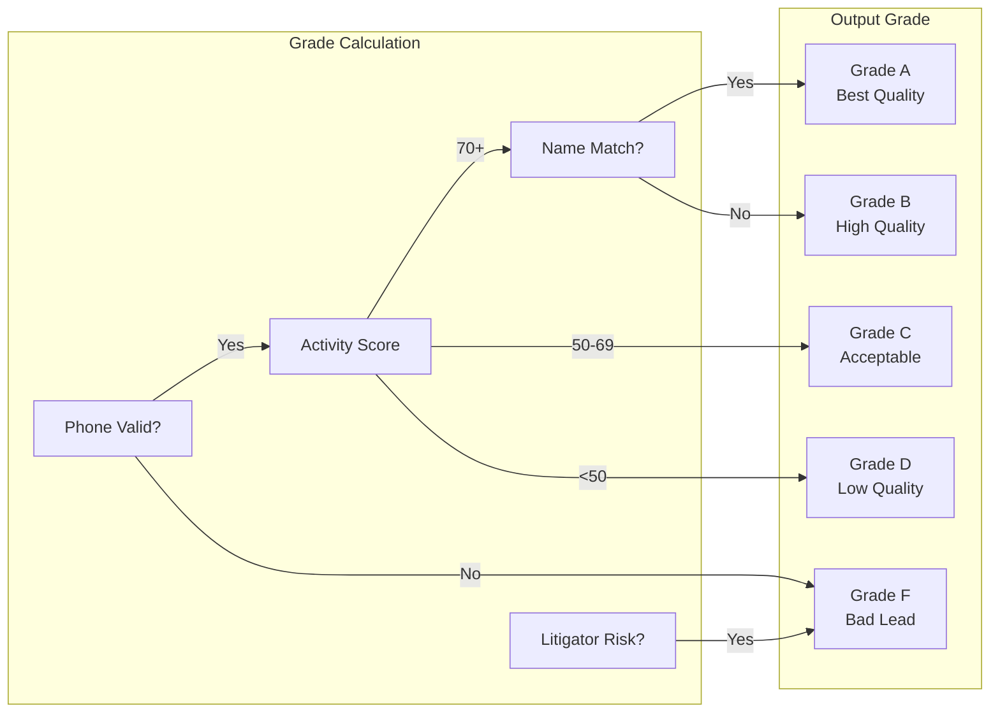
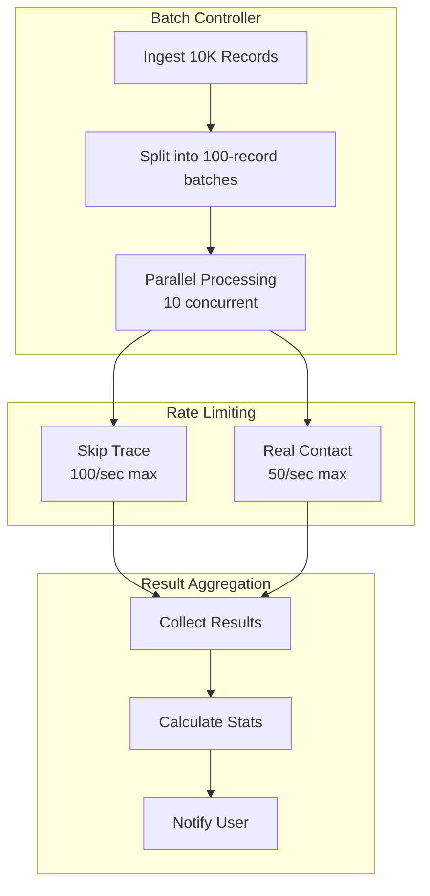
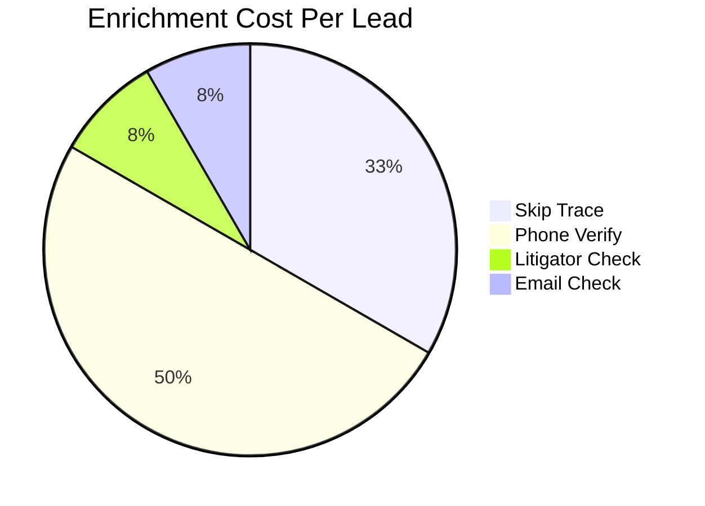
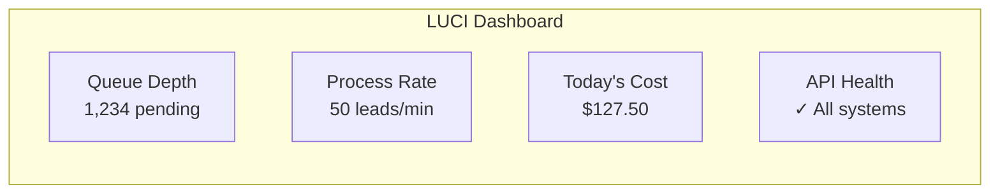
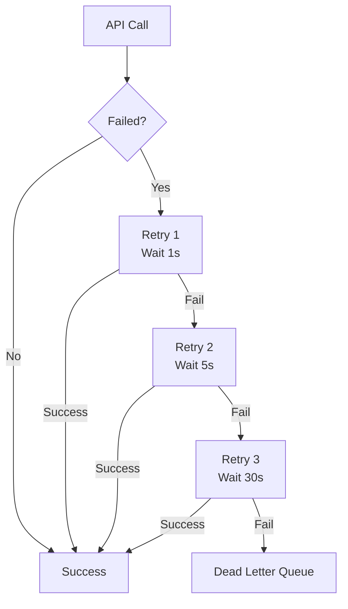

# LUCI Enrichment Pipeline

> **Version**: 1.0.0
> **Date**: January 16, 2026
> **Status**: Production Ready
> **Capacity**: 10,000+ leads/batch

---

## Executive Summary

LUCI (Lead Utility & Contact Intelligence) is NEXTIER's automated enrichment engine that transforms raw CSV imports into campaign-ready, contactable leads. The pipeline combines skip tracing for mobile discovery with real-time contactability scoring to ensure every SMS reaches a real person.

### Key Capabilities

| Feature | Description | Cost Model |
|---------|-------------|------------|
| Skip Tracing | Find mobile numbers from name + address | $0.02/lead |
| Phone Validation | Verify number is active and connected | $0.03/query |
| Contact Grading | A-F contactability score | Included |
| Litigator Check | TCPA litigator risk detection | Add-on |
| Email Validation | Deliverability + age scoring | Add-on |

---

## Architecture Overview



---

## Data Flow: CSV to Campaign-Ready Lead



---

## Contactability Scoring System

### Phone Activity Score (0-100)

| Score Range | Status | Action |
|-------------|--------|--------|
| **70-100** | High activity, connected | Priority dial |
| **50-69** | Moderate activity | Standard queue |
| **30-49** | Low activity | Nurture sequence |
| **0-29** | Disconnected/Inactive | Do not contact |

### Contact Grade (A-F)



### Grade Definitions

| Grade | Criteria | Campaign Eligibility |
|-------|----------|---------------------|
| **A** | Valid phone + 70+ activity + name match | GIANNA opener |
| **B** | Valid phone + 70+ activity | GIANNA opener |
| **C** | Valid phone + 50-69 activity | CATHY nurture |
| **D** | Valid phone + low activity | Manual review |
| **F** | Invalid OR litigator risk | Do not contact |

---

## Batch Processing Architecture



### Batch Timing Estimates

| Batch Size | Skip Trace | Verification | Total Time |
|------------|------------|--------------|------------|
| 100 leads | ~2 sec | ~2 sec | ~5 sec |
| 1,000 leads | ~15 sec | ~20 sec | ~45 sec |
| 10,000 leads | ~2 min | ~4 min | ~7 min |

---

## API Integration Details

### Skip Trace API (Mobile Discovery)

**Purpose**: Find mobile phone numbers from name + address

**Input**:
```json
{
  "firstName": "John",
  "lastName": "Smith",
  "address": "123 Main St",
  "city": "Austin",
  "state": "TX",
  "zip": "78701"
}
```

**Output**:
```json
{
  "success": true,
  "mobile": "+15125551234",
  "confidence": 0.92,
  "source": "carrier_match"
}
```

**Cost**: $0.02/lead (pay-as-you-go)

---

### Real Contact API (Phone Verification)

**Purpose**: Validate phone and score contactability

**Input**:
```
GET /1.1/real_contact?name=John%20Smith&phone=5125551234
```

**Output**:
```json
{
  "phone.is_valid": true,
  "phone.activity_score": 85,
  "phone.line_type": "Mobile",
  "phone.name_match": true,
  "phone.contact_grade": "A",
  "add_ons": {
    "litigator_checks": {
      "phone.is_litigator_risk": false
    }
  }
}
```

**Cost**: $0.03/query (pay-as-you-go)

---

## Database Schema

### Lead Enrichment Fields

```sql
-- Added to leads table
ALTER TABLE leads ADD COLUMN enrichment_status TEXT DEFAULT 'pending';
-- Values: pending, processing, completed, failed

ALTER TABLE leads ADD COLUMN phone_activity_score INTEGER;
-- 0-100 activity score from Real Contact API

ALTER TABLE leads ADD COLUMN contact_grade TEXT;
-- A, B, C, D, F

ALTER TABLE leads ADD COLUMN phone_line_type TEXT;
-- Mobile, Landline, FixedVOIP, NonFixedVOIP

ALTER TABLE leads ADD COLUMN phone_name_match BOOLEAN;
-- Does name match phone records?

ALTER TABLE leads ADD COLUMN litigator_risk BOOLEAN DEFAULT FALSE;
-- TCPA litigator flag

ALTER TABLE leads ADD COLUMN enriched_at TIMESTAMP;
-- When enrichment completed

ALTER TABLE leads ADD COLUMN enrichment_cost DECIMAL(10,4);
-- Total cost for this lead's enrichment
```

---

## Cost Tracking

### Per-Lead Cost Breakdown



### Batch Cost Calculator

| Leads | Skip Trace | Verify | Add-ons | Total |
|-------|------------|--------|---------|-------|
| 100 | $2.00 | $3.00 | $1.00 | **$6.00** |
| 1,000 | $20.00 | $30.00 | $10.00 | **$60.00** |
| 10,000 | $200.00 | $300.00 | $100.00 | **$600.00** |

### ROI Calculation

- **Without enrichment**: 2% response rate = 200 replies / 10K sends
- **With enrichment (Grade A-B only)**: 12% response rate = 600 replies / 5K sends
- **Cost savings**: 5K fewer messages × $0.02/SMS = $100 saved
- **Net ROI**: Higher conversion at lower send volume

---

## User Interface: Lead Lab

```
┌─────────────────────────────────────────────────────────────┐
│  LEAD LAB - Contactability Assessment                       │
├─────────────────────────────────────────────────────────────┤
│                                                             │
│  Upload Status: ████████████████████ 100% (10,000 leads)    │
│                                                             │
│  ┌──────────────────────────────────────────────────────┐  │
│  │  CONTACTABILITY BREAKDOWN                             │  │
│  │                                                       │  │
│  │  Grade A  ████████████████████  4,200 (42%)          │  │
│  │  Grade B  ██████████████        2,800 (28%)          │  │
│  │  Grade C  ██████████            2,000 (20%)          │  │
│  │  Grade D  ████                    800 (8%)           │  │
│  │  Grade F  ██                      200 (2%)           │  │
│  │                                                       │  │
│  │  Ready for Campaign: 9,000 (90%)                     │  │
│  └──────────────────────────────────────────────────────┘  │
│                                                             │
│  ┌─────────────┐  ┌─────────────┐  ┌─────────────┐        │
│  │ Total Cost  │  │ Avg Score   │  │ Mobile %    │        │
│  │   $600.00   │  │     72      │  │    85%      │        │
│  └─────────────┘  └─────────────┘  └─────────────┘        │
│                                                             │
│  [View Grade A Leads]  [Create Campaign]  [Export Report]  │
│                                                             │
└─────────────────────────────────────────────────────────────┘
```

---

## Pipeline Integration Points

### 1. Import → LUCI

```typescript
// On CSV import completion
async function onImportComplete(importId: string, vertical: string) {
  // Queue all leads for enrichment
  await luciEngine.enqueue({
    importId,
    vertical,
    options: {
      skipTrace: true,
      phoneVerify: true,
      litigatorCheck: true,
    },
  });
}
```

### 2. LUCI → GIANNA

```typescript
// After enrichment, route to GIANNA
async function onEnrichmentComplete(leadId: string) {
  const lead = await getLead(leadId);

  if (lead.contactGrade === 'A' || lead.contactGrade === 'B') {
    // High-quality lead → GIANNA opener
    await giannaQueue.add({
      leadId,
      template: selectTemplateForVertical(lead.vertical),
      priority: lead.contactGrade === 'A' ? 'high' : 'normal',
    });
  } else if (lead.contactGrade === 'C') {
    // Moderate quality → CATHY nurture
    await cathyQueue.add({ leadId, sequence: 'nurture_30d' });
  }
  // Grade D/F → Do not contact
}
```

---

## Monitoring & Alerts

### Health Metrics

| Metric | Threshold | Alert |
|--------|-----------|-------|
| API Error Rate | > 5% | Slack notification |
| Avg Enrichment Time | > 10 sec/lead | Warning |
| Daily Spend | > $500 | Budget alert |
| Grade F Rate | > 10% | Data quality warning |

### Dashboard Widgets



---

## Error Handling

### Retry Strategy



### Error Codes

| Code | Meaning | Action |
|------|---------|--------|
| 400 | Invalid input | Mark lead as invalid |
| 403 | API key issue | Alert admin |
| 429 | Rate limit | Backoff & retry |
| 500 | Server error | Retry with exponential backoff |

---

## Compliance & Data Security

### Data Handling

- All PII encrypted at rest (AES-256)
- TLS 1.3 for all API communications
- API keys stored in environment variables
- No raw PII logged (hashed for debugging)

### TCPA Compliance

- Litigator check on every phone before SMS
- Automatic DNC list sync
- Opt-out processing within 10 seconds
- Full audit trail for compliance

---

## Roadmap

| Phase | Feature | Impact |
|-------|---------|--------|
| **Current** | Batch processing up to 10K | Production ready |
| **Q1 2026** | Real-time enrichment on form submit | Instant lead qualification |
| **Q2 2026** | Predictive contactability scoring | ML-powered lead ranking |
| **Q3 2026** | Multi-provider failover | 99.9% uptime guarantee |

---

## Contact

**Technical Lead**: tb@outreachglobal.io
**LUCI Status**: https://status.nextier.io/luci
**Documentation**: https://docs.nextier.io/luci

---

*This document is intended for internal use and partner integrations. All costs are estimates and subject to change based on provider pricing.*
