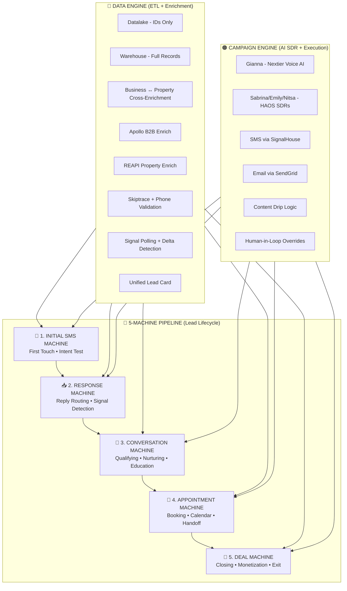
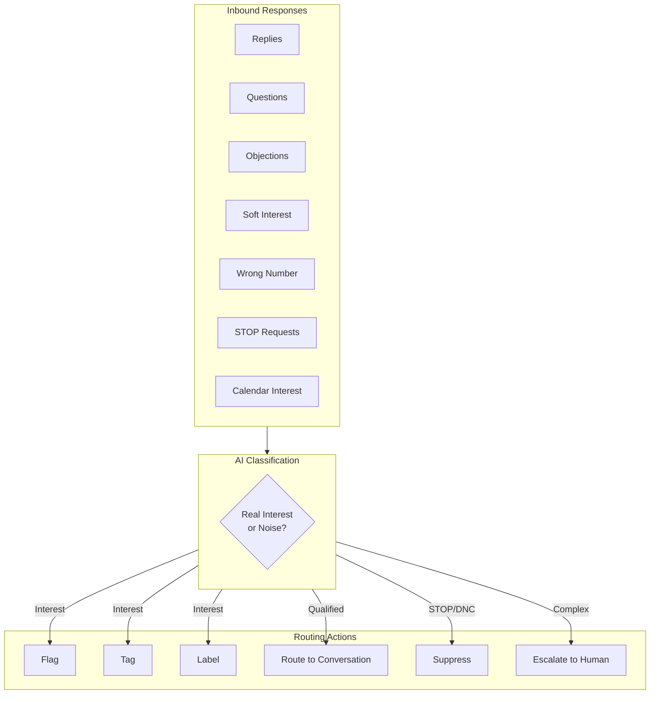
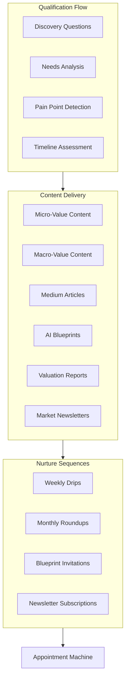
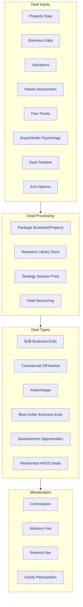
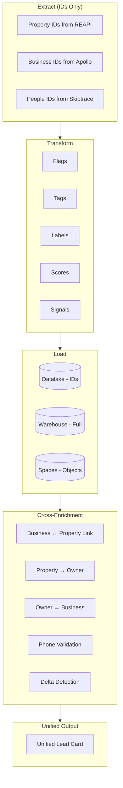
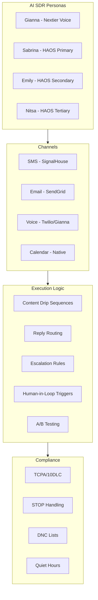

# Nextier Engine - Complete Architecture

> **The 5-Machine AI-Powered Growth Engine**
>
> This is the same architecture used by HubSpot, Outreach.io, Apollo, Palantir, and Snowflake — but specifically tuned for real estate + business origination.

---

## High-Level Overview



---

## 📱 MACHINE 1: Initial SMS Campaign Machine

**Purpose**: Start the conversation. Test for intent.

```mermaid
flowchart LR
    subgraph Inputs["Inputs"]
        I1[2K Block Pushes]
        I2[Skiptraced Leads]
        I3[Event-Signal Leads]
        I4[Business IDs]
        I5[Property IDs]
        I6[Segmented Batches]
    end

    subgraph Processing["AI SDR Outreach"]
        P1[Gianna - Nextier]
        P2[Sabrina - HAOS]
        P3[Emily - HAOS]
        P4[Nitsa - HAOS]
    end

    subgraph Actions["First Touch Actions"]
        A1[Compliant SMS]
        A2[Personalized Hook]
        A3[Intent Test Message]
    end

    Inputs --> Processing
    Processing --> Actions
    Actions --> R[Response Machine]
```



**What it does**:
- Sends first compliant outreach
- Tests for intent signals
- Handles 2K block compliance
- Routes to appropriate AI SDR persona

**Existing Code**:
- `apps/api/src/app/initial-messages/`
- `apps/front/src/app/api/signalhouse/`
- `apps/front/src/app/api/sms/queue/`

---

## 📥 MACHINE 2: Response Machine

**Purpose**: Route replies. Detect signals. Filter noise.



**What it does**:
- Classifies incoming responses
- Flags, tags, labels for routing
- Handles STOP compliance
- Detects calendar interest signals
- Filters noise from real interest

**Existing Code**:
- `apps/api/src/app/inbox/`
- `apps/front/src/app/api/webhook/sms/`
- `apps/front/src/app/api/inbox/`

---

## 💬 MACHINE 3: Conversation Machine

**Purpose**: Qualify. Educate. Nurture. Build trust.



**What it does**:
- Runs qualifying conversations
- Delivers educational content
- Pulls from Research Library
- Sends property/business insights
- Moves leads into content universe

**Existing Code**:
- `apps/api/src/app/message/`
- `apps/front/src/app/api/ai/suggest-reply/`
- `apps/front/src/app/api/content-library/`
- `apps/front/src/app/api/research-library/`

---

## 📅 MACHINE 4: Appointment Machine

**Purpose**: Bridge AI → Human. Book meetings.

```mermaid
flowchart LR
    subgraph Booking["Booking Flow"]
        B1[Calendar Availability]
        B2[Timezone Handling]
        B3[Appointment Type Selection]
        B4[Confirmation]
    end

    subgraph Coordination["Coordination"]
        C1[Callback Scheduling]
        C2[Reminder Sequences]
        C3[Reschedule Handling]
        C4[No-Show Recovery]
    end

    subgraph Handoff["Human Handoff"]
        H1[Context Package]
        H2[Lead History]
        H3[Property/Business Data]
        H4[Conversation Summary]
        H5[Recommended Approach]
    end

    Booking --> Coordination
    Coordination --> Handoff
    Handoff --> DM[Deal Machine]
```



**What it does**:
- Books meetings with proper context
- Handles timezone coordination
- Creates appointment reminders
- Syncs with Calendar module
- Pushes to Gianna for human-in-loop
- Packages full context for handoff

**Existing Code**:
- `apps/front/src/app/api/calendar/`
- `apps/front/src/app/t/[team]/calendar/`
- `apps/api/src/app/power-dialer/` (partial)

**Missing**: Deal linking, context packaging

---

## 💼 MACHINE 5: Deal Machine

**Purpose**: CLOSE and MONETIZE. This is the core of Nextier.



**What it does**:
- Consolidates all intelligence
- Packages deals for closing
- Supports multiple deal types
- Enables monetization paths

**Existing Code**: **MISSING** - Need to build `apps/front/src/app/api/deals/`

---

## 🔵 DATA ENGINE (Foundation Layer 1)

**Purpose**: Power everything. The brain of the system.



**Components**:
| Component | Purpose | Code Location |
|-----------|---------|---------------|
| Datalake | Store IDs only (cheap) | `api/datalake/` |
| Warehouse | Full enriched records | PostgreSQL + Drizzle |
| Apollo Enrich | B2B data | `api/apollo/enrich/` |
| REAPI Enrich | Property data | `api/property/` |
| Skiptrace | Phone/contact data | `api/skip-trace/`, `api/enrichment/skip-trace/` |
| Phone Validation | Line type, validity | Trestle integration |
| Signal Polling | Event detection | `api/property-search/monitor/` |
| Delta Detection | Change tracking | Needs building |
| Unified Lead Card | Combined view | `packages/common/src/unified-lead/` |

---

## 🟠 CAMPAIGN ENGINE (Foundation Layer 2)

**Purpose**: Execute outreach. AI SDR orchestration.



**Components**:
| Component | Purpose | Code Location |
|-----------|---------|---------------|
| Gianna | Voice AI SDR | `api/gianna/` |
| Sabrina SDR | Text AI SDR | `apps/api/src/app/inbox/services/sabrina-sdr.service.ts` |
| SignalHouse | SMS delivery | `api/signalhouse/` |
| SendGrid | Email delivery | `api/email/` |
| Campaign Push | Batch sends | `api/campaign/push/` |
| Automation Rules | Triggers | `api/automation/` |

---

## Code Location Summary

```
MACHINE 1 - Initial SMS
├── apps/api/src/app/initial-messages/     ✅ EXISTS
├── apps/front/src/app/api/signalhouse/    ✅ EXISTS
└── apps/front/src/app/api/sms/queue/      ✅ EXISTS

MACHINE 2 - Response
├── apps/api/src/app/inbox/                ✅ EXISTS
├── apps/front/src/app/api/webhook/sms/    ✅ EXISTS
└── apps/front/src/app/api/inbox/          ✅ EXISTS

MACHINE 3 - Conversation
├── apps/api/src/app/message/              ✅ EXISTS
├── apps/front/src/app/api/ai/             ✅ EXISTS
└── apps/front/src/app/api/content-library/ ✅ EXISTS

MACHINE 4 - Appointment
├── apps/front/src/app/api/calendar/       ✅ EXISTS
├── apps/front/src/app/t/[team]/calendar/  ✅ EXISTS
└── Context packaging for handoff          ❌ MISSING

MACHINE 5 - Deal
├── apps/front/src/app/api/deals/          ❌ MISSING
├── Deal pipeline stages                   ❌ MISSING
└── Deal packaging & monetization          ❌ MISSING

DATA ENGINE
├── apps/front/src/app/api/datalake/       ✅ EXISTS
├── apps/front/src/app/api/enrichment/     ✅ EXISTS
├── apps/front/src/app/api/apollo/         ✅ EXISTS
├── apps/front/src/app/api/property/       ✅ EXISTS
├── apps/front/src/app/api/skip-trace/     ✅ EXISTS
├── packages/common/src/unified-lead/      ✅ EXISTS
└── Delta detection system                 ❌ MISSING

CAMPAIGN ENGINE
├── apps/api/src/app/campaign/             ✅ EXISTS
├── apps/api/src/app/inbox/services/sabrina-sdr.service.ts ✅ EXISTS
├── apps/front/src/app/api/gianna/         ✅ EXISTS
├── apps/front/src/app/api/signalhouse/    ✅ EXISTS
└── apps/front/src/app/api/email/          ✅ EXISTS
```

---

## What Needs Building

| Priority | Component | Description |
|----------|-----------|-------------|
| 🔴 HIGH | Deal Machine | `/api/deals/` - Pipeline, stages, monetization |
| 🔴 HIGH | Appointment Context | Package lead history for human handoff |
| 🟡 MED | Delta Detection | Track changes in property/business data |
| 🟡 MED | Deal Types | B2B exits, commercial, assemblage, HAOS |
| 🟢 LOW | A/B Testing | Campaign variant testing |

---

## Next Steps

1. **Build Deal Machine** - The monetization core
2. **Complete Appointment Handoff** - Context packaging
3. **Add Delta Detection** - Change tracking for signals
4. **Connect All Machines** - Full pipeline flow

Ready to start building?
