# Nextier Engine - Deep Schemas & Logic

---

## 1. Unified Lead Card v2

The single source of truth for any lead - combining property, business, and person data.

```mermaid
flowchart TD
    subgraph UnifiedLeadCard["Unified Lead Card v2"]
        subgraph Identity["🆔 Identity Layer"]
            ID1[Lead UUID]
            ID2[Property ID - REAPI]
            ID3[Business ID - Apollo]
            ID4[Person ID - Skiptrace]
        end

        subgraph Contact["📞 Contact Layer"]
            C1[Primary Phone + Line Type]
            C2[Secondary Phones]
            C3[Email - Personal]
            C4[Email - Business]
            C5[Mailing Address]
        end

        subgraph Property["🏠 Property Layer"]
            P1[Address]
            P2[AVM Value]
            P3[Equity %]
            P4[Last Sale Date/Price]
            P5[Mortgage Balance]
            P6[Tax Assessed]
            P7[Event Signals]
        end

        subgraph Business["🏢 Business Layer"]
            B1[Company Name]
            B2[Industry/SIC]
            B3[Revenue]
            B4[Employee Count]
            B5[Founded Year]
            B6[Owner Name/Title]
        end

        subgraph Engagement["📊 Engagement Layer"]
            E1[Pipeline Stage]
            E2[Last Touch Date]
            E3[Total Touches]
            E4[Response Count]
            E5[Sentiment Score]
            E6[Intent Signals]
        end

        subgraph Flags["🏷️ Classification Layer"]
            F1[Tags]
            F2[Labels]
            F3[Scores]
            F4[Buckets]
            F5[Campaigns]
        end
    end
```



### Schema (TypeScript/Drizzle)

```typescript
// packages/dto/src/unified/unified-lead-card.dto.ts

export interface UnifiedLeadCardV2 {
  // Identity Layer
  id: string;                        // UUID
  propertyId?: string;               // REAPI property ID
  businessId?: string;               // Apollo company ID
  personId?: string;                 // Internal person ID
  apolloPersonId?: string;           // Apollo person ID

  // Contact Layer
  contact: {
    primaryPhone?: string;
    primaryPhoneType?: 'mobile' | 'landline' | 'voip' | 'unknown';
    primaryPhoneValid?: boolean;
    secondaryPhones?: string[];
    personalEmail?: string;
    businessEmail?: string;
    mailingAddress?: Address;
  };

  // Property Layer (from REAPI)
  property?: {
    address: Address;
    avm?: number;
    equityPercent?: number;
    lastSaleDate?: string;
    lastSalePrice?: number;
    mortgageBalance?: number;
    taxAssessed?: number;
    propertyType?: string;
    bedrooms?: number;
    bathrooms?: number;
    sqft?: number;
    yearBuilt?: number;
    lotSize?: number;
    eventSignals?: EventSignal[];
  };

  // Business Layer (from Apollo)
  business?: {
    name?: string;
    domain?: string;
    industry?: string;
    sicCode?: string;
    naicsCode?: string;
    revenue?: number;
    revenueRange?: string;
    employeeCount?: number;
    employeeRange?: string;
    foundedYear?: number;
    linkedinUrl?: string;
    ownerName?: string;
    ownerTitle?: string;
    ownerLinkedin?: string;
  };

  // Engagement Layer
  engagement: {
    pipelineStage: PipelineStage;
    machineState: MachineState;
    lastTouchDate?: string;
    lastTouchType?: 'sms' | 'email' | 'call' | 'meeting';
    totalTouches: number;
    responseCount: number;
    sentimentScore?: number;        // -1 to 1
    intentSignals?: IntentSignal[];
    conversationSummary?: string;
  };

  // Classification Layer
  classification: {
    tags: string[];
    labels: string[];
    leadScore: number;              // 0-100
    qualityScore: number;           // 0-100
    bucketIds: string[];
    campaignIds: string[];
    suppressionStatus?: 'none' | 'dnc' | 'stop' | 'bounced';
  };

  // Metadata
  createdAt: string;
  updatedAt: string;
  enrichedAt?: string;
  source: 'reapi' | 'apollo' | 'csv' | 'manual' | 'webhook';
}

type PipelineStage =
  | 'new'
  | 'contacted'
  | 'responded'
  | 'qualified'
  | 'appointment_scheduled'
  | 'appointment_completed'
  | 'proposal'
  | 'negotiation'
  | 'closed_won'
  | 'closed_lost'
  | 'nurture';

type MachineState =
  | 'initial_sms'
  | 'awaiting_response'
  | 'in_conversation'
  | 'appointment_flow'
  | 'deal_flow'
  | 'closed'
  | 'suppressed';

type EventSignal =
  | 'preForeclosure'
  | 'foreclosure'
  | 'auction'
  | 'taxLien'
  | 'divorce'
  | 'probate'
  | 'vacant'
  | 'highEquity'
  | 'freeClear'
  | 'absenteeOwner'
  | 'bankruptcy'
  | 'mlsExpired';

type IntentSignal =
  | 'asked_price'
  | 'asked_timeline'
  | 'mentioned_selling'
  | 'requested_callback'
  | 'requested_info'
  | 'positive_sentiment'
  | 'objection_price'
  | 'objection_timing';
```

---

## 2. Full ETL Schema

```mermaid
flowchart TD
    subgraph Sources["📥 DATA SOURCES"]
        S1[(REAPI - Property)]
        S2[(Apollo - Business)]
        S3[(CSV Uploads)]
        S4[(Webhook Inbound)]
        S5[(Manual Entry)]
    end

    subgraph Extract["🔍 EXTRACT (IDs Only)"]
        E1[Property ID Extractor]
        E2[Business ID Extractor]
        E3[Person ID Extractor]
        E4[Deduplication]
    end

    subgraph Staging["📦 STAGING (Datalake)"]
        ST1[(property_ids)]
        ST2[(business_ids)]
        ST3[(person_ids)]
        ST4[(raw_events)]
    end

    subgraph Transform["⚙️ TRANSFORM"]
        T1[Normalize Addresses]
        T2[Phone Formatting]
        T3[Name Parsing]
        T4[Signal Detection]
        T5[Score Calculation]
        T6[Tag Assignment]
    end

    subgraph Enrich["🔗 ENRICH"]
        EN1[REAPI Enrich]
        EN2[Apollo Enrich]
        EN3[Skiptrace]
        EN4[Phone Validation]
        EN5[Cross-Link B↔P]
    end

    subgraph Load["💾 LOAD (Warehouse)"]
        L1[(leads table)]
        L2[(properties table)]
        L3[(businesses table)]
        L4[(unified_lead_cards)]
    end

    subgraph Output["📤 OUTPUT"]
        O1[Bucket Assignment]
        O2[Campaign Queue]
        O3[Lead Card API]
    end

    Sources --> Extract
    Extract --> Staging
    Staging --> Transform
    Transform --> Enrich
    Enrich --> Load
    Load --> Output
```



### ETL Job Schema

```typescript
// apps/front/src/app/api/etl/types.ts

export interface ETLJob {
  id: string;
  type: 'property_import' | 'business_import' | 'csv_import' | 'enrich_batch';
  status: 'pending' | 'extracting' | 'transforming' | 'enriching' | 'loading' | 'completed' | 'failed';

  // Counts
  totalRecords: number;
  extractedCount: number;
  transformedCount: number;
  enrichedCount: number;
  loadedCount: number;
  errorCount: number;

  // Config
  config: {
    source: string;
    enrichmentLevel: 'ids_only' | 'basic' | 'full';
    skiptraceEnabled: boolean;
    crossEnrichEnabled: boolean;
    targetBucketId?: string;
    targetCampaignId?: string;
  };

  // Timing
  createdAt: string;
  startedAt?: string;
  completedAt?: string;

  // Errors
  errors?: ETLError[];
}

export interface ETLError {
  recordId: string;
  stage: 'extract' | 'transform' | 'enrich' | 'load';
  error: string;
  timestamp: string;
}
```

---

## 3. Event Signal Engine


### Signal Engine Schema

```typescript
// apps/front/src/lib/signals/event-signal-engine.ts

export const EVENT_SIGNALS = {
  // Distress Signals (High Priority)
  distress: {
    preForeclosure:  { weight: 35, priority: 'critical', ttl: '30d' },
    foreclosure:     { weight: 40, priority: 'critical', ttl: '14d' },
    taxLien:         { weight: 30, priority: 'high',     ttl: '60d' },
    bankruptcy:      { weight: 25, priority: 'high',     ttl: '90d' },
    divorce:         { weight: 30, priority: 'high',     ttl: '60d' },
    probate:         { weight: 35, priority: 'high',     ttl: '90d' },
  },

  // Motivation Signals (Medium Priority)
  motivation: {
    highEquity:      { weight: 20, priority: 'medium',  ttl: '180d' },
    freeClear:       { weight: 25, priority: 'medium',  ttl: '365d' },
    absenteeOwner:   { weight: 15, priority: 'medium',  ttl: '365d' },
    inherited:       { weight: 30, priority: 'high',    ttl: '180d' },
    vacant:          { weight: 25, priority: 'high',    ttl: '90d'  },
    longOwnership:   { weight: 10, priority: 'low',     ttl: '365d' },
  },

  // Market Signals
  market: {
    mlsExpired:      { weight: 20, priority: 'high',    ttl: '30d' },
    mlsCancelled:    { weight: 15, priority: 'medium',  ttl: '30d' },
    mlsWithdrawn:    { weight: 15, priority: 'medium',  ttl: '30d' },
    priceReduced:    { weight: 10, priority: 'low',     ttl: '14d' },
    domOver90:       { weight: 15, priority: 'medium',  ttl: '30d' },
  },
} as const;

export interface SignalDetectionResult {
  propertyId: string;
  signals: DetectedSignal[];
  totalScore: number;
  priority: 'critical' | 'high' | 'medium' | 'low';
  recommendedAction: 'hot_bucket' | 'priority_campaign' | 'standard_campaign' | 'nurture';
}

export interface DetectedSignal {
  type: string;
  category: 'distress' | 'motivation' | 'market';
  weight: number;
  detectedAt: string;
  expiresAt: string;
  source: string;
  rawData?: Record<string, unknown>;
}

export function calculateSignalScore(signals: DetectedSignal[]): number {
  return signals.reduce((sum, s) => sum + s.weight, 0);
}

export function determineAction(score: number): string {
  if (score >= 60) return 'hot_bucket';
  if (score >= 40) return 'priority_campaign';
  if (score >= 20) return 'standard_campaign';
  return 'nurture';
}
```

---

## 4. Deal Machine Schema


### Deal Schema

```typescript
// apps/front/src/app/api/deals/types.ts

export interface Deal {
  id: string;
  leadId: string;

  // Deal Classification
  type: DealType;
  stage: DealStage;
  priority: 'hot' | 'warm' | 'standard';

  // Value
  estimatedValue: number;
  askingPrice?: number;
  offerPrice?: number;
  finalPrice?: number;

  // Monetization
  monetization: {
    type: 'commission' | 'advisory' | 'referral' | 'equity';
    rate: number;                    // Percentage or flat
    estimatedEarnings: number;
    actualEarnings?: number;
  };

  // Property Details (if applicable)
  property?: {
    id: string;
    address: string;
    type: string;
    avm: number;
    equity: number;
  };

  // Business Details (if applicable)
  business?: {
    id: string;
    name: string;
    industry: string;
    revenue: number;
    employees: number;
  };

  // Documents
  documents: DealDocument[];

  // Activity
  activities: DealActivity[];

  // Parties
  seller?: Party;
  buyer?: Party;
  agents?: Party[];

  // Dates
  createdAt: string;
  updatedAt: string;
  expectedCloseDate?: string;
  actualCloseDate?: string;

  // Outcome
  outcome?: {
    result: 'won' | 'lost';
    reason?: string;
    feedback?: string;
  };
}

type DealType =
  | 'b2b_exit'           // Business sale
  | 'commercial'         // Commercial property
  | 'assemblage'         // Land assembly
  | 'blue_collar_exit'   // Small business exit
  | 'development'        // Development opportunity
  | 'residential_haos';  // Homeowner advisor

type DealStage =
  | 'discovery'
  | 'qualification'
  | 'proposal'
  | 'negotiation'
  | 'contract'
  | 'closing'
  | 'closed_won'
  | 'closed_lost';

interface DealDocument {
  id: string;
  type: 'valuation' | 'proposal' | 'contract' | 'research' | 'financials' | 'other';
  name: string;
  url: string;
  uploadedAt: string;
}

interface DealActivity {
  id: string;
  type: 'note' | 'call' | 'email' | 'meeting' | 'stage_change' | 'document';
  description: string;
  userId: string;
  createdAt: string;
}

interface Party {
  name: string;
  email?: string;
  phone?: string;
  role: 'seller' | 'buyer' | 'agent' | 'attorney' | 'other';
}
```

---

## 5. AI SDR Escalation Logic


### Escalation Engine

```typescript
// apps/front/src/lib/sdr/escalation-engine.ts

export interface EscalationRule {
  id: string;
  name: string;
  trigger: EscalationTrigger;
  conditions: EscalationCondition[];
  action: EscalationAction;
  priority: number;
}

type EscalationTrigger =
  | 'keyword'
  | 'sentiment'
  | 'intent'
  | 'value_threshold'
  | 'loop_count'
  | 'explicit_request';

interface EscalationCondition {
  field: string;
  operator: 'equals' | 'contains' | 'greater_than' | 'less_than';
  value: string | number;
}

type EscalationAction =
  | 'immediate_handoff'
  | 'schedule_callback'
  | 'alert_manager'
  | 'flag_and_continue'
  | 'transfer_to_specialist';

// Default Escalation Rules
export const DEFAULT_ESCALATION_RULES: EscalationRule[] = [
  {
    id: 'explicit_human_request',
    name: 'Explicit Human Request',
    trigger: 'keyword',
    conditions: [
      { field: 'message', operator: 'contains', value: 'speak to someone' },
      { field: 'message', operator: 'contains', value: 'real person' },
      { field: 'message', operator: 'contains', value: 'talk to human' },
    ],
    action: 'immediate_handoff',
    priority: 100,
  },
  {
    id: 'negative_sentiment',
    name: 'Negative Sentiment Threshold',
    trigger: 'sentiment',
    conditions: [
      { field: 'sentimentScore', operator: 'less_than', value: -0.5 },
    ],
    action: 'alert_manager',
    priority: 90,
  },
  {
    id: 'high_value_lead',
    name: 'High Value Lead',
    trigger: 'value_threshold',
    conditions: [
      { field: 'estimatedValue', operator: 'greater_than', value: 500000 },
    ],
    action: 'flag_and_continue',
    priority: 80,
  },
  {
    id: 'appointment_request',
    name: 'Appointment Request',
    trigger: 'intent',
    conditions: [
      { field: 'intent', operator: 'equals', value: 'schedule_meeting' },
    ],
    action: 'schedule_callback',
    priority: 85,
  },
  {
    id: 'objection_loop',
    name: 'Objection Loop',
    trigger: 'loop_count',
    conditions: [
      { field: 'objectionCount', operator: 'greater_than', value: 3 },
    ],
    action: 'transfer_to_specialist',
    priority: 75,
  },
];

export interface EscalationPackage {
  leadId: string;
  escalationRuleId: string;
  triggerReason: string;

  // Context
  conversationHistory: Message[];
  leadCard: UnifiedLeadCardV2;

  // Analysis
  detectedIntent: string[];
  sentimentScore: number;
  keyTopics: string[];

  // Recommendations
  suggestedResponse: string;
  talkingPoints: string[];
  warningFlags: string[];

  // Routing
  assignedTo?: string;
  callbackScheduled?: string;
  priority: 'critical' | 'high' | 'medium' | 'low';
}
```

---

## 6. Business ↔ Property Cross-Over Engine

```mermaid
flowchart TD
    subgraph PropertyData["🏠 PROPERTY DATA"]
        P1[Owner Name]
        P2[Owner Address]
        P3[Property Address]
        P4[Mailing Address]
    end

    subgraph BusinessData["🏢 BUSINESS DATA"]
        B1[Company Name]
        B2[Owner/CEO Name]
        B3[Business Address]
        B4[Domain]
    end

    subgraph Matching["🔗 CROSS-LINK ENGINE"]
        M1{Name Match}
        M2{Address Match}
        M3{Phone Match}
        M4{Email Domain Match}
        M5[Confidence Score]
    end

    subgraph Enrichment["✨ CROSS-ENRICHMENT"]
        E1[Property Owner → Business Lookup]
        E2[Business Owner → Property Lookup]
        E3[Unified Profile Creation]
    end

    subgraph Output["📤 OUTPUT"]
        O1[Linked Lead Card]
        O2[Investment Score]
        O3[Net Worth Estimate]
        O4[Multi-Property Flag]
        O5[Business Owner Flag]
    end

    PropertyData --> Matching
    BusinessData --> Matching
    Matching --> M5
    M5 --> Enrichment
    Enrichment --> Output
```



### Cross-Over Engine

```typescript
// apps/front/src/lib/enrichment/cross-over-engine.ts

export interface CrossOverMatch {
  propertyId: string;
  businessId: string;
  personId: string;

  matchScore: number;          // 0-100
  matchMethod: MatchMethod[];

  // Linked Data
  linkedProperty?: PropertyRecord;
  linkedBusiness?: BusinessRecord;
  linkedPerson?: PersonRecord;

  // Derived Insights
  insights: CrossOverInsights;
}

type MatchMethod =
  | 'exact_name'
  | 'fuzzy_name'
  | 'address_match'
  | 'phone_match'
  | 'email_domain'
  | 'manual_link';

interface CrossOverInsights {
  isBusinessOwner: boolean;
  businessCount: number;

  isPropertyOwner: boolean;
  propertyCount: number;
  totalPropertyValue: number;
  totalEquity: number;

  estimatedNetWorth: number;
  investorScore: number;        // 0-100, likelihood of being investor

  flags: string[];              // 'multi_property', 'business_owner', 'high_net_worth'
}

// Cross-Over Matching Functions
export async function findBusinessByPropertyOwner(
  ownerName: string,
  ownerAddress: string
): Promise<BusinessRecord[]> {
  // 1. Exact name match
  // 2. Fuzzy name match (Levenshtein)
  // 3. Address proximity match
  // 4. Return ranked results
}

export async function findPropertiesByBusinessOwner(
  ownerName: string,
  businessAddress: string
): Promise<PropertyRecord[]> {
  // 1. Search by owner name
  // 2. Search by business address radius
  // 3. Return all owned properties
}

export function calculateInvestorScore(insights: CrossOverInsights): number {
  let score = 0;

  if (insights.propertyCount > 1) score += 20;
  if (insights.propertyCount > 5) score += 20;
  if (insights.isBusinessOwner) score += 15;
  if (insights.businessCount > 1) score += 10;
  if (insights.totalEquity > 500000) score += 15;
  if (insights.estimatedNetWorth > 1000000) score += 20;

  return Math.min(score, 100);
}

export function estimateNetWorth(insights: CrossOverInsights): number {
  const propertyEquity = insights.totalEquity;
  const businessValue = insights.businessCount * 250000; // Rough estimate

  return propertyEquity + businessValue;
}
```

---

## Summary Diagram - All Systems Connected

```mermaid
flowchart TB
    subgraph DataLayer["🔵 DATA LAYER"]
        ULC[Unified Lead Card v2]
        ETL[ETL Pipeline]
        XO[Cross-Over Engine]
        SIG[Signal Engine]
    end

    subgraph MachineLayer["🟢 MACHINE LAYER"]
        M1[Initial SMS]
        M2[Response]
        M3[Conversation]
        M4[Appointment]
        M5[Deal]
    end

    subgraph AILayer["🟠 AI LAYER"]
        SDR[AI SDR]
        ESC[Escalation Engine]
        SENT[Sentiment Analysis]
        INT[Intent Detection]
    end

    subgraph ActionLayer["⚡ ACTION LAYER"]
        SMS[SignalHouse SMS]
        EMAIL[SendGrid Email]
        VOICE[Gianna Voice]
        CAL[Calendar]
    end

    ETL --> ULC
    XO --> ULC
    SIG --> ULC

    ULC --> M1
    M1 --> M2
    M2 --> M3
    M3 --> M4
    M4 --> M5

    SDR --> M1
    SDR --> M2
    SDR --> M3
    ESC --> M4

    SENT --> ESC
    INT --> ESC

    M1 --> SMS
    M2 --> SMS
    M3 --> SMS
    M3 --> EMAIL
    M4 --> CAL
    M4 --> VOICE
```



---

**Next**: Ready to implement these schemas as actual code?
