# OutreachGlobal: Software Design Document

> *"The fortune is in the follow-up."* — Every successful deal-maker since the Phoenician traders of 1500 BC

---

## Executive Summary: The Art of the Chase

For millennia, from the bazaars of ancient Mesopotamia to the trading floors of Wall Street, the fundamental challenge of commerce has remained unchanged: **finding the right person, at the right time, with the right message.**

OutreachGlobal is the modern answer to humanity's oldest business challenge. It's a **unified intelligence platform** that transforms scattered leads into closed deals through multi-channel automation, AI-driven personalization, and relentless follow-up orchestration.

---

# Table of Contents

1. [Non-Technical Overview](#non-technical-overview)
2. [System Architecture](#system-architecture)
3. [Core Modules](#core-modules)
4. [Role-Based Value Propositions](#role-based-value-propositions)
5. [Data Flow & Workflows](#data-flow--workflows)
6. [Integration Ecosystem](#integration-ecosystem)
7. [Deployment Architecture](#deployment-architecture)
8. [Historical Parallels](#historical-parallels)

---

# Non-Technical Overview

## What is OutreachGlobal?

Think of OutreachGlobal as your **24/7 deal-making command center**:

- **A tireless research team** finding property owners, business decision-makers, and motivated sellers
- **A brilliant assistant** remembering every conversation and knowing exactly when to follow up
- **A phone bank** dialing hundreds of prospects while you focus on closing
- **An AI copywriter** crafting personalized messages that actually get responses

## The Three Pillars

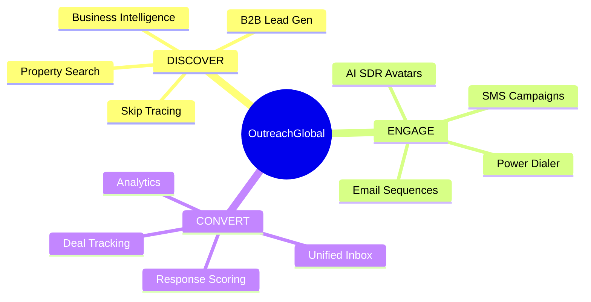

---

# System Architecture

## High-Level Architecture

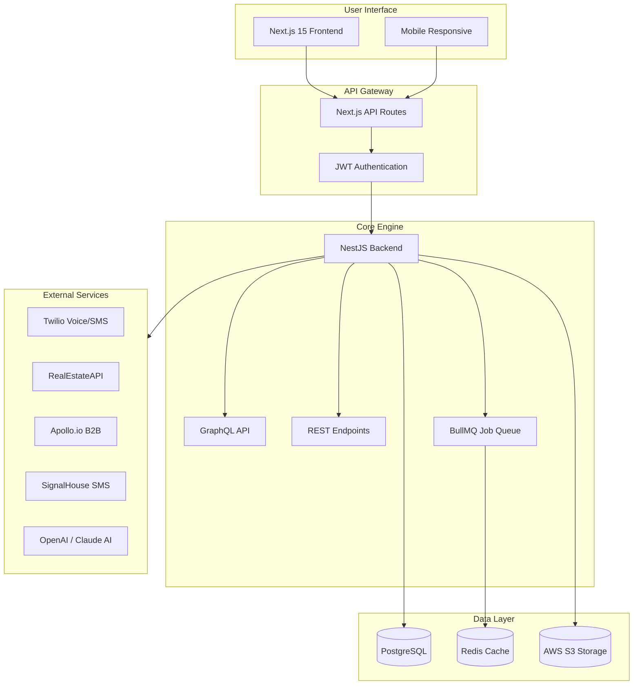

## Database Entity Relationship

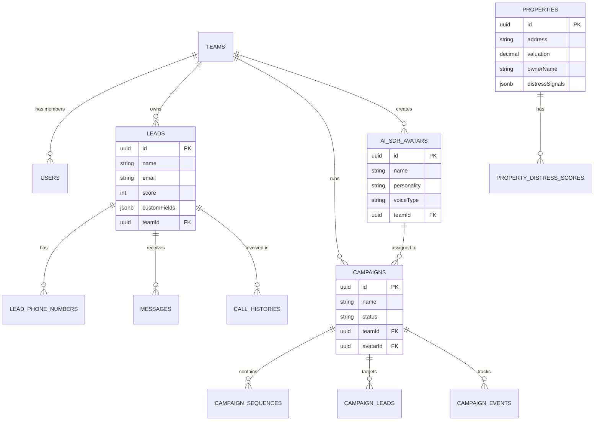

---

# Core Modules

## Module Overview

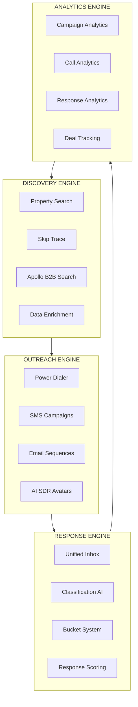

## Campaign State Machine

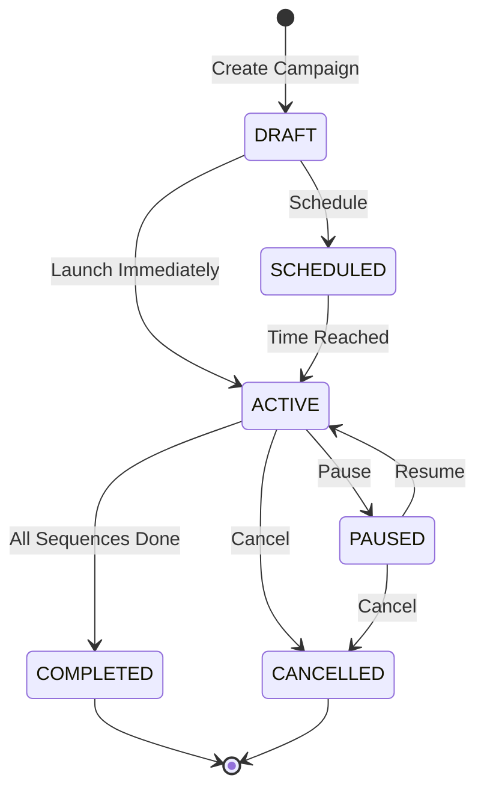

## Message Routing Flow

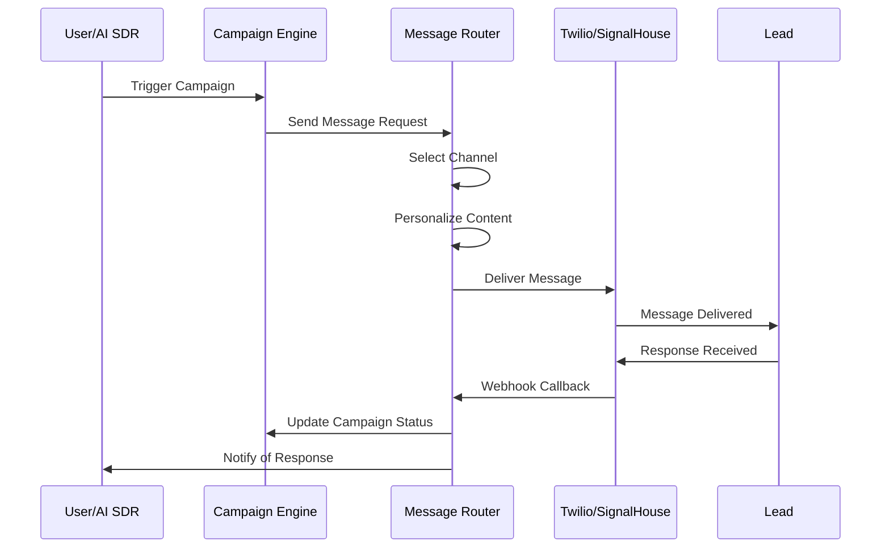

---

# Role-Based Value Propositions

---

## For Real Estate Investors & Wholesalers

> *"In 1626, Peter Minuit purchased Manhattan for $24 worth of goods. Today's best real estate deals aren't found—they're hunted with precision."*

### The Deal Flow

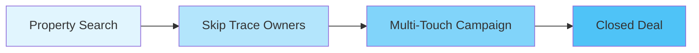

### Your Unfair Advantage

| Challenge | Old Way | OutreachGlobal Way |
|-----------|---------|-------------------|
| Finding distressed properties | Drive for dollars, random MLS | AI-powered distress scoring with pre-foreclosure, tax lien, high-equity filters |
| Getting owner contact info | Pay $1-5 per skip trace, wait days | Instant skip tracing - 5,000 traces/day |
| Initial outreach | Generic "We Buy Houses" postcards | Personalized SMS/voice referencing specific property details |
| Follow-up | Sticky notes, forgotten spreadsheets | Automated 12-touch sequences with intelligent timing |
| Response handling | Check 5 different inboxes | Unified inbox with AI scoring (COLD/WARM/HOT) |

### Property Acquisition Workflow

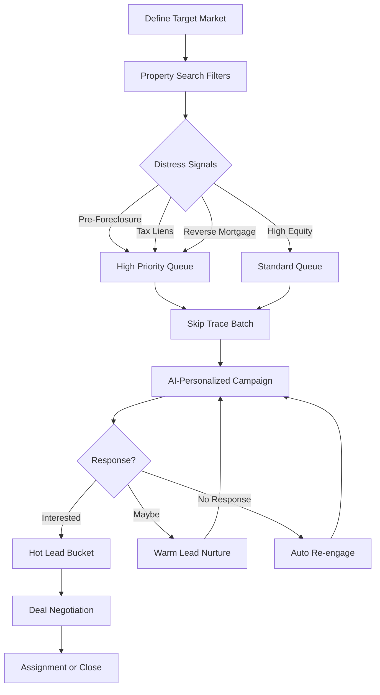

---

## For Business Brokers & M&A Advisors

> *"J.P. Morgan didn't wait for deals to come to him. In 1901, he orchestrated the creation of U.S. Steel by systematically approaching every stakeholder. Your deal flow deserves the same intentionality."*

### Deal Sourcing Pipeline

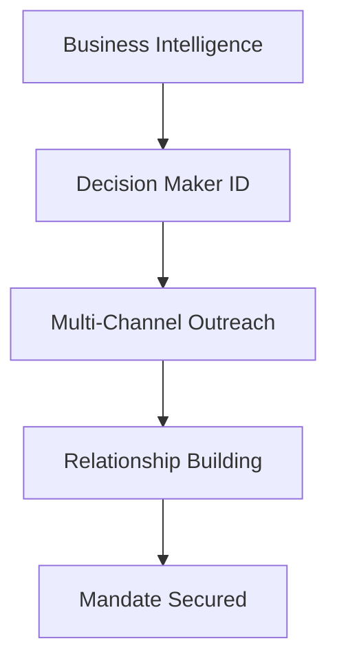

### The Modern Rainmaker's Week

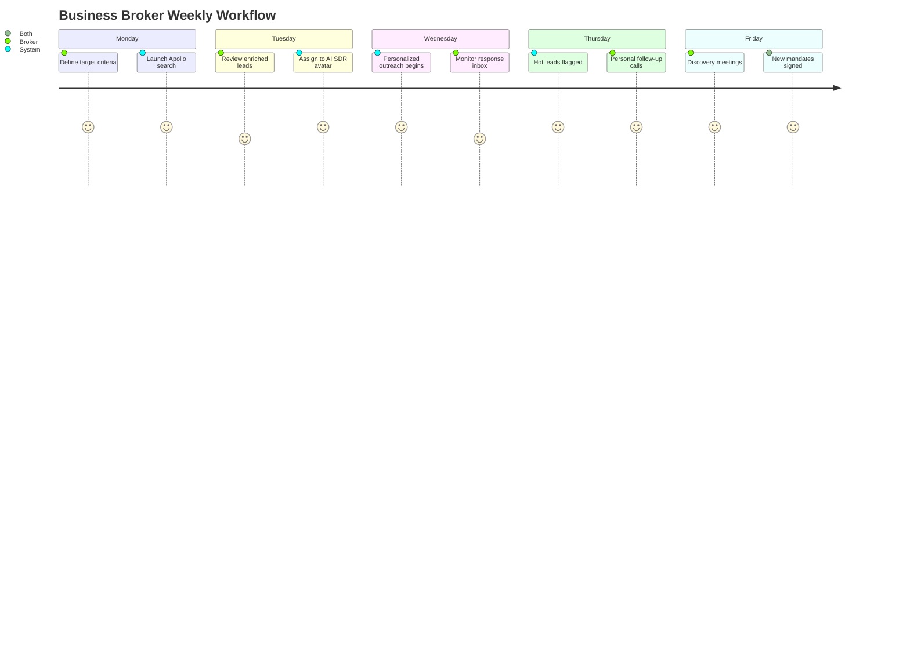

### Target Acquisition Matrix

| Owner Profile | Search Criteria | Outreach Strategy |
|--------------|-----------------|-------------------|
| **Tired Entrepreneur** | 15+ years ownership, declining revenue | Empathy-focused messaging about legacy and retirement |
| **Growth-Stage Exit** | 50-200 employees, recent funding | Strategic buyer match positioning |
| **Distressed Seller** | Negative cash flow, aging receivables | Urgent but respectful outreach |
| **Roll-up Target** | $1-5M EBITDA, fragmented industry | Platform acquisition narrative |

---

## For Solopreneurs & Independent Deal Makers

> *"Marco Polo traveled the Silk Road with a small team and changed global trade. You don't need a sales army—you need a force multiplier."*

### Time Transformation

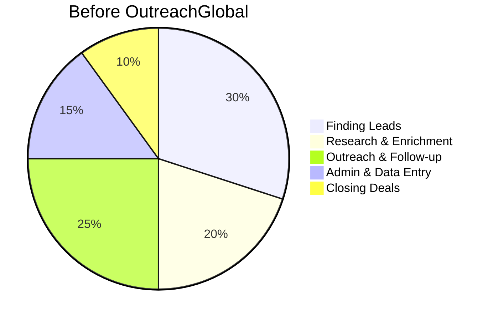

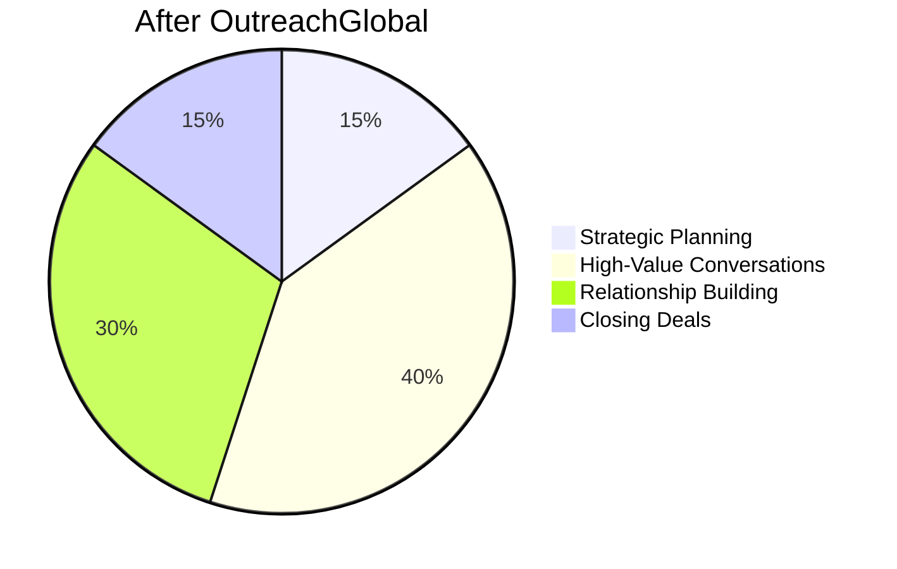

### Your AI-Powered Team of One

| Virtual Team Member | What They Do | OutreachGlobal Feature |
|--------------------|--------------|----------------------|
| **Research Analyst** | Finds and qualifies prospects | Property Search + Apollo B2B |
| **Skip Tracer** | Gets contact information | Skip Trace API (5K/day) |
| **SDR** | Initial outreach & follow-up | AI SDR Avatars |
| **Call Center Agent** | Phone outreach at scale | Power Dialer |
| **Executive Assistant** | Organizes responses | Unified Inbox + Buckets |

### Daily Success Flow

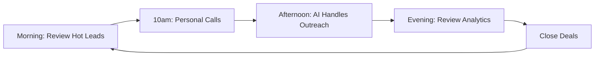

---

## For Private Equity & Enterprise Sales

> *"The House of Medici didn't build their empire through chance. They built systematic relationship networks across Europe. Your deal sourcing should be equally methodical."*

### Enterprise Deal Funnel

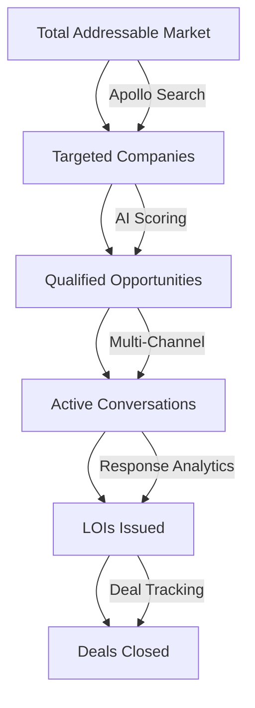

### Portfolio Company Sourcing

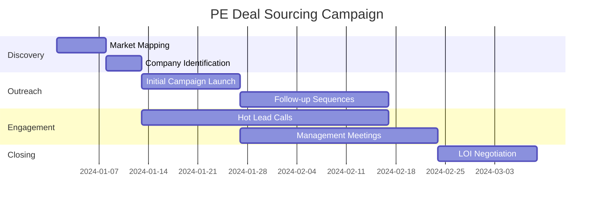

---

## For Note Buyers & Commercial Lenders

> *"The Rothschilds built a banking dynasty by knowing before others where opportunity lay. In note buying, information velocity is everything."*

### Intelligence Stack

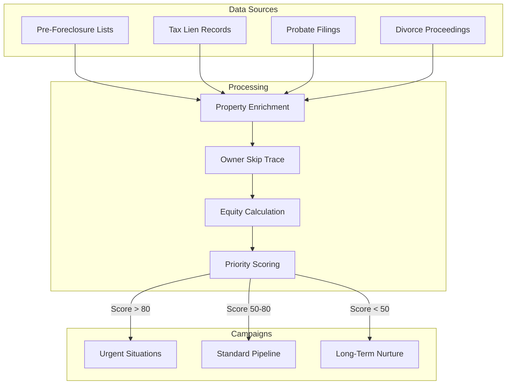

---

## For Franchise Brokers

> *"Ray Kroc didn't just sell hamburgers—he sold the American Dream. Every franchise inquiry is someone's dream waiting to be realized."*

### Lead Nurturing Sequence

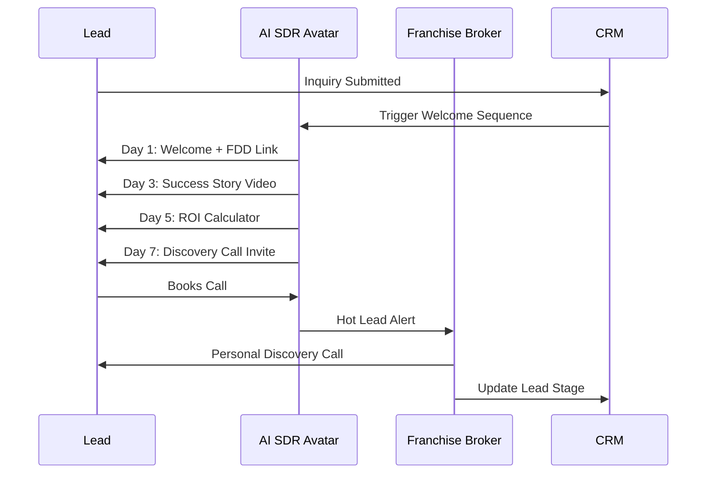

---

# Data Flow & Workflows

## Complete Lead Lifecycle

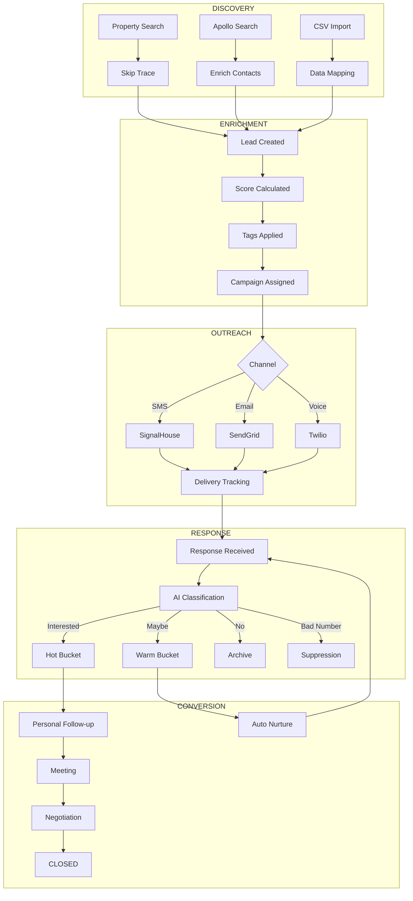

## AI SDR Avatar Flow

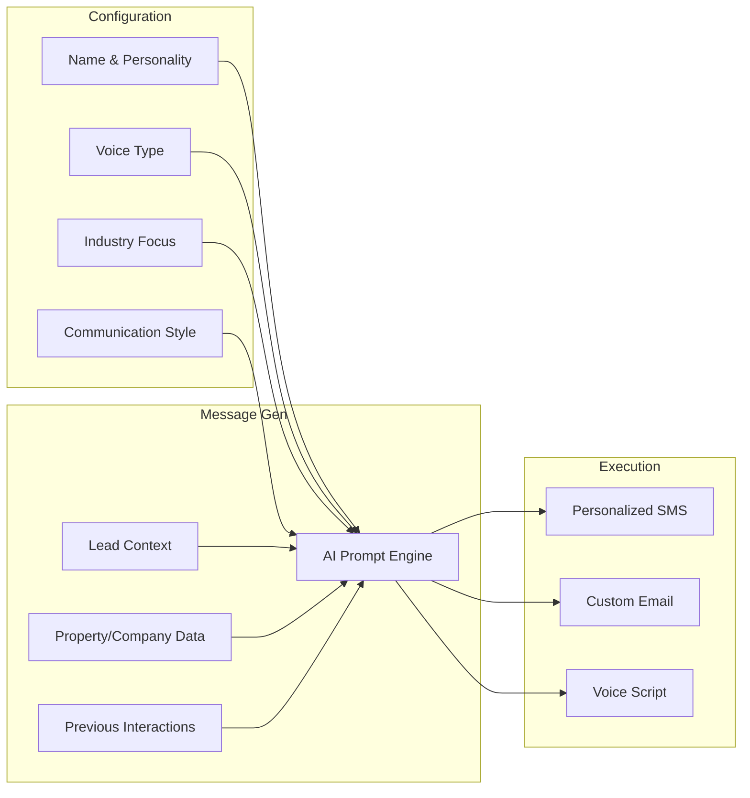

---

# Integration Ecosystem

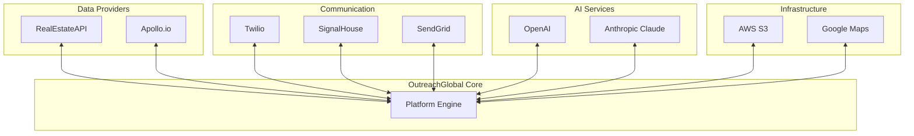

---

# Deployment Architecture

```mermaid
graph TB
    subgraph DO["DigitalOcean App Platform"]
        subgraph Apps["App Services"]
            FE[Next.js Frontend - Port 3000]
            BE[NestJS Backend - Port 3001]
        end

        subgraph Managed["Managed Services"]
            DB[(PostgreSQL)]
            RD[(Redis)]
        end

        subgraph Net["Networking"]
            LB[Load Balancer]
            DNS[DNS / SSL]
        end
    end

    subgraph Ext["External"]
        CDN[DO Spaces CDN]
        API[External APIs]
    end

    DNS --> LB
    LB --> FE
    LB --> BE
    FE --> BE
    BE --> DB
    BE --> RD
    BE --> CDN
    BE --> API
```

---

# Historical Parallels: Deal-Making Through the Ages

| Era | Deal Maker | Their "Tech Stack" | OutreachGlobal Equivalent |
|-----|-----------|-------------------|--------------------------|
| **1500 BC** | Phoenician Traders | Ship routes, trade agreements, messenger networks | Multi-channel campaigns, automated sequences |
| **1400s** | Medici Bankers | Coded letters, trusted couriers, relationship ledgers | Encrypted messaging, CRM, lead scoring |
| **1800s** | Robber Barons | Telegraph, rail networks, newspaper influence | Real-time communication, power dialer, analytics |
| **1950s** | Door-to-Door Sales | Rolodex, maps, call sheets | Contact database, territory management |
| **2024** | Modern Deal Makers | OutreachGlobal | The integrated command center |

> *"The only difference between then and now is velocity. A Medici banker might wait weeks for a response. You'll know in minutes."*

---

# Quick Reference

```
+------------------------------------------------------------------+
|                    OUTREACH GLOBAL CHEAT SHEET                    |
+------------------------------------------------------------------+
|                                                                   |
|  FIND LEADS                                                       |
|     -> Property Search: Filter by distress, equity, location      |
|     -> Apollo Search: B2B by revenue, industry, employees         |
|     -> Skip Trace: Get phones & emails (5K/day)                   |
|                                                                   |
|  REACH OUT                                                        |
|     -> AI SDR Avatars: Personalized at scale                      |
|     -> Power Dialer: 3x your call volume                          |
|     -> SMS Campaigns: 98% open rates                              |
|                                                                   |
|  MANAGE RESPONSES                                                 |
|     -> Unified Inbox: One place for everything                    |
|     -> AI Scoring: COLD -> WARM -> HOT                            |
|     -> Bucket System: Kanban for responses                        |
|                                                                   |
|  TRACK RESULTS                                                    |
|     -> Campaign Analytics: What's working                         |
|     -> Response Rates: By channel, time, message                  |
|     -> Deal Pipeline: From lead to close                          |
|                                                                   |
+------------------------------------------------------------------+
```

---

# Glossary

| Term | Definition |
|------|------------|
| **AI SDR** | AI Sales Development Representative - automated outreach avatar |
| **Skip Trace** | Finding contact information for property owners |
| **Power Dialer** | Automated phone dialing system for high-volume calling |
| **Campaign Sequence** | Multi-step automated outreach with timed delays |
| **Response Bucket** | Categorized containers for organizing lead responses |
| **Distress Score** | Numerical indicator of property owner motivation to sell |
| **Hot Lead** | Highly engaged prospect ready for personal contact |
| **Unified Inbox** | Single view of all responses across channels |

---

*Document Version: 1.0 | December 2024 | OutreachGlobal v2.0*

> *"Fortune favors the prepared mind, but fortune favors even more the prepared mind with automated follow-up sequences."*
> — Adapted from Louis Pasteur
