# OutreachGlobal Platform Overview

## The Numbers Game, Played Systematically

---

## The Core Thesis

**Sales is a numbers game.** Everyone knows this. But most companies play it wrong—manually, inconsistently, and without the infrastructure to compound their wins.

OutreachGlobal transforms outreach from a random hustle into a **manufacturing process** for positive responses.

---

## SMS: The Gateway to Everything Else

**SMS is the backbone.** It's not the destination—it's the **path** to phone calls, Zoom meetings, and in-person deals.

```mermaid
graph LR
    subgraph ENTRY["📱 SMS: The Gateway"]
        A[Initial Text]
    end

    subgraph ESCALATION["📈 The Escalation Ladder"]
        B[📞 Phone Call]
        C[💻 Zoom Meeting]
        D[🤝 In-Person]
        E[💰 Closed Deal]
    end

    A -->|"Response"| B
    B -->|"Qualified"| C
    C -->|"High Intent"| D
    D -->|"Decision"| E

    style ENTRY fill:#e3f2fd
    style E fill:#c8e6c9,stroke:#2e7d32,stroke-width:3px
```



### Why SMS First?

| Channel | Open Rate | Response Time | Friction |
|---------|-----------|---------------|----------|
| **SMS** | **98%** | **90 seconds** | **Zero** |
| Email | 20% | 24+ hours | Medium |
| Cold Call | 2% answer | Immediate | High |
| LinkedIn | 10% | Days | Medium |

**SMS opens doors that other channels can't.**

But SMS alone doesn't close deals. It creates the opportunity for higher-value conversations:

```mermaid
flowchart TB
    subgraph VOLUME["📊 High Volume (SMS)"]
        SMS1[1,000 Initial Texts]
        SMS2[150 Responses]
    end

    subgraph QUALIFICATION["🎯 Qualification"]
        Q1[100 Interested]
        Q2[50 Need It Now]
    end

    subgraph HIGHVALUE["💎 High-Value Interactions"]
        P[30 Phone Calls]
        Z[15 Zoom Meetings]
        IP[5 In-Person]
    end

    subgraph CLOSE["💰 Closed"]
        DEAL[3-5 Deals]
    end

    SMS1 --> SMS2
    SMS2 --> Q1
    Q1 --> Q2
    Q2 --> P
    P --> Z
    Z --> IP
    IP --> DEAL

    style VOLUME fill:#e3f2fd
    style QUALIFICATION fill:#fff3e0
    style HIGHVALUE fill:#f3e5f5
    style CLOSE fill:#c8e6c9
```



### The Conversion Reality

**You can't get to phone calls without conversations.**
**You can't get conversations without responses.**
**You can't get responses without systematic outreach.**

SMS is the **top of the funnel** that feeds everything else.


**The math is simple:**
- More texts → More responses
- More responses → More calls
- More calls → More meetings
- More meetings → More deals

**SMS is the engine that powers the entire sales motion.**

---

## SignalHouse Infrastructure: Omni-Campaign Engine

Every organization is a **campaign factory**. SignalHouse provides the infrastructure to run unlimited parallel campaigns across your entire org.

```mermaid
graph TB
    subgraph SIGNALHOUSE["☁️ SignalHouse Infrastructure"]
        API[API Layer]
        NUMBERS[Phone Number Pool]
        GATEWAY[SMS Gateway]
        COMPLIANCE[10DLC Registry]
    end

    subgraph PLATFORM["🏢 OutreachGlobal Platform"]
        SUPER[Super Admin]
    end

    subgraph ORGS["📊 Organizations"]
        subgraph ORG1["Org A: Roofing Co"]
            C1A[Campaign: Storm Follow-up]
            C1B[Campaign: New Leads]
            C1C[Campaign: Re-engagement]
        end

        subgraph ORG2["Org B: Solar Agency"]
            C2A[Campaign: Homeowners 2024]
            C2B[Campaign: Commercial]
        end

        subgraph ORG3["Org C: Insurance"]
            C3A[Campaign: Medicare]
            C3B[Campaign: Auto Quotes]
            C3C[Campaign: Life Insurance]
        end
    end

    SUPER --> ORG1
    SUPER --> ORG2
    SUPER --> ORG3

    ORG1 --> NUMBERS
    ORG2 --> NUMBERS
    ORG3 --> NUMBERS

    NUMBERS --> GATEWAY
    GATEWAY --> API

    style SIGNALHOUSE fill:#e3f2fd
    style PLATFORM fill:#f3e5f5
    style ORGS fill:#e8f5e9
```



### The Omni-Campaign Model

**One organization. Unlimited campaigns. Parallel execution.**


### How It Maps to SignalHouse

| OutreachGlobal Concept | SignalHouse Infrastructure |
|------------------------|---------------------------|
| **Organization (Team)** | Account with dedicated phone numbers |
| **Campaign** | Messaging campaign with 10DLC registration |
| **Phone Number** | Purchased/provisioned number in pool |
| **Contact List** | Recipients for outbound messaging |
| **Message Template** | Content sent via API |
| **Webhook** | Delivery receipts & inbound handling |

### Creating Users = Spinning Up Campaign Engines

Every new user/org you create gets their own:

```mermaid
graph TB
    subgraph NEWUSER["🆕 New Organization Created"]
        U[Organization: "ABC Roofing"]
    end

    subgraph AUTO["⚡ Auto-Provisioned"]
        PN[Phone Number(s)]
        BR[10DLC Brand]
        CP[Campaign Registration]
        WH[Webhooks Configured]
        DB[Isolated Data Store]
    end

    subgraph READY["✅ Ready to Run"]
        C1[Campaign 1]
        C2[Campaign 2]
        C3[Campaign N...]
    end

    U --> PN
    U --> BR
    U --> CP
    U --> WH
    U --> DB

    PN --> C1
    PN --> C2
    PN --> C3

    style NEWUSER fill:#bbdefb
    style AUTO fill:#fff9c4
    style READY fill:#c8e6c9
```

### The Scaling Reality

```
1 Organization = 1 SignalHouse Sub-Account
    └── N Phone Numbers (from shared pool or dedicated)
        └── M Campaigns (unlimited, parallel)
            └── X Contacts per campaign (unlimited)
                └── Y Messages per day (based on 10DLC throughput)
```

**Example Scale:**

| Orgs | Numbers/Org | Campaigns/Org | Contacts/Campaign | Daily Messages |
|------|-------------|---------------|-------------------|----------------|
| 10 | 5 | 10 | 1,000 | 500,000 |
| 50 | 10 | 20 | 2,500 | 2,500,000 |
| 100 | 20 | 50 | 5,000 | 10,000,000 |

**All running in parallel. All through SignalHouse.**

### Campaign Lifecycle


### Why This Architecture Wins

1. **Isolation** - Each org's data is completely separate
2. **Scalability** - Add orgs/campaigns without infrastructure changes
3. **Compliance** - Each org has proper 10DLC registration
4. **Parallel Execution** - All campaigns run simultaneously
5. **Unified Analytics** - Super admin sees everything, orgs see theirs

```mermaid
graph LR
    subgraph YOU["👑 You (Super Admin)"]
        DASH[Master Dashboard]
    end

    subgraph VIEW["What You See"]
        A1[Org A: 50K msgs today]
        A2[Org B: 120K msgs today]
        A3[Org C: 30K msgs today]
        A4[Total: 200K msgs today]
    end

    subgraph THEY["What Each Org Sees"]
        B1[Their campaigns only]
        B2[Their contacts only]
        B3[Their analytics only]
    end

    DASH --> VIEW
    A1 -.-> B1
    A2 -.-> B1
    A3 -.-> B1

    style YOU fill:#f3e5f5
    style VIEW fill:#e8f5e9
    style THEY fill:#e3f2fd
```



---

## The Compounding Machine

---

## The Problem We Solve

### Before OutreachGlobal

| Activity | Reality |
|----------|---------|
| Manual texting | Inconsistent, slow, burns out reps |
| No tracking | Can't measure what works |
| Siloed data | Each rep has their own phone |
| Compliance risk | No opt-out tracking, carrier bans |
| Can't scale | Linear effort = linear results |

### After OutreachGlobal

| Activity | Reality |
|----------|---------|
| Systematic campaigns | Consistent, measured, optimized |
| Full analytics | Know exactly what's working |
| Centralized platform | All data in one place |
| Built-in compliance | 10DLC, opt-outs, carrier-safe |
| Compounds growth | Exponential effort = exponential results |

---

## The Compounding Machine


---

## How It Works (The Simple Version)

### Step 1: Load Your Contacts

Upload your list. Could be 100 contacts or 100,000. The platform ingests them, cleans them, validates phone numbers, and prepares them for outreach.

```mermaid
graph LR
    A[📋 Raw List] --> B[🔍 Validation]
    B --> C[✅ Clean Contacts]
    B --> D[❌ Invalid Numbers]

    style C fill:#c8e6c9
    style D fill:#ffcdd2
```



**Checkpoint: Clean, validated contact database ready for outreach.**

---

### Step 2: Set Up Your Campaigns

Define what you're going to say, when you're going to say it, and how you'll handle responses.

```mermaid
graph TB
    subgraph CAMPAIGN["Campaign Setup"]
        A[Choose Template] --> B[Set Schedule]
        B --> C[Define Rules]
        C --> D[Assign Phone Numbers]
    end

    D --> E{Launch?}
    E -->|Yes| F[🚀 Campaign Active]
    E -->|No| G[📝 Draft Saved]
```



**Checkpoint: Campaign configured with messaging, timing, and response rules.**

---

### Step 3: The Outreach Flywheel

Messages go out systematically. Responses come back. AI triages them. Humans close deals.


**Checkpoint: Automated outreach generating qualified conversations for humans.**

---

### Step 4: Measure Everything

What gets measured gets improved. Track every metric that matters.


Key metrics we track:

| Metric | What It Tells You |
|--------|-------------------|
| **Response Rate** | How compelling is your opening? |
| **Positive Rate** | Are you reaching the right people? |
| **Conversion Rate** | Is your team closing? |
| **Time to Response** | How fast are leads engaging? |
| **Best Performing Templates** | What messaging works? |
| **Best Days/Times** | When should you reach out? |

**Checkpoint: Full visibility into what's working and what's not.**

---

### Step 5: Compound Your Wins

The magic happens when you use data to get better every week.


**The compound effect in action:**

| Week | Messages Sent | Response Rate | Positive Responses |
|------|--------------|---------------|-------------------|
| 1 | 1,000 | 10% | 100 |
| 4 | 1,000 | 14% | 140 |
| 8 | 1,000 | 18% | 180 |
| 12 | 1,000 | 22% | 220 |

**Same effort. 2.2x the results.** That's compounding.

**Checkpoint: Continuous improvement loop driving exponential results.**

---

## The Multi-Tenant Advantage

OutreachGlobal isn't just for one company. It's built to power agencies, franchises, and enterprises with multiple teams.


Each company gets:
- Their own phone numbers
- Their own contacts
- Their own campaigns
- Their own team members
- Complete data isolation

---

## White-Label Ready

Agencies and resellers can put their own brand on it.


Your clients see YOUR brand. You control features, pricing, and experience. We power the backend.

---

## The Journey: From Zero to Systematic


---

## The Daily Reality

What does using OutreachGlobal actually look like day-to-day?

### Morning (8am)

```mermaid
graph LR
    A[☀️ Campaign Launches] --> B[Messages Go Out]
    B --> C[First Responses Arrive]
```


### Midday (12pm)

```mermaid
graph LR
    A[📊 Check Dashboard] --> B[See Response Rates]
    B --> C[AI Flagged Hot Leads]
    C --> D[Reps Follow Up]
```


### Afternoon (4pm)

```mermaid
graph LR
    A[📈 Review Performance] --> B[Optimize Tomorrow's Campaign]
    B --> C[Adjust Templates]
    C --> D[Schedule Next Batch]
```


### End of Week
```mermaid
graph LR
    A[📋 Weekly Report] --> B[What Worked?]
    B --> C[What Didn't?]
    C --> D[Plan Next Week]
    D --> E[Compound the Wins]
```

---

## Key Checkpoints Summary

```mermaid
graph TB
    CP1[✅ Checkpoint 1<br/>Clean Contact Database]
    CP2[✅ Checkpoint 2<br/>Campaigns Configured]
    CP3[✅ Checkpoint 3<br/>Outreach Generating Conversations]
    CP4[✅ Checkpoint 4<br/>Full Analytics Visibility]
    CP5[✅ Checkpoint 5<br/>Compounding Improvement Loop]

    CP1 --> CP2 --> CP3 --> CP4 --> CP5

    CP5 -->|Repeat| CP3

    style CP1 fill:#e8f5e9
    style CP2 fill:#e8f5e9
    style CP3 fill:#e8f5e9
    style CP4 fill:#e8f5e9
    style CP5 fill:#c8e6c9,stroke:#2e7d32,stroke-width:3px
```

---

## The Bottom Line

**Sales is a numbers game.** But it's not about working harder—it's about building a machine that compounds your effort.

OutreachGlobal gives you:

1. **Systematic outreach** instead of random hustle
2. **AI-powered triage** so humans focus on closers
3. **Full analytics** to know what's working
4. **Compounding improvement** every single week
5. **Scalable infrastructure** that grows with you

The companies that win aren't the ones with the most reps. They're the ones with the best systems.

**Build the machine. Compound the wins. Dominate your market.**

---

## Ready to Start?

```mermaid
graph LR
    A[📞 Book Demo] --> B[🔧 Setup]
    B --> C[🚀 Launch]
    C --> D[📈 Compound]

    style A fill:#bbdefb
    style B fill:#c5cae9
    style C fill:#b2dfdb
    style D fill:#c8e6c9
```

Contact: **admin@outreachglobal.io**

---

*OutreachGlobal: Manufacture Positive Responses. Compound Your Growth.*
