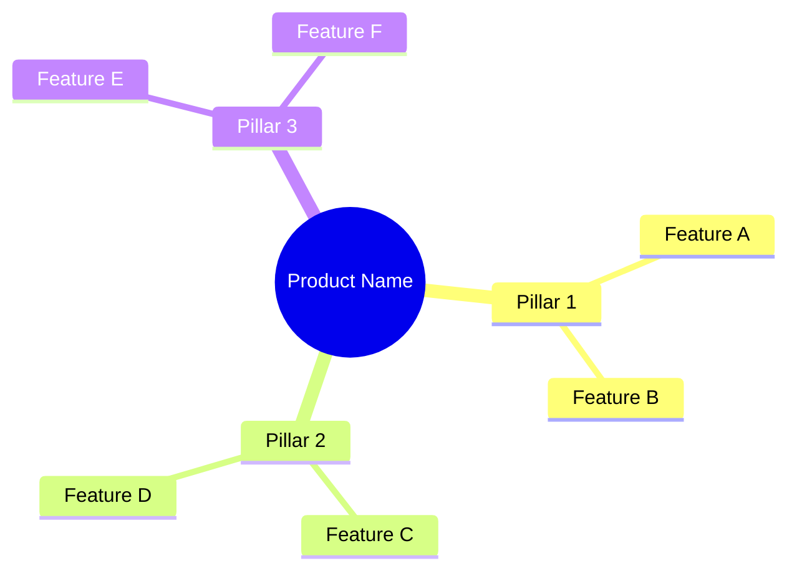
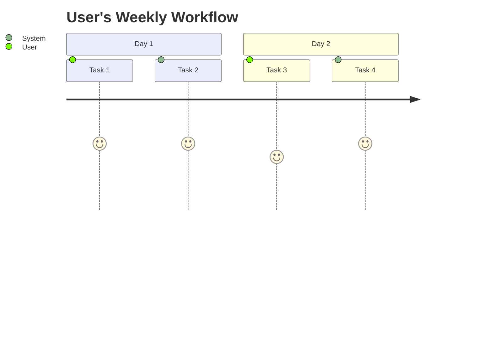
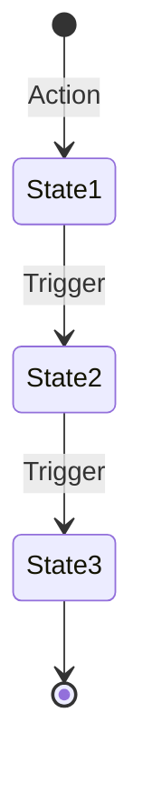
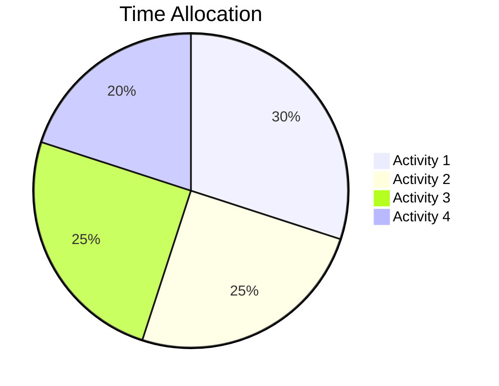
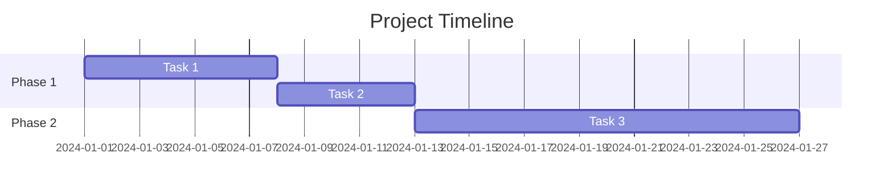

# Prompt Template: SDD with Historical Copy & Role-Based Messaging

Use this prompt to generate compelling Software Design Documents with Mermaid diagrams, non-technical overviews, and role-based marketing copy.

---

## The Master Prompt

```
You are a world-class technical writer and brand storyteller. Create a comprehensive Software Design Document (SDD) for [PRODUCT_NAME], a [BRIEF_DESCRIPTION].

## Requirements:

### 1. NON-TECHNICAL OVERVIEW
Write an executive summary that any business person can understand. Use analogies and plain language. Explain the "what" and "why" before the "how."

### 2. MERMAID DIAGRAMS
Include the following diagram types:
- mindmap: For feature overview
- flowchart TB/LR: For system architecture and workflows
- erDiagram: For database relationships
- sequenceDiagram: For API/message flows
- stateDiagram-v2: For state machines
- journey: For user experience flows
- pie: For data distribution visualization
- gantt: For timeline/project flows

### 3. ROLE-BASED VALUE PROPOSITIONS
Create compelling copy for each user persona:
[LIST YOUR PERSONAS - e.g., Solopreneur, Enterprise Sales, Business Broker, etc.]

For each role, include:
- A historical quote or reference that resonates with their work
- A "Before vs After" comparison table
- A workflow diagram specific to their use case
- Concrete benefits in their language

### 4. HISTORICAL PARALLELS
Draw connections between the product and famous historical deal-makers, traders, or business legends. Examples:
- Phoenician traders (ancient commerce networks)
- Medici bankers (relationship management, coded communications)
- Silk Road merchants (Marco Polo - small team, big impact)
- Industrial titans (J.P. Morgan, Rockefeller - systematic approaches)
- Modern disruptors (appropriate contemporary examples)

Use quotes (real or adapted) that connect ancient wisdom to modern technology.

### 5. TONE & STYLE GUIDELINES
- Authoritative but accessible
- Use metaphors from history, warfare, exploration, and empire-building
- Make technical concepts feel epic and meaningful
- Write copy that makes users feel like they're part of something historic
- Avoid jargon unless immediately explained
- Use tables for comparisons
- Include a "Quick Reference Card" at the end

### 6. STRUCTURE
1. Executive Summary with historical hook
2. Non-Technical Overview (The Three Pillars mindmap)
3. System Architecture (technical diagrams)
4. Core Modules Deep Dive
5. Role-Based Value Propositions (one section per persona)
6. Data Flow & Workflows
7. Integration Ecosystem
8. Deployment Architecture
9. Historical Parallels Table
10. Quick Reference Card
11. Glossary

## Product Details to Include:
[INSERT YOUR PRODUCT'S FEATURES, TECH STACK, INTEGRATIONS, etc.]

## Target Personas:
[LIST EACH PERSONA WITH A BRIEF DESCRIPTION OF THEIR PAIN POINTS]

---

Generate the complete SDD with all Mermaid diagrams properly formatted.
```

---

## Example Persona Descriptions to Include

### Real Estate / Property Investors
```
**Persona: Real Estate Investor / Wholesaler**
- Pain Points: Finding motivated sellers, skip tracing costs, manual follow-up
- Language: "Deals," "motivated sellers," "assignment fees," "distress signals"
- Historical Reference: Land deals, territorial expansion, property dynasties
- Tone: Hustle-focused, ROI-driven, competitive advantage
```

### Business Brokers / M&A
```
**Persona: Business Broker / M&A Advisor**
- Pain Points: Deal sourcing, owner outreach, relationship building at scale
- Language: "Mandates," "deal flow," "multiples," "LOI," "due diligence"
- Historical Reference: J.P. Morgan, the Medicis, investment banking origins
- Tone: Sophisticated, relationship-focused, long-game mentality
```

### Solopreneurs
```
**Persona: Solopreneur / Independent Operator**
- Pain Points: Limited time, wearing all hats, can't afford a team
- Language: "Leverage," "scale myself," "automation," "time freedom"
- Historical Reference: Marco Polo, lone explorers, small teams with big impact
- Tone: Empowering, efficiency-focused, David vs Goliath narrative
```

### Enterprise / Private Equity
```
**Persona: Private Equity / Enterprise Sales**
- Pain Points: Systematic deal sourcing, portfolio company identification
- Language: "Platform plays," "roll-ups," "thesis-driven," "pipeline"
- Historical Reference: The Medicis, Rothschilds, systematic empire builders
- Tone: Methodical, data-driven, institutional quality
```

### Note Buyers / Lenders
```
**Persona: Note Buyer / Commercial Lender**
- Pain Points: Information velocity, finding distressed assets first
- Language: "Paper," "NPLs," "performing notes," "yield," "collateral"
- Historical Reference: Rothschild banking dynasty, information arbitrage
- Tone: Analytical, speed-focused, information advantage
```

### Franchise Brokers
```
**Persona: Franchise Broker / Business Consultant**
- Pain Points: Lead nurturing, qualification, long sales cycles
- Language: "FDD," "validation calls," "item 19," "territory"
- Historical Reference: Ray Kroc, franchise pioneers, dream-selling
- Tone: Aspirational, educational, dream-enabler
```

---

## Historical Quote Bank

Use or adapt these for your copy:

### On Persistence & Follow-Up
> "The fortune is in the follow-up." — Sales wisdom through the ages

> "Fortune favors the prepared mind, but fortune favors even more the prepared mind with automated follow-up sequences." — Adapted from Louis Pasteur

### On Information Advantage
> "He who has the information, has the power." — Attributed to various historical figures

> "The Rothschilds built an empire on knowing before others what would happen next."

### On Systems & Scale
> "J.P. Morgan didn't wait for deals to come to him. He systematically approached every stakeholder."

> "The House of Medici didn't build their empire through chance encounters. They built systematic relationship networks across Europe."

### On Small Teams, Big Impact
> "Marco Polo traveled the Silk Road with a small team and changed global trade. You don't need a sales army—you need a force multiplier."

### On Seizing Opportunity
> "In 1626, Peter Minuit purchased Manhattan for $24 worth of goods. Today's best deals aren't found—they're hunted with precision."

> "Ray Kroc didn't just sell hamburgers—he sold the American Dream of business ownership."

### On Speed & Velocity
> "The only difference between then and now is velocity. A Medici banker might wait weeks for a response. You'll know in minutes."

---

## Mermaid Diagram Templates

### Mindmap (Feature Overview)


### Journey Map (User Experience)


### State Machine (Status Flow)


### Pie Chart (Distribution)


### Gantt Chart (Timeline)


---

## Quick Tips

1. **Start with emotion, end with logic** - Hook them with the historical reference, then deliver the technical goods

2. **One hero diagram per section** - Don't overwhelm; pick the most impactful visualization

3. **Tables for comparisons** - "Old Way vs New Way" is always compelling

4. **Quote placement** - Put historical quotes at the start of role-based sections

5. **Keep the glossary** - It shows professionalism and helps newcomers

6. **The Quick Reference Card** - This becomes the most-shared part of the doc

---

*Template Version: 1.0 | December 2024*
