# RealEstate API Explorer - Non-Technical Overview

## 🎯 What is This?

The RealEstate API Explorer is a powerful property intelligence platform that helps real estate investors find, analyze, and target motivated sellers. It's like having a supercharged property search engine combined with a deal-scoring AI that tells you which properties are the best opportunities.

## 📊 System Architecture

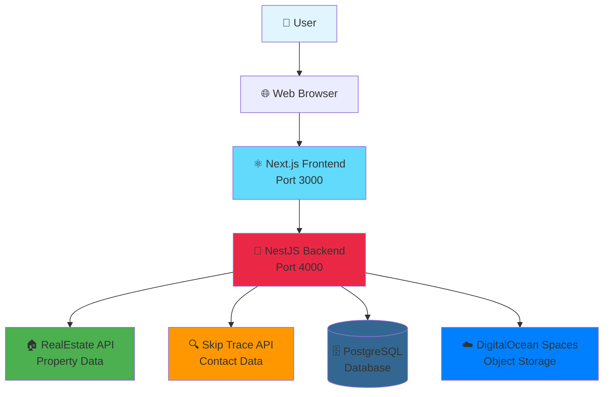

## 🔄 How the System Works

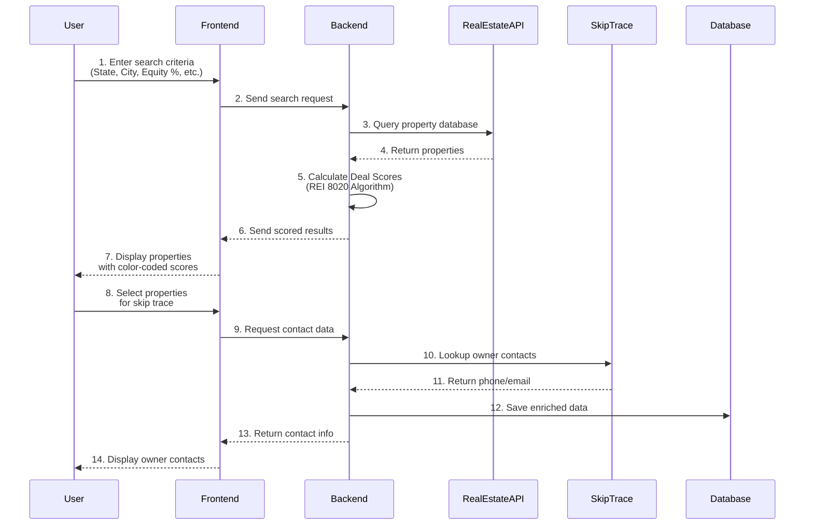

## 🎨 User Journey - Step by Step

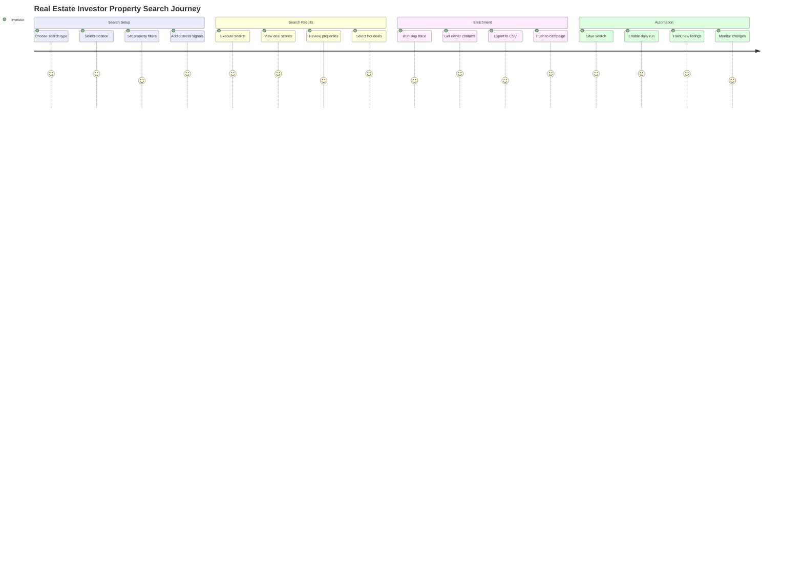

## 🏆 Deal Scoring System (REI 8020 Algorithm)

The system automatically scores every property from 0-100 based on multiple factors:

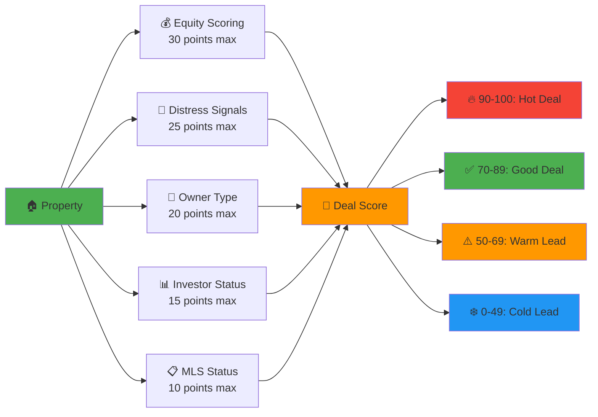

### Scoring Breakdown:

**Equity Scoring (0-30 points)**
- 80%+ equity = 30 points (Owned outright or nearly)
- 60-79% equity = 20 points (Good equity position)
- 40-59% equity = 10 points (Moderate equity)

**Distress Signals (0-25 points)**
- Pre-foreclosure = 15 points
- Foreclosure = 15 points
- Vacant property = 10 points
- Lis Pendens = 10 points

**Owner Type (0-20 points)**
- Absentee owner = 10 points (Lives elsewhere)
- Out-of-state = 5 points (Harder to manage)
- Corporate owned = 5 points (Business decision-makers)

**Portfolio/Investor (0-15 points)**
- 10+ properties = 15 points (Active investor)
- 5-9 properties = 10 points (Growing portfolio)
- 2-4 properties = 5 points (Small investor)

**MLS Status (0-10 points)**
- Off-market = 10 points (Less competition)
- Listed = 0 points (Public market)

## 🔍 Three-Step Search Wizard

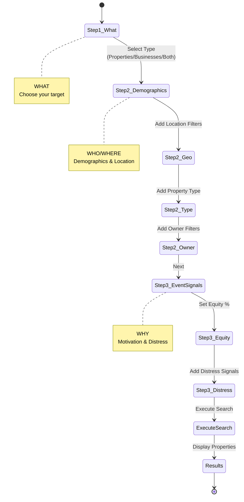

## 🎯 Key Features

### 1. Property Search (60+ Filters)
Search properties using sophisticated filters across multiple categories:

**Geographic Filters:**
- State, City, County, Zip Code
- Macro zip code targeting (search multiple zips at once)

**Property Characteristics:**
- Property Type (Single Family, Multi-Family, Commercial, Land)
- Building Size, Lot Size
- Bedrooms, Bathrooms
- Year Built, Units

**Financial Filters:**
- Market Value (min/max)
- Assessed Value
- Equity Percentage
- Loan Amount

**Owner Intelligence:**
- Absentee Owner
- Out-of-State Owner
- Corporate Owned
- Years Owned (5+ years filter)
- Portfolio Size (properties owned)
- Recent Purchases (last 12 months)

**Distress/Event Signals:**
- Pre-Foreclosure
- Foreclosure
- Vacant Property
- Lis Pendens
- Auction
- Recently Sold (last 12 months)

### 2. Four View Modes

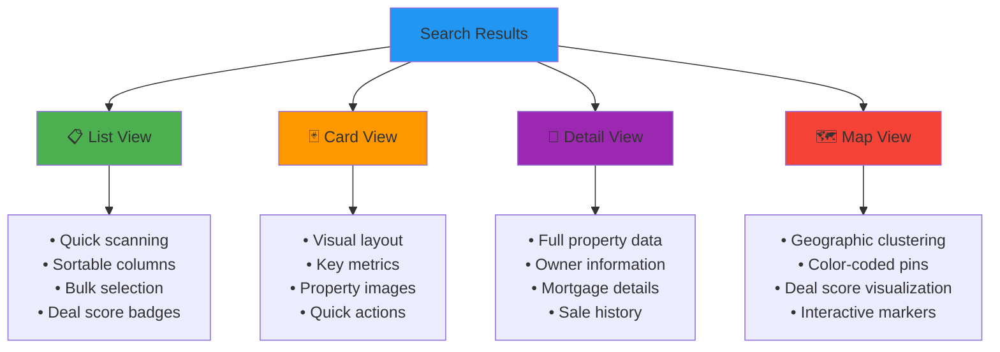

### 3. Skip Trace Integration

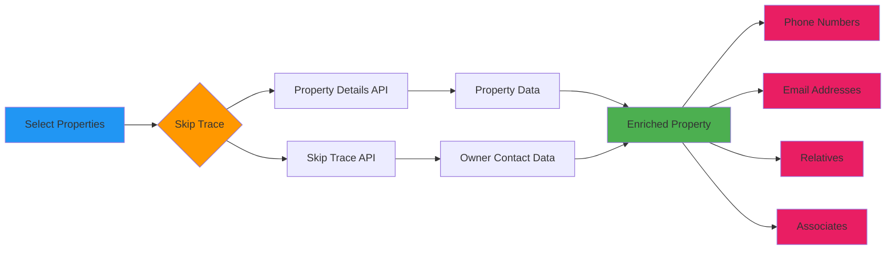

### 4. Saved Search Automation

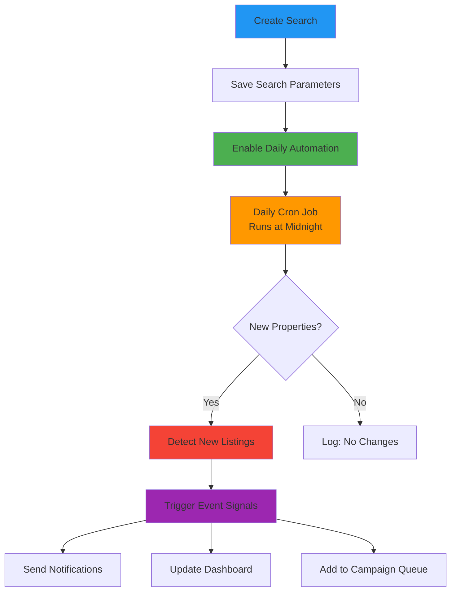

### 5. Campaign Integration

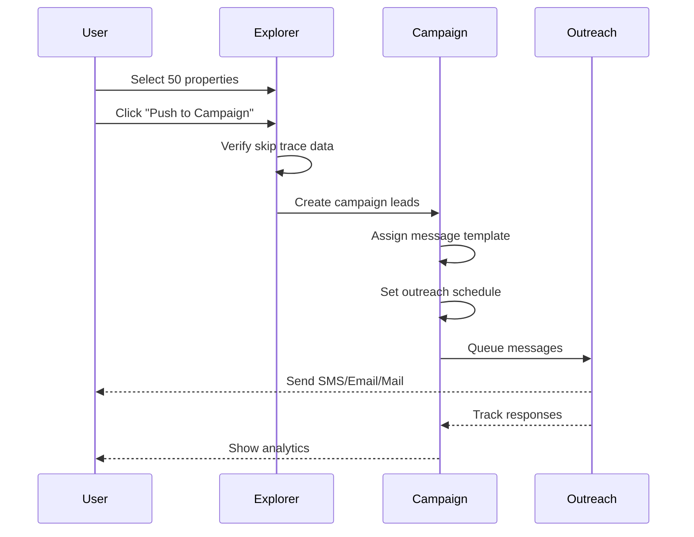

## 📁 Data Flow Architecture

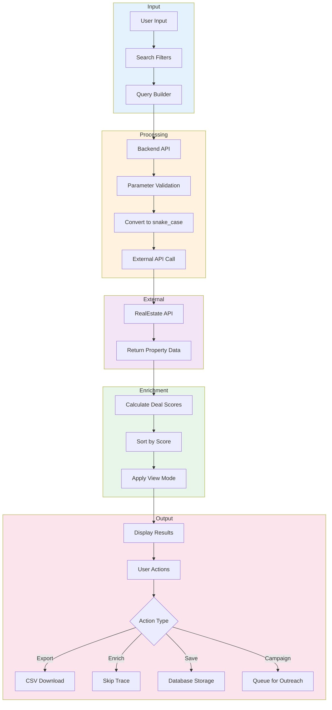

## 🎮 User Interface Layout

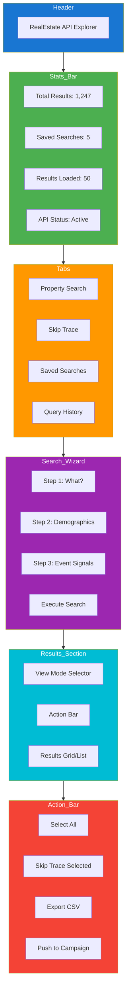

## 🔐 Authentication & Security

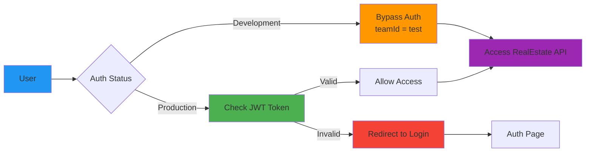

**Current State:**
- Development Mode: Authentication disabled (`teamId = "test"`)
- All users can access the RealEstate API Explorer
- No login required for testing

**Production State:**
- JWT-based authentication
- Team-based access control
- User permissions via team policies

## 📊 Database Schema

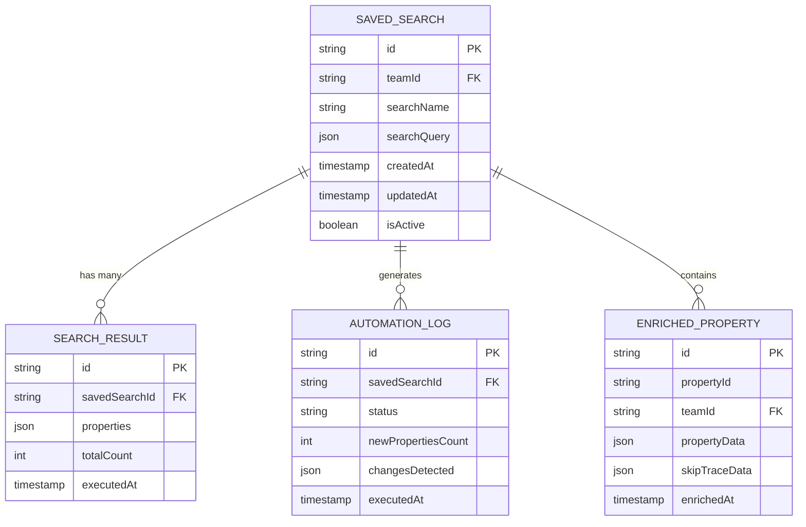

## 🚀 Deployment Architecture

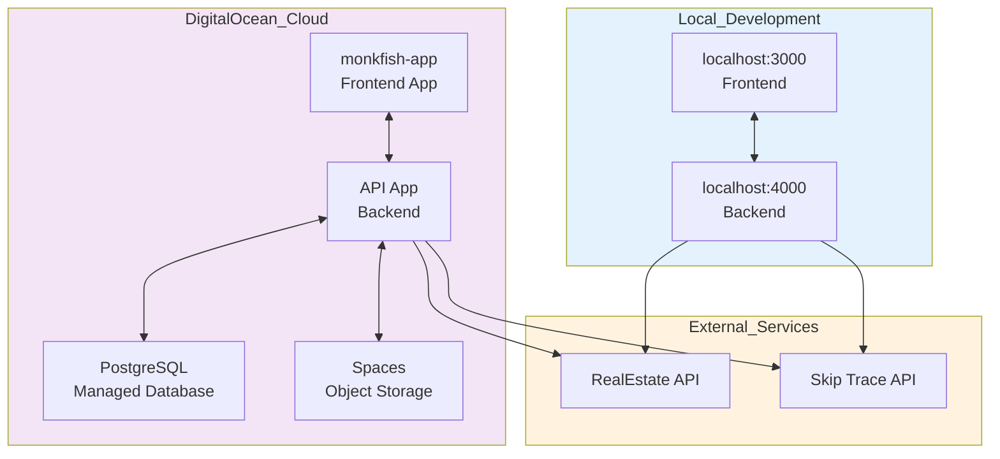

## 🎯 Use Cases

### Use Case 1: Finding Distressed Properties

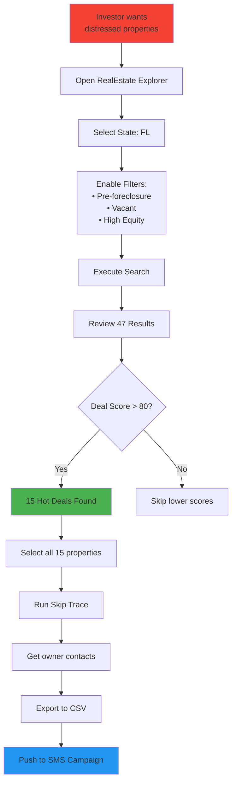

### Use Case 2: Active Investor Targeting

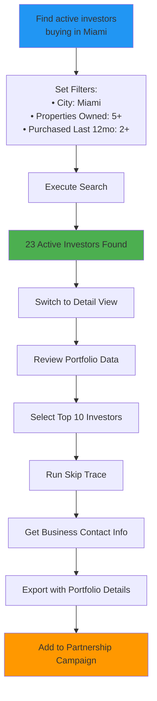

### Use Case 3: Daily Automation

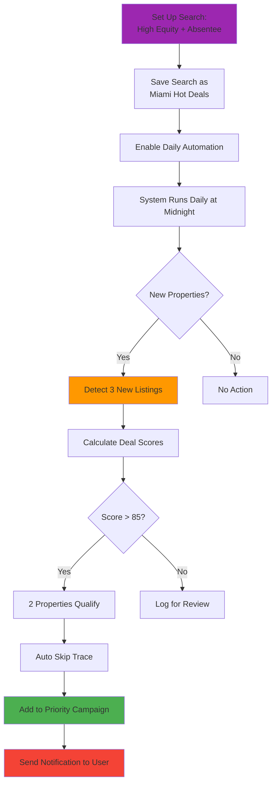

## 💡 Business Value

### For Real Estate Investors:

**Time Savings:**
- Automated daily property monitoring
- One-click skip trace (vs. manual lookup)
- Bulk export and campaign integration
- Smart filtering reduces noise

**Better Targeting:**
- REI 8020 deal scoring identifies best opportunities
- Multiple distress signals for motivated sellers
- Equity analysis shows negotiation leverage
- Portfolio tracking finds active investors

**Competitive Advantage:**
- Off-market property discovery
- Daily automation catches new listings first
- Multi-dimensional filtering (60+ criteria)
- Contact data enrichment streamlines outreach

**ROI Optimization:**
- Focus on high-score deals (80-100 points)
- Avoid low-equity properties
- Target multiple distress signals
- Track investor activity for partnerships

## 🛠️ Technology Stack

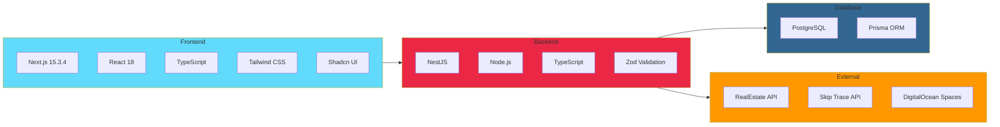

## 🔮 Future Enhancements

1. **Full Interactive Map**
   - Mapbox/Google Maps integration
   - Property clustering by deal score
   - Heat maps for deal density
   - Draw custom search areas

2. **AI-Powered Insights**
   - PropGPT: Natural language property search
   - Predictive analytics for property values
   - Market trend analysis
   - Automated lead scoring refinement

3. **Advanced Automation**
   - Webhook triggers for new properties
   - Automatic campaign creation
   - Smart follow-up sequences
   - Integration with CRM systems

4. **Enhanced Analytics**
   - Portfolio performance tracking
   - Campaign ROI metrics
   - Market comparison reports
   - Deal velocity tracking

5. **Collaboration Features**
   - Team workspaces
   - Shared saved searches
   - Property notes and tagging
   - Deal assignment workflow

---

## 📚 Quick Reference

### Access URLs:
- **Local Frontend:** http://localhost:3000
- **Local Backend:** http://localhost:4000
- **Production:** monkfish-app-mb7h3.ondigitalocean.app

### API Keys:
- **PropertySearch:** `NEXTIER-2906-74a1-8684-d2f63f473b7b`
- **SkipTrace:** `ELITEHOMEOWNERADVISORSSKIPPRODUCTION-8aae-7b54-9463-5db02217ffa5`

### Key Files:
- Frontend Explorer: `apps/front/src/features/property/components/realestate-api-explorer.tsx`
- Backend Controller: `apps/api/src/app/property/controllers/realestate-api.controller.ts`
- Backend Service: `apps/api/src/app/property/services/real-estate.service.ts`
- Automation Service: `apps/api/src/app/property/services/saved-search-automation.service.ts`

---

**Document Version:** 1.0
**Last Updated:** November 22, 2025
**Status:** Active Development
**Environment:** Local + DigitalOcean Cloud
