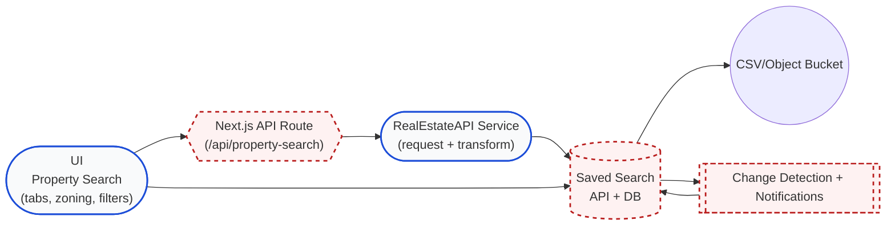

# Real Estate Search Story

This document gives a **non-technical** overview of how the Real Estate search experience works today. It maps the UI controls you use to the backend that runs the RealEstateAPI call, explains how saved searches become buckets of up to ~10K properties, and shows how filters like zoning, lot size, MLS status, and ownership flags are captured.

## 1. What the end user controls

- **Search by location**: You can toggle between radius (latitude/longitude + miles), a street address, or a ZIP code.
- **Property type & zoning**: The dropdown lets you pick common classifications (single family, condo, commercial, etc.), and you can add filters or tags that describe zoning or property use when building your query.
- **Lot size, MLS flags, pre-foreclosure, ownership duration**: Additional inputs or switches feed parameters like `lot_size_min`, `lot_size_max`, `mls_active`, `mls_pending`, `pre_foreclosure`, and other boolean flags so the API returns only the properties you care about.
- **Save that search**: When you persist a query, the same parameters plus a name/description are sent to the saved-search API, which runs the query again, stores the resulting IDs, and tracks changes over time.
- **Export as CSV/object bucket**: The saved bucket of IDs can later be exported to whatever CSV or storage workflow you prefer (the export step reads from the saved search and writes rows into the storage bucket you described).

## 2. High-level data flow

```mermaid
flowchart TD
  UI[Property Search UI<br/>(tabs, filters, zoning, lot size, MLS flags)]
  API["Next.js API Route<br/>(/api/property-search)"]
  Service[RealEstateAPI Service]
  SavedSearch["Saved Search API<br/>(saved_searches + saved_search_property_ids)"]
  Bucket[CSV / Object Bucket<br/>(exported rows & metadata)]

  UI --> API
  API --> Service
  Service --> SavedSearch
  SavedSearch --> Bucket
  UI --> SavedSearch
  style UI fill:#fef3c7,stroke:#84cc16
  style API fill:#e0f2fe,stroke:#0284c7
  style Service fill:#ede9fe,stroke:#7c3aed
  style SavedSearch fill:#d1fae5,stroke:#059669
  style Bucket fill:#fee2e2,stroke:#dc2626
```

In plain terms:

1. The user picks filters (state/county, property type, zoning, lot size, MLS flags, ownership flags like "5+ years" or "pre-foreclosure") and clicks "Search Properties".
2. The UI talks to `/api/property-search`, which simply converts those inputs into the `PropertySearchQuery` shape RealEstateAPI expects.
3. The shared service class (`real-estate-api.ts`) calls the upstream `https://api.realestateapi.com/v2` endpoint with the selected filters and returns structured property data.
4. If you save the search, a second API (`/api/saved-searches`) runs the same query again, stores the metadata, and stashes up to ~10K property IDs in the database (this is your bucket).
5. Any export or automation can read that saved search, grab the IDs, and write a CSV/object bucket containing the latest details (including zoning, lot size, MLS state, and other flags).

## 3. Flags & filters captured

- **Location**: state, county, ZIP, latitude/longitude, radius.
- **Property classification**: `property_type`, zoning/property use, lot size range, building size.
- **MLS status**: `mls_active`, `mls_pending`, `mls_sold`, `mls_cancelled`, etc.
- **Ownership & event flags**: `absentee_owner`, `owner_occupied`, `high_equity`, `pre_foreclosure`, `foreclosure`, `vacant`, `tax_lien`, `inherited`, `corporate_owned`, `years_owned`.
- **Timing filters**: `year_built_min/max`, `estimated_value_min/max`, `estimated_equity_min/max`, `equity_percent_min/max`.

## 4. Saved searches + buckets

When a search is saved, the backend:

1. Runs the property search to get counts and fetches batches of IDs.
2. Inserts a `saved_searches` row plus up to ~10K rows in `saved_search_property_ids` (stored in 1,000-row chunks for scale).
3. Optionally notifies on changes (`notifyOnChanges`) by comparing new IDs to previous ones and logging additions/removals.
4. Exposes the saved search via `GET /api/saved-searches?id=...`, allowing other services to stream the bucket (the CSV export) using the stored IDs and the `PropertySearchQuery`.

## 5. Next steps for your workflow

1. Wire the UI to surface every filter you need so the query object includes state, county, zoning, lot size, MLS, ownership, pre-foreclosure, and other flags up front.
2. Save the resulting query (plus metadata) via the saved-search API to create the 10K-limit bucket.
3. Build a CSV/export job that reads the saved search (via `/api/saved-searches`) and emits rows into your object bucket, flagging MLS listing status, ownership age, etc., so downstream consumers see exactly what you described.

## 6. Architecture with shapes



This diagram uses different node shapes (rounded rectangles, capsules, parallelograms) to show the major parties and arrows to clarify how data flows from the UI down to exports and change tracking. The saved-search bucket both powers exports and feeds the change-event queue that can flag MLS status or ownership history.
