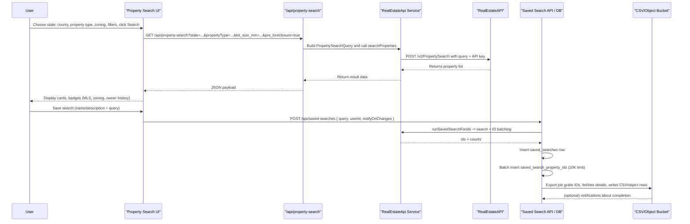

# Real Estate API Ladder Journey

Here is the **ladder-style journey** for a property search that touches the RealEstateAPI from end to end. Each row is a participant and each arrow is a hands-off interaction, so you can visibly follow how a user action ripples through the system.

This diagram acts like a ladder: each participant is a rung, and the arrows show where the control passes from one team to another. Use it for presentations or to explain the life cycle of a property search bucket.
