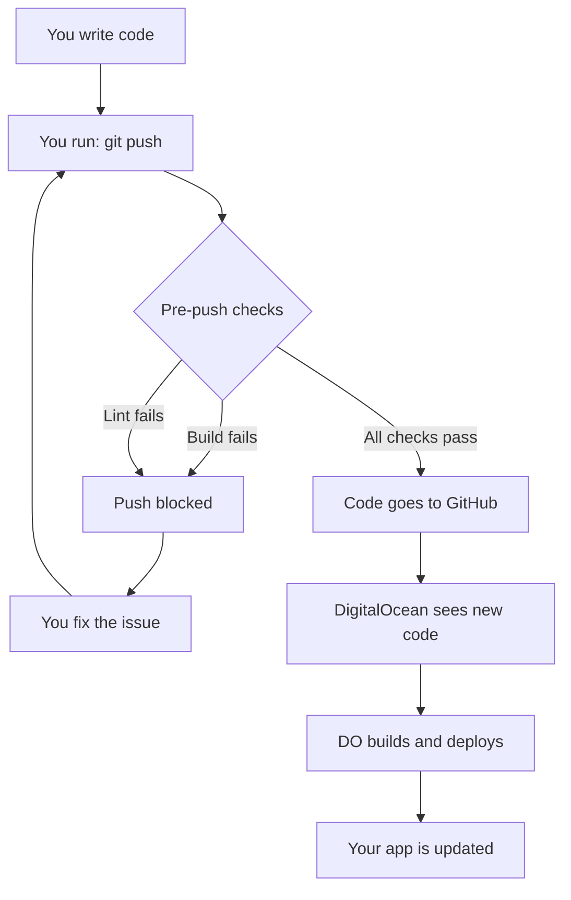
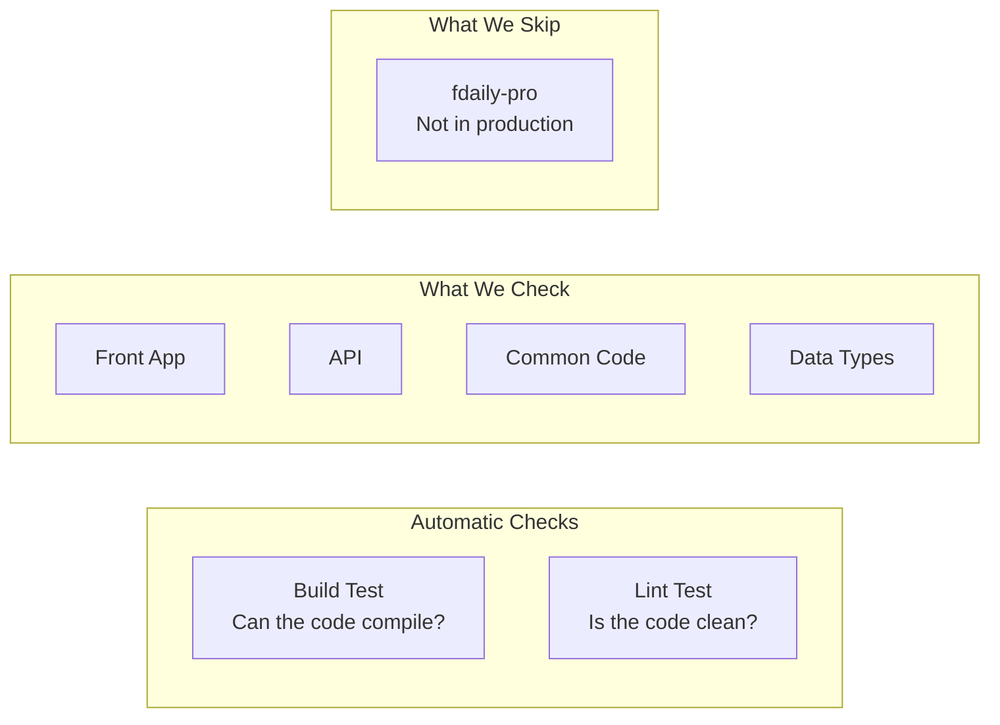
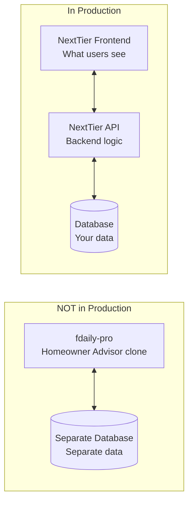
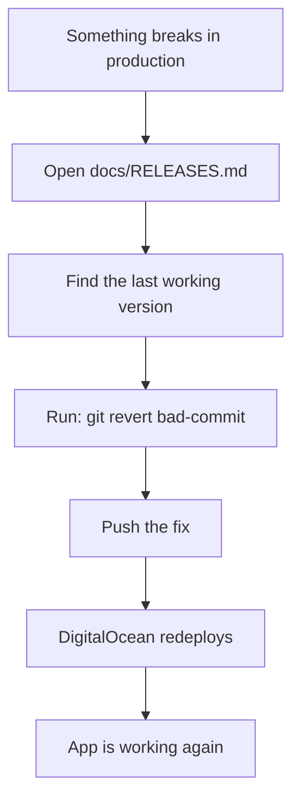

# Safety Guardrails Overview

How we keep production safe when deploying code.

---

## The Problem We Solved

Before: You push code → It goes straight to production → If it's broken, your app breaks.

After: You push code → Automatic checks run first → Only good code reaches production.

---

## How It Works



---

## What Gets Checked Before Every Push



---

## What's In Production vs Not



---

## When Something Goes Wrong



---

## Your Safety Net

| Protection | What It Does |
|------------|--------------|
| Pre-push hook | Stops broken code before it leaves your computer |
| Release log | Tracks every deploy so you can undo mistakes |
| Env docs | Lists all the settings your app needs to run |

---

## Quick Commands

**Check your code manually (without pushing):**
```bash
pnpm precheck
```

**See what would be deployed:**
```bash
git log --oneline -5
```

**Undo a bad deploy:**
```bash
git revert <bad-commit-sha>
git push
```

---

## Files We Created

| File | Purpose |
|------|---------|
| `.git/hooks/pre-push` | Runs checks before every push |
| `docs/RELEASES.md` | Log of all deploys for rollback |
| `docs/ENVIRONMENTS.md` | List of all settings needed |
| `docs/SAFETY-GUARDRAILS.md` | This overview |
