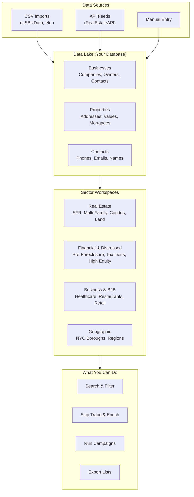
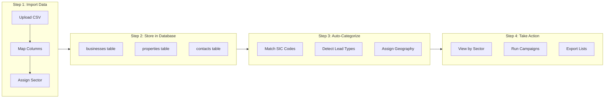
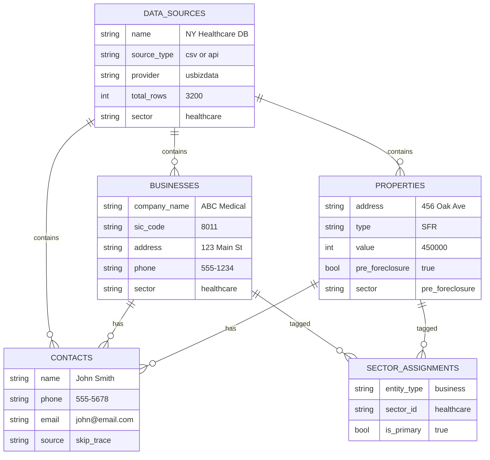

# Sector Workspaces - Data Organization System

## What Is This?

Sector Workspaces is a new feature that organizes all your leads, properties, and business contacts into **industry-specific categories**. Think of it like having separate filing cabinets for different types of deals.

Instead of one giant list of everything, you can now:
- View only **Healthcare businesses** when prospecting medical offices
- Focus on **Pre-Foreclosure properties** when looking for distressed deals
- Target **Restaurants** in a specific area for commercial opportunities
- Filter by **NYC boroughs** for geographic campaigns

---

## How It Works (Non-Technical)

---

## The Four Workspace Categories

### 1. Real Estate Sectors
Properties organized by type:

| Sector | What's Included |
|--------|-----------------|
| **Single Family (SFR)** | Houses, townhouses |
| **Multi-Family** | Duplexes, triplexes, apartments |
| **Condos** | Condominiums, co-ops |
| **Commercial** | Office, retail buildings |
| **Land** | Vacant lots, undeveloped land |
| **Mobile Homes** | Manufactured housing |

### 2. Financial & Distressed Sectors
Motivated seller opportunities:

| Sector | What's Included |
|--------|-----------------|
| **Pre-Foreclosure** | Properties in default, not yet auctioned |
| **Foreclosure/REO** | Bank-owned properties |
| **Tax Liens** | Delinquent property taxes |
| **Reverse Mortgage** | Properties with REV loan type |
| **High Equity** | 50%+ equity owners |
| **Free & Clear** | No mortgage (100% equity) |
| **Absentee Owner** | Owner lives elsewhere |
| **Inherited/Probate** | Recently inherited properties |

### 3. Business & B2B Sectors
Companies organized by industry (SIC codes):

| Sector | Industries |
|--------|------------|
| **Healthcare** | Doctors, clinics, medical services |
| **Restaurants** | Restaurants, cafes, catering |
| **Retail** | Shops and stores |
| **Professional Services** | Law, accounting, consulting |
| **Manufacturing** | Factories, production |
| **Transportation** | Trucking, logistics |
| **Hospitality** | Hotels, motels |
| **Construction** | Builders, contractors |

### 4. Geographic Sectors
Location-based targeting:

| Sector | Coverage |
|--------|----------|
| **NYC Metro** | All 5 boroughs + Long Island + Westchester |
| **Bronx** | Bronx County |
| **Brooklyn** | Kings County |
| **Manhattan** | New York County |
| **Queens** | Queens County |
| **Staten Island** | Richmond County |
| **Upstate NY** | Buffalo, Rochester, Syracuse, Albany |

---

## Data Flow Diagram

---

## Database Structure (Simple View)

---

## Example Use Cases

### Use Case 1: Healthcare Campaign
1. Go to **Sectors** → **Business & B2B** → **Healthcare**
2. See all 3,200 medical businesses in your database
3. Filter by city or employee count
4. Export list for calling campaign

### Use Case 2: Distressed Property Deals
1. Go to **Sectors** → **Financial** → **Pre-Foreclosure**
2. View 2,300 properties in default
3. Skip trace to get owner phone numbers
4. Start power dialer campaign

### Use Case 3: Bronx Multi-Family
1. Go to **Sectors** → **Geographic** → **Bronx**
2. Filter: Property Type = Multi-Family
3. Filter: High Equity = Yes
4. Target absentee owners for acquisition

---

## What's Next?

When you purchase and upload the **USBizData NY Business Bundle** ($47):
- 4 CSV files with ~500K+ business records
- Auto-categorized into sectors by SIC code
- Ready for skip tracing and campaigns

The system will:
1. Parse the CSV headers
2. Map columns to database fields
3. Assign each business to appropriate sectors
4. Make records searchable and campaign-ready

---

## Quick Reference

| Feature | Location |
|---------|----------|
| Sector Dashboard | `/t/[team]/sectors` |
| Sector Selector | Any search page (Layers icon) |
| Import Data | Sectors page → "Import Data" button |
| View Records | Select sector → "View Records" |

---

*This feature was added to organize your growing database of properties and businesses into actionable segments for targeted outreach campaigns.*
