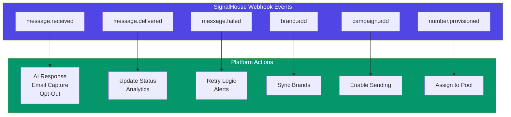

# OutreachGlobal × SignalHouse.io Integration

> **Enterprise SMS Infrastructure for Scalable Lead Generation**

---

## Platform Overview

OutreachGlobal is a multi-tenant lead generation platform that uses SignalHouse.io as its core SMS infrastructure. We turn cold data into warm conversations at scale.


---

## The Numbers Game

Our philosophy: **Volume × Quality × Persistence = Results**


---

## Multi-Tenant Architecture

Each client organization maps to SignalHouse sub-groups for complete isolation:


**Scaling Reality:**
| Tenants | Phone Numbers | Daily Capacity |
|---------|---------------|----------------|
| 10 | 200 | 400,000 SMS |
| 50 | 1,000 | 2,000,000 SMS |
| 100 | 2,000 | 4,000,000 SMS |

---

## AI Worker Pipeline

Three AI personalities handle different stages of the conversation:


---

## Message Flow Architecture


---

## SignalHouse API Usage

### Endpoints We Use

| Category | Endpoints | Purpose |
|----------|-----------|---------|
| **Messaging** | `/message/sendSMS`, `/message/sendMMS` | Core sending |
| **Numbers** | `/phoneNumber/buyPhoneNumber`, `/phoneNumber/myPhoneNumbers` | Number provisioning |
| **Brands** | `/brand/nonBlocking`, `/brand/basicBrandDetails` | 10DLC registration |
| **Campaigns** | `/campaign/storeForReview`, `/campaign/details` | Campaign management |
| **Analytics** | `/analytics/dashboardAnalytics`, `/analytics/analyticsOutbound` | Reporting |
| **Webhooks** | Inbound to our `/api/webhook/signalhouse` | Event handling |
| **Sub-Groups** | `/user/subGroup/create`, `/user/subGroup/get` | Multi-tenant isolation |

### Request Volume (Projected)


---

## Webhook Events We Handle



---

## 2-Bracket Conversation Flows

### Flow A: Email Capture


### Flow B: Content Permission


---

## Lead Scoring System

```mermaid
flowchart TB
    subgraph SCORING["Lead Priority Scoring"]
        GREEN["🟢 GREEN<br/>Responded to SMS<br/>3x Priority<br/>CALL IMMEDIATELY"]
        GOLD["🥇 GOLD<br/>Email + Mobile Captured<br/>100% Score<br/>High Contactability"]
        STANDARD["⚪ STANDARD<br/>Initial Contact<br/>1x Priority<br/>Normal Queue"]
    end

    INBOUND["Inbound Reply"] --> GREEN
    EMAIL["Email Captured"] --> GOLD
    MOBILE["SMS Received From"] --> GOLD
    IMPORT["List Import"] --> STANDARD

    style GREEN fill:#22C55E,color:#fff
    style GOLD fill:#EAB308,color:#000
    style STANDARD fill:#6B7280,color:#fff
```



---

## Platform Statistics

| Metric | Current | Growth Target |
|--------|---------|---------------|
| Active Tenants | 10 | 100 |
| Phone Numbers | 150 | 2,000 |
| Daily SMS Volume | 50,000 | 2,000,000 |
| Response Rate | 4.8% | 6%+ |
| Email Capture Rate | 28% | 35%+ |

---

## Technical Integration

### Environment Configuration

```
SIGNALHOUSE_API_KEY=sk_live_...
SIGNALHOUSE_AUTH_TOKEN=at_...
SIGNALHOUSE_WEBHOOK_TOKEN=whsec_...
```

### Webhook URL

```
https://app.outreachglobal.io/api/webhook/signalhouse?token=SECURE_TOKEN
```

### Key Features Used

- ✅ SMS/MMS Sending
- ✅ 10DLC Brand Registration
- ✅ Campaign Management
- ✅ Phone Number Provisioning
- ✅ Sub-Group Multi-Tenancy
- ✅ Webhook Event Handling
- ✅ Opt-Out Management
- ✅ Analytics & Reporting
- ✅ Short Links
- ✅ Message Templates

---

## Contact

**OutreachGlobal Platform**
- Production: `app.outreachglobal.io`
- Admin: `admin@outreachglobal.io`

---

*This integration leverages SignalHouse.io's enterprise SMS infrastructure to power scalable, compliant lead generation across multiple industries.*
