# NEXTIER × SignalHouse Integration Blueprint

> **Version**: 1.0.0
> **Date**: January 16, 2026
> **Status**: Production Ready
> **Brand ID**: BZOYPIH - NEXTIER
> **Campaign IDs**: CJRCU60, CW7I6X5

---

## Executive Summary

NEXTIER is an AI-powered B2B outreach platform that leverages SignalHouse's 10DLC infrastructure to deliver compliant, personalized SMS campaigns at scale. Our integration transforms raw business data into intelligent conversations through **GIANNA**, our AI worker with human oversight.

### Key Differentiators

| Feature | Traditional SMS | NEXTIER + SignalHouse |
|---------|-----------------|----------------------|
| Personalization | Static templates | Dynamic {firstName}, {companyName}, {industry} variables |
| Compliance | Manual opt-out handling | Automated TCPA/10DLC compliance built-in |
| Intelligence | Blast campaigns | AI-classified responses with routing |
| Scale | Single campaign | Isolated vertical campaigns (8+ industries) |
| Visibility | Basic delivery stats | Real-time micro-dashboards per vertical |

---

## Architecture Overview


---

## Campaign Vertical Isolation

Each industry vertical operates as an isolated campaign block with dedicated KPIs:

```mermaid
flowchart LR
    subgraph "Brand: BZOYPIH"
        direction TB

        subgraph "Vertical Campaigns"
            P["🔧 Plumbing"]
            T["🚛 Trucking"]
            C["📊 CPAs"]
            CO["💼 Consultants"]
            AB["🏠 Agents/Brokers"]
            SP["📈 Sales Pros"]
            SO["🚀 Solopreneurs"]
            PE["💎 PE Boutiques"]
        end

        subgraph "Shared Infrastructure"
            TPL["Template Library"]
            OPT["Opt-Out Registry"]
            ANL["Analytics Engine"]
        end
    end

    P --> TPL
    T --> TPL
    C --> TPL
    CO --> TPL
    AB --> TPL
    SP --> TPL
    SO --> TPL
    PE --> TPL
```



---

## User Personas & Experience Flows

### Persona 1: Marketing Agency

**Profile**: Full-service digital agency managing 10+ client accounts


**Key Workflows**:
1. **Multi-tenant management** - Each client = separate vertical campaign
2. **White-label dashboards** - Branded micro-dashboards per client
3. **Bulk operations** - Import 10K+ leads across multiple verticals
4. **Human oversight** - Agency team reviews AI-suggested responses

---

### Persona 2: Solopreneur

**Profile**: Independent consultant or coach building their practice


**Key Workflows**:
1. **Simple CSV upload** - No technical setup required
2. **Template selection** - Choose from 20 pre-approved messages
3. **Personal touch** - Review and approve before sending
4. **Calendar integration** - SABRINA books directly to Calendly

---

### Persona 3: Insurance/Real Estate Broker

**Profile**: Licensed professional with compliance requirements


**Key Workflows**:
1. **Geographic personalization** - {neighborhood}, {county} variables
2. **Compliance-first** - All messages include opt-out, archived for audit
3. **Carrier visibility** - See delivery rates by AT&T, T-Mobile, Verizon
4. **Follow-up automation** - CATHY re-engages after 48 hours

---

## Message Template System

### Variable Interpolation


### Approved Templates (20 variants)

| ID | Intro Style | Sample |
|----|-------------|--------|
| data_001 | "Hi {firstName}, Gianna here." | Data decay happens quietly... |
| data_002 | "{firstName}—Gianna again." | If data health slips... |
| data_003 | "Hey {firstName}, Gianna here." | Most teams scale before... |
| ... | (17 more variants) | ... |

**Character Limit**: 160 max
**Compliance**: All include "Reply STOP to opt out – NEXTIER"

---

## Micro-Dashboard Architecture

Real-time KPI visibility per campaign vertical:


### KPI Metrics Per Vertical

| Metric | Description | Formula |
|--------|-------------|---------|
| Delivery Rate | Messages delivered / sent | delivered ÷ sent × 100 |
| Response Rate | Replies / delivered | replies ÷ delivered × 100 |
| Conversion Rate | Booked / replies | booked ÷ replies × 100 |
| Opt-Out Rate | Opt-outs / delivered | optOuts ÷ delivered × 100 |

---

## SignalHouse API Integration

### Current Configuration

```yaml
Brand:
  id: BZOYPIH
  name: NEXTIER
  legal_entity: Artac Capital LLC
  ein: 862237370
  vertical: PROFESSIONAL

Campaigns:
  - id: CJRCU60
    use_case: LOW_VOLUME
    status: APPROVED
    carriers: [AT&T, T-Mobile, Verizon, US Cellular]

  - id: CW7I6X5
    use_case: LOW_VOLUME
    status: APPROVED
    carriers: [AT&T, T-Mobile, Verizon, US Cellular]

Phone Numbers:
  - number: +15164079249
    campaign: CJRCU60
    webhook: https://monkfish-app-mb7h3.ondigitalocean.app/api/webhook/signalhouse

Group:
  id: GM7CEB
  subgroup: S7ZI7S
```

### API Endpoints Used

| Endpoint | Purpose | Frequency |
|----------|---------|-----------|
| `POST /message/sendSMS` | Outbound messages | ~75/min (AT&T TPM) |
| `GET /analytics/dashboardAnalytics` | KPI aggregation | Every 5 min |
| `POST /webhook` | Inbound message handling | Real-time |
| `GET /phoneNumber/myPhoneNumbers` | Number inventory | On-demand |
| `GET /message/optOutList` | Compliance check | Pre-send |

---

## Data Flow: CSV to Conversation


---

## Compliance & Security

### 10DLC Compliance

- ✅ Brand registered with TCR
- ✅ Campaigns approved (LOW_VOLUME use case)
- ✅ All messages include opt-out language
- ✅ Opt-out list checked before every send
- ✅ Message archive for audit trail

### TCPA Compliance

- ✅ Prior express consent via opt-in forms
- ✅ Clear identification: "Reply STOP to opt out – NEXTIER"
- ✅ Immediate opt-out processing
- ✅ No messages to numbers on DNC registry

### Data Security

- ✅ All data encrypted at rest (PostgreSQL)
- ✅ TLS 1.3 for all API communications
- ✅ API keys rotated quarterly
- ✅ Webhook signature verification

---

## Roadmap: Next 30 Days

| Week | Milestone | Impact |
|------|-----------|--------|
| 1 | CSV import with auto-vertical detection | Faster onboarding |
| 2 | 6 additional vertical campaigns | 8 total campaign blocks |
| 3 | Multi-number rotation per vertical | Higher deliverability |
| 4 | Predictive send-time optimization | +15% response rate |

---

## Technical Stack Compatibility

### NEXTIER Stack
- **Frontend**: Next.js 14 (App Router)
- **Backend**: NestJS GraphQL API
- **Database**: PostgreSQL (Drizzle ORM)
- **Hosting**: DigitalOcean App Platform
- **AI**: OpenAI GPT-4o-mini, Anthropic Claude

### SignalHouse Stack (MERN)
- **MongoDB** ↔ Our PostgreSQL (REST API bridge)
- **Express** ↔ Our NestJS (compatible patterns)
- **React** ↔ Our Next.js (same ecosystem)
- **Node.js** ↔ Our Node.js (identical runtime)

**Integration Pattern**: REST API with JSON payloads, webhook callbacks

---

## Contact

**Technical Lead**: tb@outreachglobal.io
**Platform**: https://monkfish-app-mb7h3.ondigitalocean.app
**Brand Portal**: https://nextier.signalhouse.io/intake/LDZH8OR

---

*This document is intended for SignalHouse technical team review. All diagrams render in GitHub-flavored Markdown with Mermaid support.*
