# SignalHouse SMS Platform Overview

A non-technical guide to understanding SMS messaging in OutreachGlobal.

---

## What is SignalHouse?

SignalHouse is our **SMS/text messaging provider** - the service that lets OutreachGlobal send and receive text messages to leads and property owners.

---

## How SMS Messaging Works

---

## The Complete SMS Flow

---

## What is 10DLC?

**10DLC** (10-Digit Long Code) is a **compliance requirement** for business text messaging in the US.

### Why You Need 10DLC

| Without 10DLC | With 10DLC |
|---------------|------------|
| Messages blocked by carriers | Messages delivered reliably |
| 1 message per second | 60+ messages per second |
| High spam filtering | Trusted sender status |
| Potential fines | Full compliance |

---

## Message Types

---

## Automatic Response Handling

OutreachGlobal automatically processes incoming messages:

```mermaid
flowchart TD
    MSG[Incoming Message] --> PARSE[Analyze Content]

    PARSE -->|Contains YES, INTERESTED, CALL| HOT[🔥 Mark as Hot Lead]
    PARSE -->|Contains STOP, UNSUBSCRIBE| OPT[🚫 Auto Opt-Out]
    PARSE -->|Contains HELP| HELP[ℹ️ Send Help Info]
    PARSE -->|Other Response| INBOX[📥 Add to Inbox]

    HOT --> NOTIFY[Notify Agent]
    OPT --> REMOVE[Remove from Queue]
    HELP --> AUTO[Send Auto-Reply]
    INBOX --> REVIEW[Ready for Review]
```

---

## Cost Structure

### Pricing Breakdown

| Item | Cost | Notes |
|------|------|-------|
| Outbound SMS | $0.01/message | Per 160 characters |
| Inbound SMS | $0.005/message | Replies are cheaper |
| Phone Number | $2/month | Local area codes |
| 10DLC Brand | $4/month | One-time setup |
| 10DLC Campaign | $10 one-time | Per campaign |

**Example:** 5,000 messages/month = ~$60 total

---

## Dashboard Overview

```mermaid
graph TD
    subgraph Dashboard["SignalHouse Dashboard"]
        subgraph Analytics["📊 Analytics"]
            A1[Messages Sent]
            A2[Delivery Rate]
            A3[Response Rate]
        end

        subgraph Wallet["💰 Wallet"]
            W1[Current Balance]
            W2[Usage History]
            W3[Add Funds]
        end

        subgraph Numbers["📱 Phone Numbers"]
            N1[Your Numbers]
            N2[Buy New]
            N3[Configure]
        end

        subgraph Compliance["✅ 10DLC"]
            C1[Brand Status]
            C2[Campaign Status]
            C3[Throughput]
        end
    end
```

---

## Message Delivery Status

```mermaid
stateDiagram-v2
    [*] --> Queued: Message Created
    Queued --> Sent: Sent to Carrier
    Sent --> Delivered: Confirmed Delivery
    Sent --> Failed: Delivery Failed

    Delivered --> [*]: Success ✅
    Failed --> Retry: Auto Retry
    Retry --> Sent: Try Again
    Retry --> Error: Max Retries
    Error --> [*]: Failed ❌
```

---

## Campaign Workflow

---

## Integration Architecture

---

## Key Features at a Glance

---

## Quick Start Checklist

```mermaid
graph TD
    subgraph Setup["✅ Setup Tasks"]
        S1[Create Account] --> S2[Add $100 to Wallet]
        S2 --> S3[Submit Brand Registration]
        S3 --> S4[Wait for Approval 1-3 days]
        S4 --> S5[Create Campaign]
        S5 --> S6[Wait for Approval 1-5 days]
    end

    subgraph Config["⚙️ Configuration"]
        S6 --> C1[Buy Phone Number]
        C1 --> C2[Attach to Campaign]
        C2 --> C3[Configure Webhooks]
        C3 --> C4[Test Connection]
    end

    subgraph Launch["🚀 Go Live"]
        C4 --> L1[Import Leads]
        L1 --> L2[Create Templates]
        L2 --> L3[Send First Campaign]
        L3 --> L4[Monitor Results]
    end
```

---

## Support & Resources

| Resource | Link |
|----------|------|
| SignalHouse Dashboard | https://app.signalhouse.io |
| API Documentation | https://app.signalhouse.io/apidoc |
| Support Email | support@signalhouse.io |
| Status Page | https://status.signalhouse.io |

---

## Glossary

| Term | Definition |
|------|------------|
| **SMS** | Short Message Service - text messages |
| **MMS** | Multimedia Message Service - texts with images |
| **10DLC** | 10-Digit Long Code - business texting compliance |
| **A2P** | Application-to-Person messaging |
| **Webhook** | Automatic notification when something happens |
| **Opt-Out** | When someone texts STOP to unsubscribe |
| **Throughput** | How many messages can be sent per minute |
| **Segment** | 160 characters = 1 SMS segment |

---

*For technical implementation details, see [SIGNALHOUSE_ONBOARDING.md](./SIGNALHOUSE_ONBOARDING.md)*
