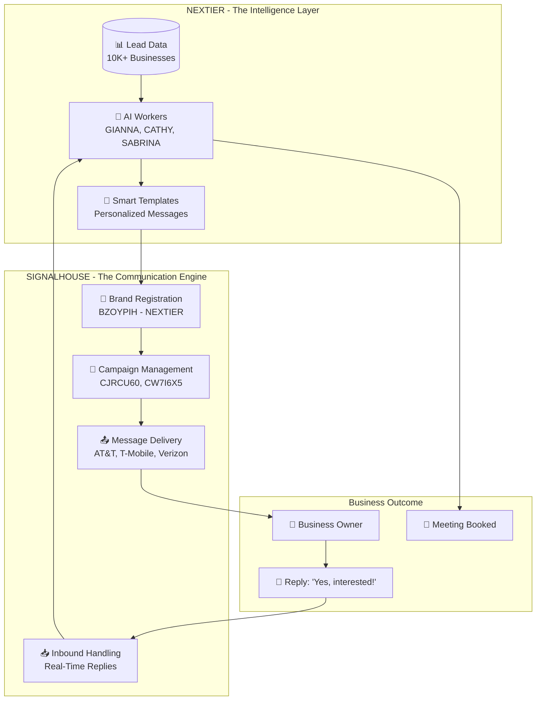

# NEXTIER × SignalHouse Partnership Overview

> **For**: SignalHouse Team
> **From**: NEXTIER (Artac Capital LLC)
> **Date**: January 2026

---

## The Big Picture

**SignalHouse is the foundational communication engine that powers NEXTIER's entire outreach platform.**

```
┌─────────────────────────────────────────────────────────────────────────┐
│                                                                         │
│                          NEXTIER PLATFORM                               │
│                                                                         │
│   ┌─────────────┐    ┌─────────────┐    ┌─────────────┐                │
│   │   GIANNA    │    │   CATHY     │    │  SABRINA    │                │
│   │   Opener    │    │   Nurturer  │    │   Closer    │                │
│   └──────┬──────┘    └──────┬──────┘    └──────┬──────┘                │
│          │                  │                  │                        │
│          └──────────────────┼──────────────────┘                        │
│                             │                                           │
│                             ▼                                           │
│   ┌─────────────────────────────────────────────────────────────────┐  │
│   │                                                                 │  │
│   │                    ═══════════════════════                      │  │
│   │                     SIGNALHOUSE ENGINE                          │  │
│   │                    ═══════════════════════                      │  │
│   │                                                                 │  │
│   │        The Foundation That Makes It All Possible                │  │
│   │                                                                 │  │
│   │    ✓ 10DLC Compliance        ✓ Multi-Carrier Delivery          │  │
│   │    ✓ Real-Time Webhooks      ✓ Opt-Out Management              │  │
│   │    ✓ Brand Registration      ✓ Message Delivery                │  │
│   │                                                                 │  │
│   └─────────────────────────────────────────────────────────────────┘  │
│                             │                                           │
│                             ▼                                           │
│                    ┌─────────────────┐                                  │
│                    │  Business Owner │                                  │
│                    │    (Prospect)   │                                  │
│                    └─────────────────┘                                  │
│                                                                         │
└─────────────────────────────────────────────────────────────────────────┘
```

---

## How We Work Together



---

## What SignalHouse Provides

| Capability | What It Means for NEXTIER |
|------------|--------------------------|
| **10DLC Registration** | We're compliant from day one - no carrier issues |
| **Brand Identity** | NEXTIER shows as a trusted sender |
| **Campaign Blocks** | Isolated campaigns per industry vertical |
| **Multi-Carrier** | Reaches AT&T, T-Mobile, Verizon, US Cellular |
| **Webhooks** | Instant notification when prospects reply |
| **Opt-Out Handling** | Automatic compliance, zero manual work |
| **Analytics** | Real-time delivery and engagement data |

---

## The Flow: From Lead to Conversation

```
┌──────────────────────────────────────────────────────────────────────┐
│                                                                      │
│  1️⃣ NEXTIER imports 500 plumbing companies                          │
│     ↓                                                                │
│  2️⃣ AI (GIANNA) crafts personalized opener:                         │
│     "Hey John, Gianna here. Data decay happens quietly..."           │
│     ↓                                                                │
│  3️⃣ SIGNALHOUSE delivers via 10DLC to John's phone                  │
│     ↓                                                                │
│  4️⃣ John replies: "Sure, when can we talk?"                         │
│     ↓                                                                │
│  5️⃣ SIGNALHOUSE webhook notifies NEXTIER instantly                  │
│     ↓                                                                │
│  6️⃣ AI (SABRINA) schedules the meeting                              │
│                                                                      │
│  ══════════════════════════════════════════════════════════════════  │
│  RESULT: Qualified meeting booked, zero manual dialing               │
│  ══════════════════════════════════════════════════════════════════  │
│                                                                      │
└──────────────────────────────────────────────────────────────────────┘
```

---

## Industry Verticals (Campaign Isolation)

NEXTIER targets 8 distinct B2B verticals, each as an isolated SignalHouse campaign:

```
                    ┌─────────────────────────────────┐
                    │      BRAND: BZOYPIH - NEXTIER   │
                    └─────────────────────────────────┘
                                    │
        ┌───────────────────────────┼───────────────────────────┐
        │           │           │           │           │       │
        ▼           ▼           ▼           ▼           ▼       ▼
    ┌───────┐   ┌───────┐   ┌───────┐   ┌───────┐   ┌───────┐ ...
    │  🔧   │   │  🚛   │   │  📊   │   │  💼   │   │  🏠   │
    │Plumb- │   │Truck- │   │ CPAs  │   │Consul-│   │Agents │
    │ ing   │   │ ing   │   │       │   │ tants │   │Brokers│
    └───────┘   └───────┘   └───────┘   └───────┘   └───────┘

    Each vertical = Isolated KPIs, dedicated templates, separate analytics
```

---

## Why This Partnership Matters

### For NEXTIER:
- **Zero Infrastructure Headache** - SignalHouse handles carrier relationships
- **Instant Compliance** - 10DLC registration done right
- **Scale Ready** - Can grow from 1K to 100K messages without changing providers
- **Real-Time Intelligence** - Webhooks power our AI response system

### For SignalHouse:
- **Consistent Volume** - B2B outreach = steady, predictable messaging
- **Premium Use Case** - Professional services, not spam
- **Multi-Vertical** - 8+ campaign blocks across industries
- **Growth Partner** - Our success = your volume growth

---

## Current Configuration

```
Brand:        BZOYPIH - NEXTIER
Legal Entity: Artac Capital LLC
EIN:          862237370
Vertical:     PROFESSIONAL

Active Campaigns:
├── CJRCU60 (LOW_VOLUME) - Approved
└── CW7I6X5 (LOW_VOLUME) - Approved

Phone Number: +1 516-407-9249
Webhook:      /api/webhook/signalhouse

Carriers:
├── AT&T ✓ (75 TPM)
├── T-Mobile ✓
├── Verizon ✓
└── US Cellular ✓
```

---

## The Vision

```
┌─────────────────────────────────────────────────────────────────────┐
│                                                                     │
│   TODAY                          TOMORROW                           │
│   ═════                          ════════                           │
│                                                                     │
│   • 2 campaigns                  • 8+ vertical campaigns            │
│   • 1 phone number               • Number rotation per vertical     │
│   • LOW_VOLUME tier              • STANDARD tier as we scale        │
│   • Manual campaign creation     • API-driven campaign management   │
│                                                                     │
│   ─────────────────────────────────────────────────────────────     │
│                                                                     │
│   SignalHouse remains our SOLE SMS infrastructure partner.          │
│   As NEXTIER grows, SignalHouse grows with us.                      │
│                                                                     │
└─────────────────────────────────────────────────────────────────────┘
```

---

## Contact

**Thomas Borruso**
tb@outreachglobal.io
NEXTIER / Artac Capital LLC

---

*SignalHouse is not just a vendor - it's the communication backbone that makes NEXTIER possible.*
