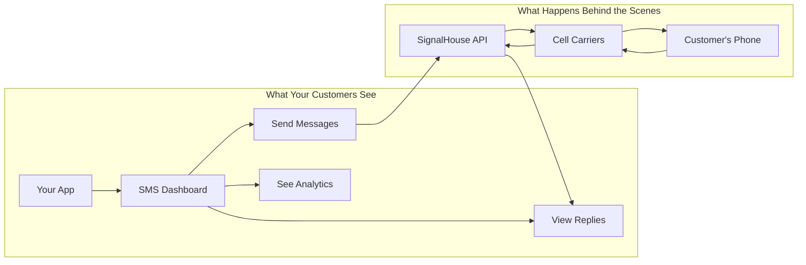
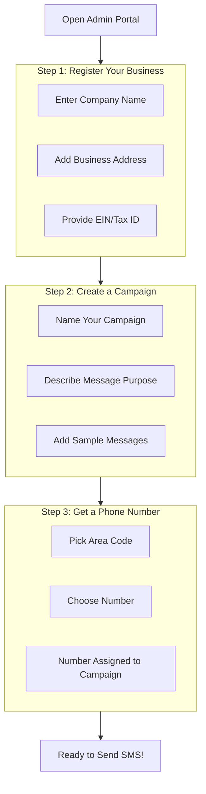
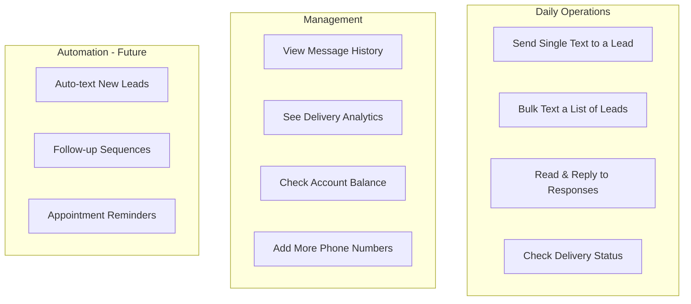
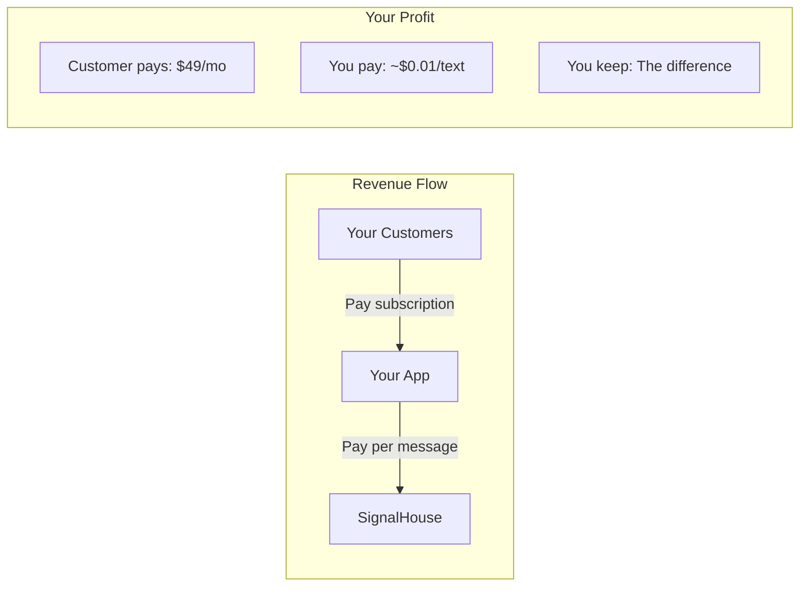

# SignalHouse SMS Integration - Checkpoint

**Date**: December 9, 2024
**Status**: Deployed & Ready for Setup

---

## What Is This?

We built a **white-label SMS system** into your app. Your customers use YOUR app to send text messages, but behind the scenes it uses SignalHouse.io to actually deliver them.

Think of it like:
- **Stripe** = You handle payments, Stripe does the banking
- **This** = You handle the SMS UI, SignalHouse does the carrier work

---

## How It Works (Non-Technical)



---

## The Setup Process (One-Time)



**Why these steps?**
US carriers (AT&T, Verizon, T-Mobile) require businesses to register before sending bulk texts. This prevents spam and ensures your messages actually get delivered.

---

## What Your Team Can Do After Setup



---

## Your Business Model



**Example**:
- Customer on $49/mo plan sends 500 texts
- SignalHouse cost: ~$5
- Your profit: $44

---

## Where To Find Everything

| What | Where | Who Uses It |
|------|-------|-------------|
| Admin SMS Settings | `/admin/integrations/signalhouse` | You (admin) |
| Team SMS Settings | `/t/[team]/settings/sms` | Team members |
| Setup Wizard | Inside either page above | First-time setup |
| SMS Dashboard | Inside either page above | Daily use |

---

## Current Status Checklist

- [x] SignalHouse API connected
- [x] Admin portal updated with wizard
- [x] Dashboard shows real data
- [x] All API endpoints working
- [x] Deployed to DigitalOcean
- [ ] Brand registered with carriers
- [ ] Campaign created
- [ ] Phone number purchased
- [ ] Wallet funded

---

## What's Next?

1. **Go to**: `https://monkfish-app-mb7h3.ondigitalocean.app/admin/integrations/signalhouse`
2. **Click**: Setup Wizard tab
3. **Complete**: The 4-step registration
4. **Fund**: Add money to SignalHouse wallet
5. **Send**: Your first SMS!

---

## Technical Summary (For Reference)

**Files Created**:
| File | Purpose |
|------|---------|
| `lib/signalhouse/client.ts` | API client for all SignalHouse calls |
| `api/signalhouse/brand/route.ts` | Register business for 10DLC |
| `api/signalhouse/campaign/route.ts` | Create messaging campaigns |
| `api/signalhouse/numbers/route.ts` | Buy/manage phone numbers |
| `api/signalhouse/message/route.ts` | Send SMS, view logs |
| `api/signalhouse/analytics/route.ts` | Stats, wallet, usage |
| `components/signalhouse/sms-onboarding-wizard.tsx` | 4-step setup wizard |
| `components/signalhouse/sms-dashboard.tsx` | Analytics & management UI |

**Environment Variables Needed**:
```
SIGNALHOUSE_API_KEY=your-key
SIGNALHOUSE_AUTH_TOKEN=your-token
```

---

## Questions?

- **What is 10DLC?** - "10-Digit Long Code" - the system carriers use to verify business texters
- **Why register?** - Unregistered numbers get blocked as spam
- **How much does it cost?** - ~$0.01 per text segment (160 chars)
- **Can I send MMS?** - Yes, images and media supported
- **Two-way messaging?** - Yes, replies come back to your dashboard
