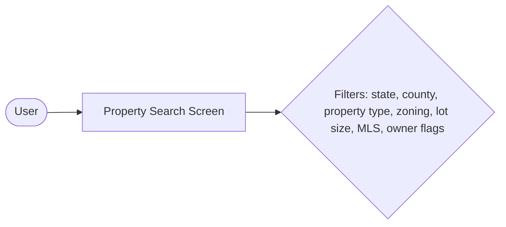
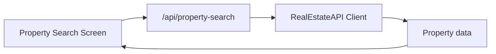
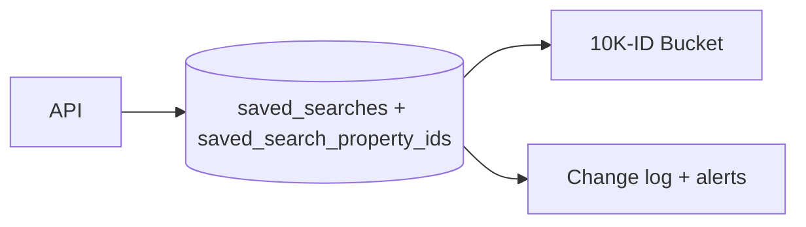
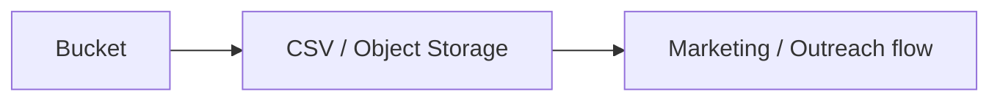

# Outreach Global Storyboard

This storyboard is a **visual storytelling map** of how the platform works—from the user clicking filters to saved searches turning into buckets. Each “frame” mirrors the shapes/arrows idea you asked for, with a short caption and an accompanying mermaid snippet to sketch what is happening.

## Frame 1: User sets filters

- Caption: “I pick state, county, property type, zoning, and flags like MLS-listed or pre-foreclosure; then I hit Search.”
- Visual:

## Frame 2: UI talks to backend

- Caption: “The UI sends those filters to `/api/property-search`, which forwards them to RealEstateAPI.”
- Visual:

## Frame 3: Saving becomes a bucket

- Caption: “Saving the search runs it again, stores up to 10K IDs, and flags any MLS/ownership changes.”
- Visual:

## Frame 4: Export and automation

- Caption: “Now you can export that bucket to CSV/Object bucket with zoning, lot size, MLS, ownership history, etc.”
- Visual:

Reuse this storyboard in presentations or docs by showing each frame as a slide; the simple shapes and captions keep things non-technical while still explaining what touches what. Let me know if you want an actual image file or a slide deck version. 
