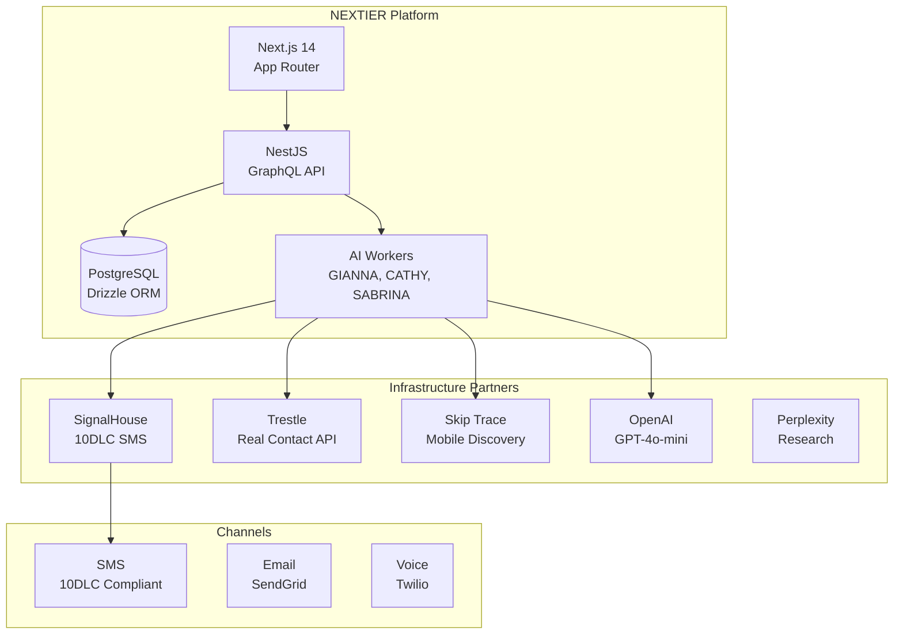
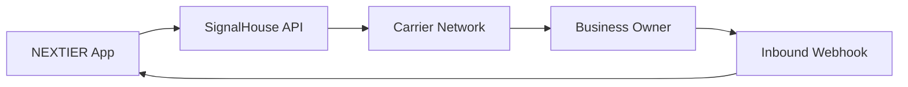
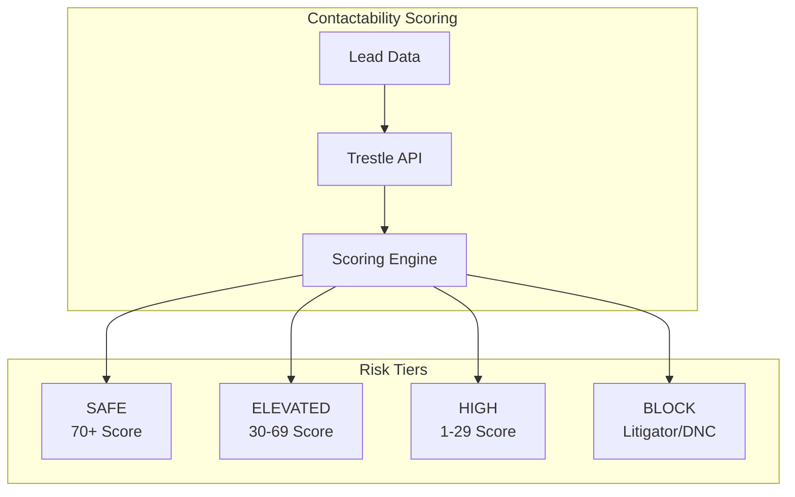
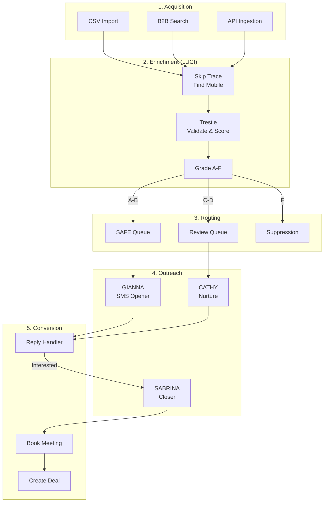
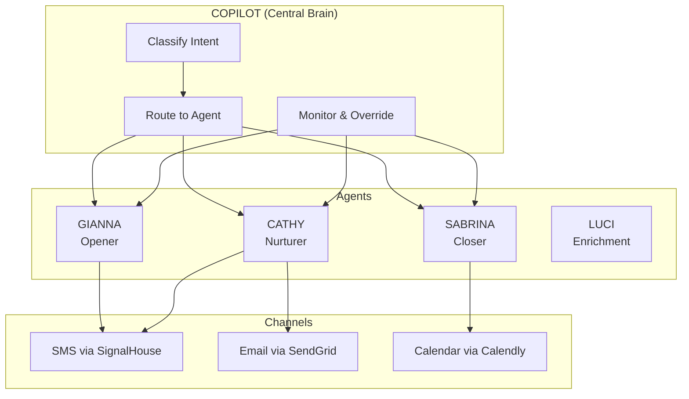
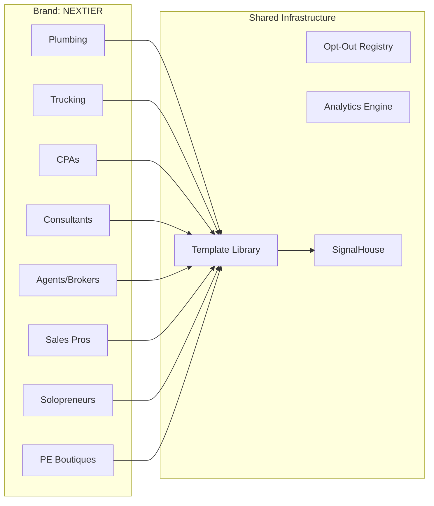
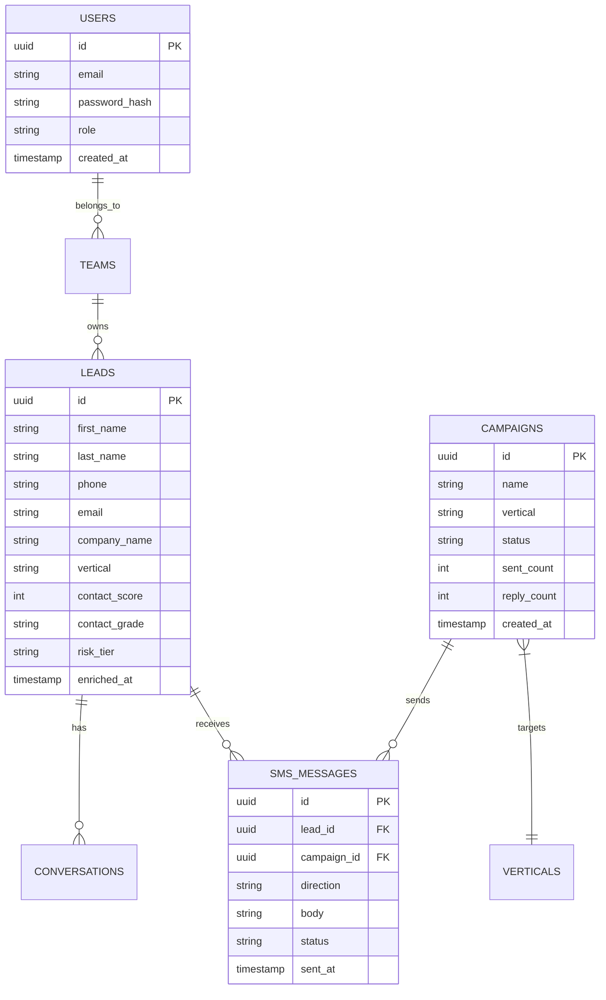
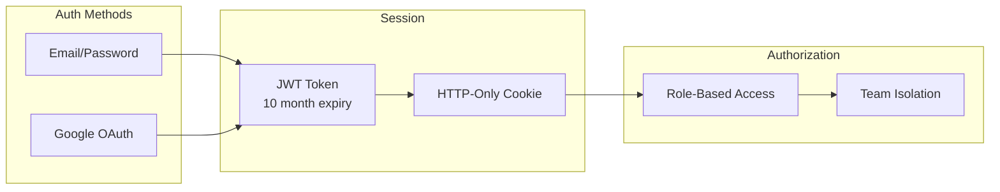
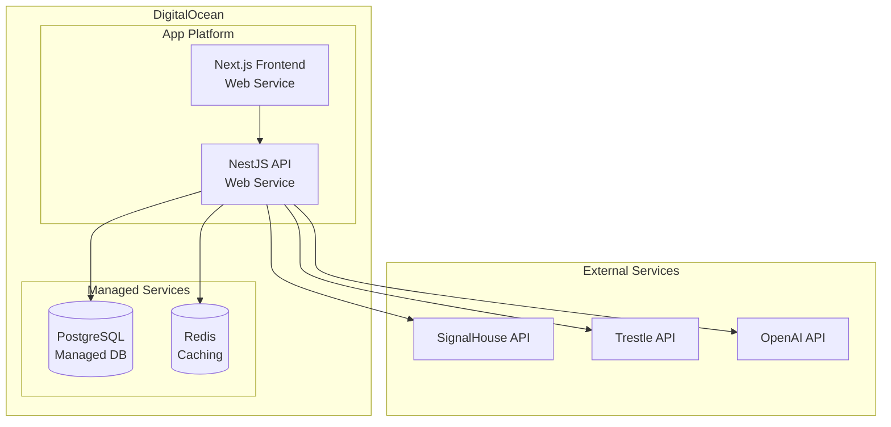

# NEXTIER System Architecture

> **Version**: 2.0.0
> **Date**: January 16, 2026
> **Status**: Production Ready

---

## Platform Overview

NEXTIER is an enterprise B2B outreach platform that orchestrates AI-powered conversations across SMS, email, and voice channels. The platform leverages best-in-class infrastructure partners for carrier-grade reliability while focusing on intelligent automation and compliance.



---

## Infrastructure Partners (Enterprise Lifting)

### SignalHouse - 10DLC SMS Infrastructure

**What they provide:**
- Carrier-grade 10DLC registration
- Multi-carrier delivery (AT&T, T-Mobile, Verizon, US Cellular)
- Real-time delivery webhooks
- Opt-out management
- Compliance tooling

**Our configuration:**
| Setting | Value |
|---------|-------|
| Brand ID | BZOYPIH - NEXTIER |
| Campaigns | CJRCU60, CW7I6X5 (LOW_VOLUME) |
| Phone | +1 516-407-9249 |
| AT&T TPM | 75 SMS/min |
| Webhook | `/api/webhook/signalhouse` |



---

### Trestle - Real Contact API (Contactability Engine)

**What they provide:**
- Phone validation and activity scoring (0-100)
- Contact grading (A-F)
- TCPA litigator risk detection
- Email deliverability checks
- Address verification

**Our usage:**
| API | Purpose | Cost |
|-----|---------|------|
| Real Contact | Phone + email validation | $0.03/query |
| Litigator Checks | TCPA compliance | Included |
| Email Checks | Deliverability + age | Included |
| Phone Feedback | Improve model accuracy | Free |



---

### Skip Trace - Mobile Discovery

**What they provide:**
- Mobile phone number discovery from name + address
- Carrier lookup
- Line type identification (mobile vs landline)

**Our usage:**
| Service | Purpose | Cost |
|---------|---------|------|
| Skip Trace | Find mobile numbers | $0.02/lead |

---

### OpenAI - AI Classification & Response

**What they provide:**
- GPT-4o-mini for message classification
- Response generation with guardrails
- Intent detection

**Our usage:**
| Task | Model | Cost |
|------|-------|------|
| SMS Classification | gpt-4o-mini | $0.00015/1K tokens |
| Response Suggestions | gpt-4o-mini | $0.00015/1K tokens |

---

### Perplexity - Business Research

**What they provide:**
- Real-time business verification
- Owner research
- Competitive intelligence

**Our usage:**
| Task | Model | Purpose |
|------|-------|---------|
| Business Verification | llama-3.1-sonar-small | Verify leads |
| Deep Research | llama-3.1-sonar-small | Company intel |

---

## Data Flow Architecture

### Lead Lifecycle



---

## AI Worker Architecture

### Agent Registry



### Agent Responsibilities

| Agent | Purpose | Trigger | Channel | Human Oversight |
|-------|---------|---------|---------|-----------------|
| **GIANNA** | Initial outreach | New lead in queue | SMS | <70% confidence |
| **CATHY** | Follow-up & nurture | No response 48h | SMS, Email | Template fallback |
| **SABRINA** | Close & schedule | "Interested" reply | SMS, Calendly | 100% approval |
| **LUCI** | Data enrichment | Import, API call | Internal | No |
| **COPILOT** | Central routing | All inbound | Internal | Confidence-based |

---

## Campaign Vertical Isolation



Each vertical operates as an isolated campaign block with:
- Dedicated KPIs (delivery, response, conversion rates)
- Industry-specific templates
- Separate micro-dashboards
- Independent A/B testing

---

## Database Schema (Core Tables)



---

## API Architecture

### GraphQL API (NestJS)

```
/graphql
├── Queries
│   ├── me - Current user
│   ├── leads - Lead management
│   ├── campaigns - Campaign CRUD
│   ├── conversations - SMS threads
│   └── analytics - KPI aggregations
│
└── Mutations
    ├── login - Authentication
    ├── createLead - Lead creation
    ├── sendSMS - Queue message
    ├── createCampaign - Campaign setup
    └── updateCampaignStatus - Start/pause
```

### REST Endpoints (Next.js API Routes)

```
/api
├── /auth
│   ├── /google - OAuth initiation
│   └── /google/callback - OAuth callback
│
├── /webhook
│   └── /signalhouse - Inbound SMS
│
├── /datalake
│   └── /import - CSV upload
│
├── /lead-lab
│   ├── /analyze - Batch contactability
│   └── /export - Profile export
│
└── /billing
    └── /usage - Credit tracking
```

---

## Security & Compliance

### Authentication



### Data Security

| Layer | Protection |
|-------|------------|
| Transport | TLS 1.3 for all API calls |
| At Rest | AES-256 encryption (PostgreSQL) |
| API Keys | Environment variables, rotated quarterly |
| PII | Hashed in logs, encrypted in DB |
| Webhooks | Signature verification |

### TCPA Compliance

- Litigator check on every phone via Trestle
- Automatic DNC list sync
- Opt-out processing within 10 seconds
- All messages include opt-out language
- Full audit trail for compliance

---

## Deployment Architecture

### DigitalOcean App Platform



### Environment Variables

```bash
# Database
DATABASE_URL=postgresql://...

# Authentication
NEXTAUTH_SECRET=...
GOOGLE_CLIENT_ID=...
GOOGLE_CLIENT_SECRET=...

# SignalHouse
SIGNALHOUSE_API_KEY=...
SIGNALHOUSE_WEBHOOK_SECRET=...

# Trestle
TRESTLE_API_KEY=...

# OpenAI
OPENAI_API_KEY=...

# Perplexity
PERPLEXITY_API_KEY=...
```

---

## Monitoring & Observability

### Health Checks

| Endpoint | Purpose | Frequency |
|----------|---------|-----------|
| `/api/health` | App health | 30s |
| `/api/health/db` | Database | 60s |
| `/api/health/ai` | AI providers | 300s |

### Metrics Dashboard

```
┌─────────────────────────────────────────────────────────────┐
│  NEXTIER SYSTEM HEALTH                                      │
├─────────────────────────────────────────────────────────────┤
│                                                             │
│  API Response Time     │  Database Connections             │
│  ████████████ 45ms     │  ████████░░ 80/100               │
│                                                             │
│  SignalHouse Status    │  Trestle Status                  │
│  ✓ Operational         │  ✓ Operational                   │
│                                                             │
│  Messages Sent (24h)   │  Enrichments (24h)               │
│  12,450                │  3,200                            │
│                                                             │
│  Error Rate            │  Queue Depth                      │
│  0.02%                 │  234 pending                      │
│                                                             │
└─────────────────────────────────────────────────────────────┘
```

---

## Cost Structure

### Infrastructure Costs (Monthly)

| Service | Usage | Cost |
|---------|-------|------|
| DigitalOcean App Platform | 2 services | $50 |
| PostgreSQL Managed | Basic | $15 |
| Redis | Basic | $10 |
| **Subtotal** | | **$75/mo** |

### Pay-As-You-Go Costs (Per Lead)

| Service | Per Unit | 10K Leads |
|---------|----------|-----------|
| Skip Trace | $0.02/lead | $200 |
| Trestle Real Contact | $0.03/query | $300 |
| SignalHouse SMS | $0.02/msg | $200 |
| OpenAI | $0.0002/lead | $2 |
| **Subtotal** | | **~$700** |

### Total Cost per 10K Campaign

```
Infrastructure: $75/mo (amortized)
Enrichment:     $500
SMS Delivery:   $200
AI Processing:  $2
─────────────────────
Total:          ~$777 per 10K leads
Per Lead:       ~$0.08
```

---

## Roadmap

### Current (Q1 2026)

- [x] 10DLC compliant SMS via SignalHouse
- [x] Contactability scoring via Trestle
- [x] Campaign vertical isolation
- [x] GIANNA opener templates
- [x] CSV import with auto-enrichment

### Q2 2026

- [ ] Real-time enrichment on form submit
- [ ] Multi-number rotation per vertical
- [ ] Predictive send-time optimization
- [ ] Voice channel via Twilio

### Q3 2026

- [ ] ML-powered lead scoring
- [ ] Multi-provider SMS failover
- [ ] White-label dashboards
- [ ] API for agency partners

---

## Support

**Technical Lead**: tb@outreachglobal.io
**Platform**: https://nextier.io
**Status**: https://status.nextier.io
**Documentation**: https://docs.nextier.io

---

*NEXTIER - Enterprise B2B Outreach, Powered by Best-in-Class Infrastructure Partners*
