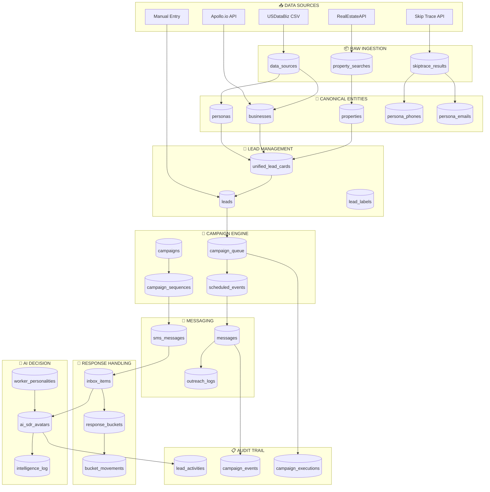
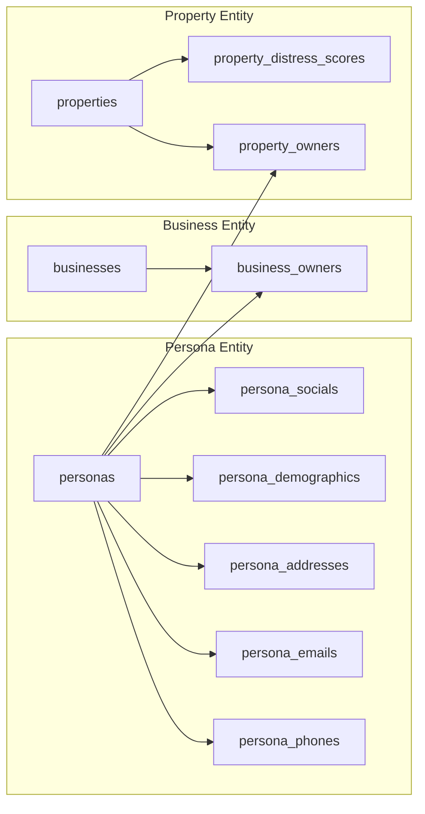
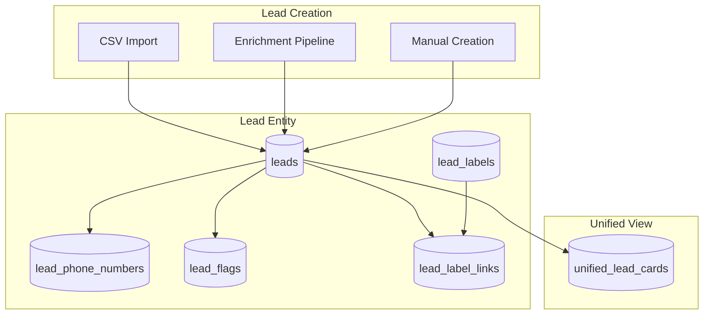
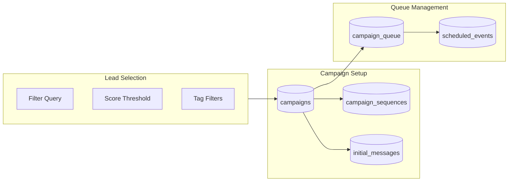
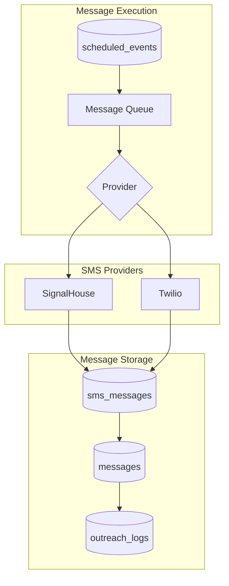
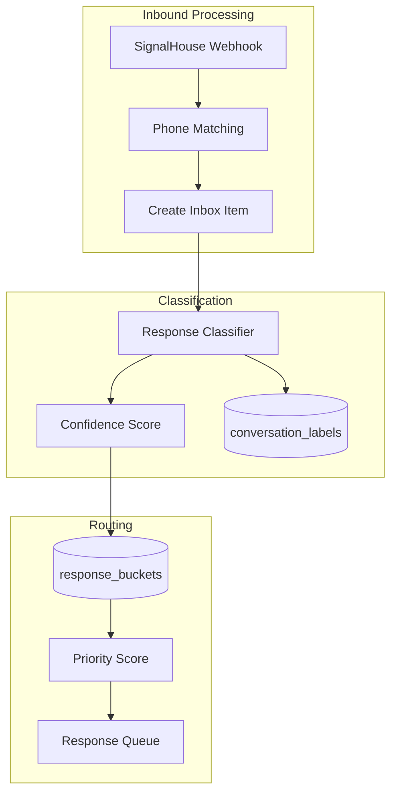
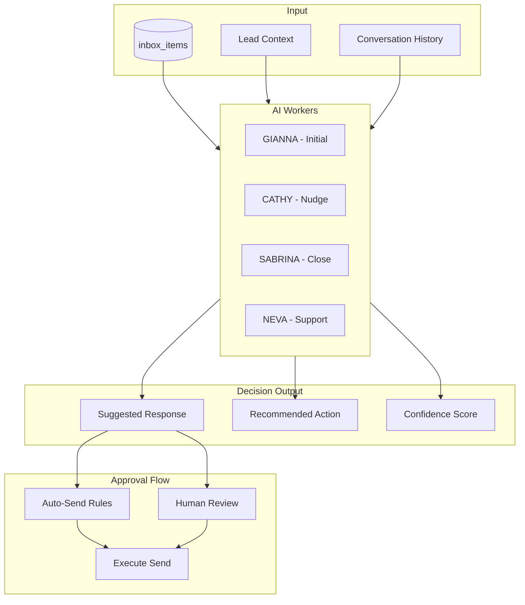
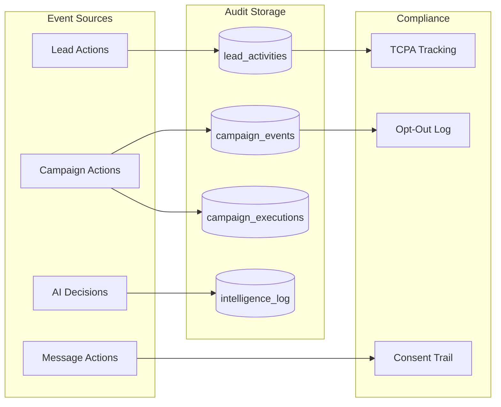

# DATA FLOW MAP

**Generated:** 2024-12-30
**System:** OutreachGlobal / Nextier Platform

---

## Overview

This document maps the complete data lifecycle from source ingestion through response handling and audit.

```
Source → Raw → Canonical → Lead → Campaign → Message → Response → Decision → Audit
```

---

## Master Data Flow Diagram



---

## Stage-by-Stage Breakdown

### Stage 1: SOURCE INGESTION

| Source | Format | Destination Table | Frequency |
|--------|--------|-------------------|-----------|
| USDataBiz | CSV | data_sources → businesses | Batch |
| Apollo.io | API | businesses, persona_emails | On-demand |
| RealEstateAPI | API | properties, property_searches | On-demand |
| Skip Trace | API | skiptrace_results → persona_* | Batch |
| Manual | UI | leads | Real-time |

**Key Files:**
- `/apps/front/src/app/api/enrichment/csv/route.ts`
- `/apps/front/src/app/api/apollo/enrich/route.ts`
- `/apps/front/src/app/api/fdaily/skip-trace/route.ts`

---

### Stage 2: RAW DATA STORAGE

| Table | Purpose | Tenant Isolated |
|-------|---------|-----------------|
| data_sources | Track CSV imports | ❌ NEEDS FIX |
| property_searches | Cache property lookups | ✅ team_id |
| skiptrace_results | Skip trace responses | ✅ team_id |
| property_search_blocks | Paginated results | ❌ Shared |

**Mutations:**
- INSERT: New imports create data_sources records
- UPDATE: Status updates (pending → completed → failed)
- DELETE: Cleanup of stale imports

---

### Stage 3: CANONICAL ENTITIES



| Table | Purpose | Dedup Key |
|-------|---------|-----------|
| personas | Unified contact entity | normalized_name + dob |
| businesses | Company records | normalized_name + state |
| properties | Property records | external_id + source |

**Key Files:**
- `/apps/api/src/database/schema/personas.schema.ts`
- `/apps/api/src/database/schema/businesses.schema.ts`
- `/apps/api/src/database/schema/properties.schema.ts`

---

### Stage 4: LEAD MANAGEMENT



**Lead Status Flow:**
```
new → contacted → qualified → customer
                ↘ churned
```

**Key Files:**
- `/apps/front/src/app/api/leads/bulk-create/route.ts`
- `/apps/front/src/app/api/luci/orchestrate/route.ts`
- `/apps/front/src/lib/ai-workers/campaign-workflow.ts`

---

### Stage 5: CAMPAIGN PREPARATION



**Campaign States:**
```
draft → scheduled → active → paused → completed
                         ↘ cancelled
```

**Key Files:**
- `/apps/front/src/app/api/campaign/push/route.ts`
- `/apps/front/src/lib/campaign/contexts.ts`
- `/apps/front/src/lib/ai-workers/scheduling-engine.ts`

---

### Stage 6: MESSAGE EXECUTION



**Message Flow:**
1. scheduled_events triggers at send time
2. Message pulled from campaign_queue
3. Sent via SignalHouse or Twilio
4. Response stored in sms_messages
5. Audit logged to outreach_logs

**Key Files:**
- `/apps/front/src/app/api/sms/batch/route.ts`
- `/apps/front/src/app/api/signalhouse/send/route.ts`
- `/apps/front/src/lib/signalhouse/client.ts`

---

### Stage 7: RESPONSE HANDLING



**Classification Types:**
- STOP / OPT_OUT → Suppression list
- POSITIVE → Hot lead queue
- QUESTION → AI response queue
- EMAIL_CAPTURE → Gold label
- UNCLEAR → Human review

**Key Files:**
- `/apps/front/src/app/api/signalhouse/webhook/route.ts`
- `/apps/front/src/lib/sms/response-mapping.ts`
- `/apps/front/src/lib/response-classifications.ts`

---

### Stage 8: AI DECISION ENGINE



**AI Worker Assignment:**
| Stage | Worker | Role |
|-------|--------|------|
| initial | GIANNA | First contact |
| retarget | GIANNA | Follow-up |
| nudge | CATHY | Gentle push |
| nurture | GIANNA | Long-term |
| book | SABRINA | Appointment |
| reminder | APPOINTMENT_BOT | Confirmations |

**Key Files:**
- `/apps/front/src/lib/ai-workers/digital-workers.ts`
- `/apps/front/src/lib/gianna/gianna-service.ts`
- `/apps/front/src/lib/campaign/contexts.ts`

---

### Stage 9: AUDIT & COMPLIANCE



**Audit Requirements:**
- Every outbound message logged with timestamp
- Every AI decision logged with confidence
- Every opt-out logged immediately
- Every human approval tracked

**Key Files:**
- `/apps/front/src/lib/audit-log.ts`
- `/apps/api/src/database/schema/intelligence-log.schema.ts`

---

## Read-Only Boundaries

| Stage | Read-Only Tables |
|-------|------------------|
| Source | N/A |
| Raw | property_search_blocks |
| Canonical | properties, property_distress_scores |
| Lead | N/A |
| Campaign | campaign_sequences (after start) |
| Message | messages (after send) |
| Response | N/A |
| AI | intelligence_log |
| Audit | ALL audit tables |

---

## Mutation Checkpoints

| Checkpoint | Table | Action | Audit |
|------------|-------|--------|-------|
| Lead Created | leads | INSERT | lead_activities |
| Lead Enriched | personas | UPDATE | intelligence_log |
| Campaign Started | campaigns | UPDATE status | campaign_events |
| Message Sent | messages | INSERT | outreach_logs |
| Response Received | inbox_items | INSERT | lead_activities |
| AI Decision | intelligence_log | INSERT | Self-audit |
| Lead Converted | leads | UPDATE status | lead_activities |

---

## Tenant Isolation Checkpoints

Every stage MUST verify `team_id`:

```typescript
// Pattern for all queries
const data = await db.query.tableName.findMany({
  where: and(
    eq(tableName.teamId, currentTeamId),  // REQUIRED
    // other filters
  )
});
```

**Critical Paths Requiring Verification:**
1. Lead selection for campaigns
2. Message sending
3. Response matching
4. AI context loading
5. Audit log queries
