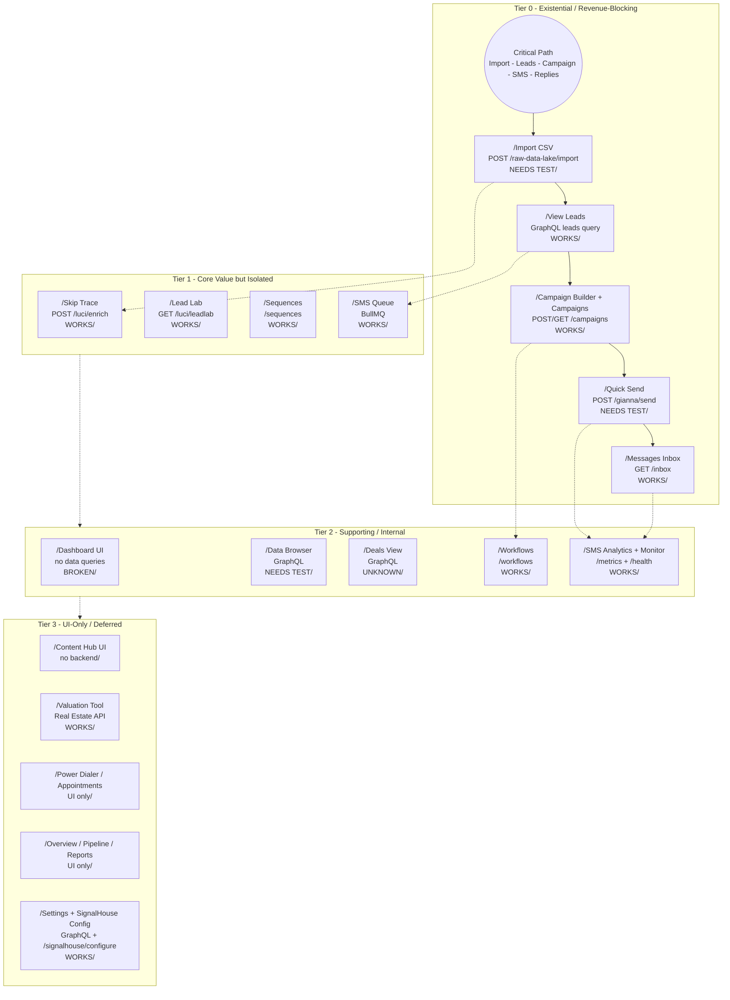

# Feature Risk Tiers Map

> **Version**: 1.0.0
> **Date**: January 27, 2026
> **Source**: PAGE_MAP.md (commit f4772944a5474f86bbba72dad48a605e90639698)

---

## Overview

This document reorganizes the PAGE_MAP.md feature audit from route-centric to **flow-centric** for debugging purposes. Features are categorized into four risk tiers based on business criticality.

---

## Tier Definitions

| Tier | Label | Description |
|------|-------|-------------|
| 0 | Existential / Revenue-Blocking | Platform is a lie if any are broken |
| 1 | Core Value but Isolated | Must work once Tier 0 is VERIFIED |
| 2 | Supporting / Internal | Ops visibility, not core execution |
| 3 | UI-Only / Deferred | No backend, pure UI surface |

---

## Risk Tier Visualization



---

## Detailed Tier Breakdown

### Tier 0 - Existential / Revenue-Blocking

These are non-negotiable. If any are broken, nothing else matters.

| Feature | Route | Backend API | Source Status | Ledger Status | Risk Notes | Evidence |
|---------|-------|-------------|---------------|---------------|------------|----------|
| **Critical Path** | n/a | n/a | Must Work | UNKNOWN | Entire platform is a lie if any step fails | PAGE_MAP.md (line 3) |
| **Import CSV** | /t/[team]/import | POST /raw-data-lake/import | NEEDS TEST | UNKNOWN | Silent import failure poisons downstream flows | PAGE_MAP.md (line 19) |
| **View Leads** | /t/[team]/leads | GraphQL leads query | WORKS (names fixed) | UNKNOWN | Data completeness/staleness unclear | PAGE_MAP.md (line 23) |
| **Campaign Builder** | /t/[team]/campaign-builder | POST /campaigns | WORKS | UNKNOWN | Persistence/back-end confirmation not verified | PAGE_MAP.md (line 40) |
| **Campaigns** | /t/[team]/campaigns | GET /campaigns | WORKS | UNKNOWN | Campaign list retrieval | PAGE_MAP.md (line 41) |
| **Quick Send** | /t/[team]/quick-send | POST /gianna/send | NEEDS TEST | UNKNOWN | Live outbound risk (compliance/trust) if send fails | PAGE_MAP.md (line 42) |
| **Messages (Inbox)** | /t/[team]/inbox | GET /inbox | WORKS | UNKNOWN | Replies must sync to close the sales loop | PAGE_MAP.md (line 50) |

---

### Tier 1 - Core Value but Isolated

These must work once Tier 0 is VERIFIED.

| Feature | Route | Backend API | Source Status | Ledger Status | Risk Notes | Evidence |
|---------|-------|-------------|---------------|---------------|------------|----------|
| **Skip Trace** | /t/[team]/skip-trace | POST /luci/enrich | WORKS | UNKNOWN | Restart/idempotency unclear | PAGE_MAP.md (line 21) |
| **Lead Lab** | /t/[team]/lead-lab | GET /luci/leadlab | WORKS | UNKNOWN | Persistence/context around sessions unclear | PAGE_MAP.md (line 22) |
| **Sequences** | /t/[team]/sequences | /sequences | WORKS | UNKNOWN | Reliability of sequence state after failures unknown | PAGE_MAP.md (line 44) |
| **SMS Queue** | /t/[team]/sms/queue | BullMQ queue | WORKS | UNKNOWN | Queue replay/restart safety unclear | PAGE_MAP.md (line 45) |

---

### Tier 2 - Supporting / Internal

These affect ops visibility, not core execution.

| Feature | Route | Backend API | Source Status | Ledger Status | Risk Notes | Evidence |
|---------|-------|-------------|---------------|---------------|------------|----------|
| **Dashboard** | /t/[team] | None | BROKEN (no data) | BROKEN | Ops visibility blocked but lower priority if Tier 0 fixed | PAGE_MAP.md (line 13) |
| **Data Browser** | /t/[team]/data-browser | GraphQL | NEEDS TEST | UNKNOWN | Backend data health unclear | PAGE_MAP.md (line 24) |
| **Deals** | /t/[team]/deals | GraphQL | UNKNOWN | UNKNOWN | Status and persistence not documented | PAGE_MAP.md (line 29) |
| **Workflows** | /t/[team]/workflows | /workflows | WORKS | UNKNOWN | Restart semantics unclear | PAGE_MAP.md (line 54) |
| **SMS Analytics** | /t/[team]/sms/analytics | /metrics | WORKS | UNKNOWN | Aggregation persistence unknown | PAGE_MAP.md (line 60) |
| **API Monitor** | /t/[team]/api-monitor | /health | WORKS | UNKNOWN | Health coverage vs Tier 0 unknown | PAGE_MAP.md (line 63) |
| **Diagnostics** | /t/[team]/diagnostics | /health | WORKS | UNKNOWN | Diagnostic depth unknown | PAGE_MAP.md (line 69) |

---

### Tier 3 - UI-Only / Deferred

No persistence/backend. Can lag as long as Tiers 0-1 work.

| Feature | Route | Backend API | Source Status | Ledger Status | Risk Notes | Evidence |
|---------|-------|-------------|---------------|---------------|------------|----------|
| **Content Hub** | /t/[team]/content | None | UI ONLY | UNKNOWN | No persistence/back-end | PAGE_MAP.md (line 34) |
| **Valuation Tool** | /t/[team]/valuation | Real Estate API | WORKS | UNKNOWN | External dependency behavior unknown | PAGE_MAP.md (line 35) |
| **Power Dialer** | /t/[team]/power-dialer | None | UI ONLY | UNKNOWN | No backend - pure UI | PAGE_MAP.md (line 52) |
| **Appointments** | /t/[team]/appointments | None | UI ONLY | UNKNOWN | No backend - pure UI | PAGE_MAP.md (line 53) |
| **Overview** | /t/[team]/analytics | None | UI ONLY | UNKNOWN | Metrics not wired for persistence | PAGE_MAP.md (line 59) |
| **Pipeline Heatmap** | /t/[team]/pipelines | None | UI ONLY | UNKNOWN | Metrics not wired for persistence | PAGE_MAP.md (line 61) |
| **Reports** | /t/[team]/reports | None | UI ONLY | UNKNOWN | Metrics not wired for persistence | PAGE_MAP.md (line 62) |
| **Call Queue** | /t/[team]/call-center | call_queue table | SCHEMA ONLY | UNKNOWN | Schema exists but no routing logic | PAGE_MAP.md (line 51) |
| **Settings** | /t/[team]/settings | GraphQL team | WORKS | UNKNOWN | Configuration persistence needs verification | PAGE_MAP.md (line 68) |
| **Account** | /t/[team]/settings/account | GraphQL | WORKS | UNKNOWN | Configuration persistence | PAGE_MAP.md (line 70) |
| **Users** | /t/[team]/users | GraphQL teamMembers | WORKS | UNKNOWN | Team management | PAGE_MAP.md (line 71) |
| **Integrations** | /t/[team]/integrations | GraphQL | WORKS | UNKNOWN | Integration config | PAGE_MAP.md (line 72) |
| **SignalHouse** | /t/[team]/signalhouse | /signalhouse/configure | WORKS | UNKNOWN | SMS provider config | PAGE_MAP.md (line 73) |
| **Digital Workers** | /t/[team]/digital-workers | /gianna, /cathy, /sabrina | PARTIAL | UNKNOWN | Agent config UI | PAGE_MAP.md (line 43) |
| **Sectors** | /t/[team]/sectors | GET /luci/sectors | WORKS | UNKNOWN | Sector management | PAGE_MAP.md (line 14) |
| **B2B Search** | /t/[team]/b2b-search | POST /business-list/search | WORKS | UNKNOWN | Search UI | PAGE_MAP.md (line 20) |

---

## Fix Order Priority

### Phase 1 - Verify Critical Path (Tier 0)

**This is NEXTIER. If this flow is not VERIFIED, the platform is not sellable.**

```
Import CSV --> View Leads --> Create Campaign --> Send SMS --> Handle Replies
```

1. **Import** - Test end-to-end CSV upload, verify leads appear
2. **Leads** - Verify data completeness and freshness
3. **Campaign Builder** - Verify persistence, confirm campaign creation
4. **Quick Send** - Test SMS send flow, verify delivery
5. **Messages** - Verify reply ingestion and lead attachment

### Phase 2 - Validate Core Value (Tier 1)

6. Skip Trace - Test enrichment flow, verify idempotency
7. Lead Lab - Test session persistence
8. Sequences - Test restart behavior
9. SMS Queue - Test queue replay safety

### Phase 3 - Restore Visibility (Tier 2)

10. Dashboard - Wire up real data queries
11. Data Browser - Test GraphQL queries
12. SMS Analytics - Verify metrics accuracy

### Phase 4 - Polish (Tier 3)

Deferred until Tiers 0-2 are verified.

---

## Status Legend

| Status | Meaning |
|--------|---------|
| WORKS | Backend responds, basic function confirmed |
| NEEDS TEST | Endpoint exists but not verified end-to-end |
| UNKNOWN | No information available |
| BROKEN | Known to be non-functional |
| UI ONLY | No backend wired |
| PARTIAL | Some functionality works |
| SCHEMA ONLY | Database schema exists but no logic |
