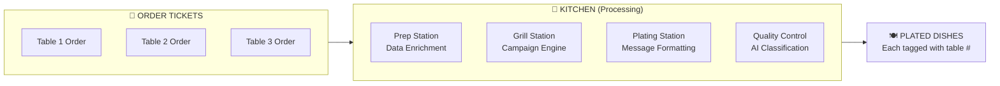
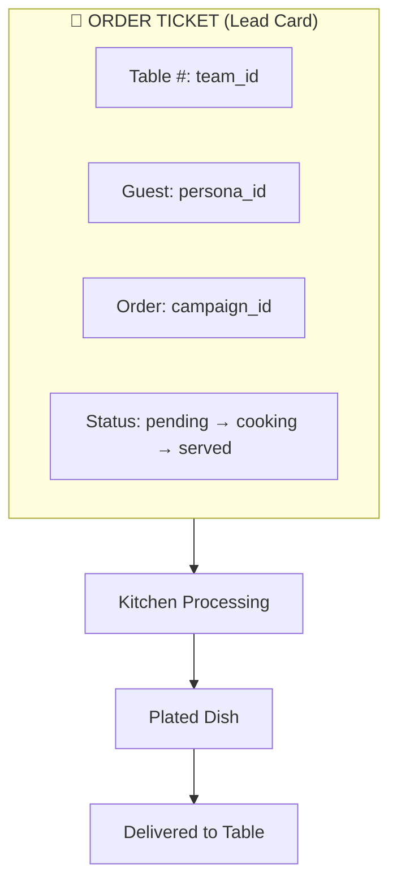

# RESTAURANT MODEL MAP

**Generated:** 2024-12-30
**Purpose:** Human-readable metaphor for multi-tenant data architecture

---

## The Restaurant Metaphor

> **This system is a restaurant:**
> - The platform is the restaurant
> - Each tenant is a table
> - The menu, kitchen, and staff are shared
> - Orders, food, conversations, and bills are NEVER shared
> - Every plate must be stamped with a table number before leaving the kitchen

---

## Concept Mapping

### The Restaurant = The Platform

| Restaurant Concept | System Concept | Tables/Entities |
|-------------------|----------------|-----------------|
| 🏢 **Restaurant** | Platform | OutreachGlobal application |
| 🪑 **Dining Table** | Tenant | `teams` |
| 👨‍🍳 **Kitchen** | Processing Engine | AI workers, enrichment pipelines |
| 📋 **Menu** | Templates | `message_templates`, `cadence_templates` |
| 👨‍🍳 **Chefs** | AI Workers | GIANNA, CATHY, SABRINA, NEVA |
| 🍽️ **Waitstaff** | UI/API | Frontend routes, API handlers |

---

### The Menu = Shared Templates

**The menu is the same for all tables, but orders are table-specific.**

| Menu Item | System Equivalent | Table |
|-----------|-------------------|-------|
| 📖 Menu Items | Message templates | `message_templates` |
| 🍲 Daily Specials | Cadence templates | `cadence_templates` |
| 📝 Recipe Book | Knowledge documents | `knowledge_documents` |
| 🎨 Presentation Guide | Worker personalities | `worker_personalities` |

**Important:** The menu (templates) can be:
- Global (system templates available to all)
- Table-specific (custom templates per tenant)

```
Menu Access:
├── Global Templates (read-only for all)
└── Team Templates (read-write for team only)
```

---

### The Kitchen = Processing Engine

**The kitchen is shared infrastructure, but every dish is tagged with a table number.**



| Kitchen Station | System Function | Key Tables |
|-----------------|-----------------|------------|
| 🥬 Prep Station | Data enrichment | `skiptrace_results`, `personas` |
| 🔥 Grill Station | Campaign execution | `campaign_queue`, `scheduled_events` |
| 🍽️ Plating Station | Message formatting | `messages`, `sms_messages` |
| ✅ Quality Control | Response classification | `inbox_items`, `intelligence_log` |

---

### The Dining Tables = Tenants

**Each table is completely isolated. Food, conversations, and bills never cross tables.**

| Table Element | System Element | Table |
|---------------|----------------|-------|
| 🪑 Table Number | Team ID | `teams.id` |
| 👥 Guests | Users | `team_members` |
| 📋 Guest List | Leads | `leads` |
| 🧾 Tab/Bill | Usage tracking | `usage_events` |

```
Table 1 (Team A)          Table 2 (Team B)
├── Guests (users)        ├── Guests (users)
├── Orders (leads)        ├── Orders (leads)
├── Dishes (messages)     ├── Dishes (messages)
└── Bill (usage)          └── Bill (usage)

❌ NEVER: Table 1 sees Table 2's orders
❌ NEVER: Table 2 eats Table 1's food
✅ ALWAYS: Each dish tagged with table number
```

---

### Order Tickets = Lead Cards

**An order ticket travels through the kitchen with the table number stamped on it.**

| Order Ticket Field | System Field | Purpose |
|--------------------|--------------|---------|
| 🔢 Table Number | `team_id` | Tenant isolation |
| 👤 Guest Name | `lead.firstName`, `lastName` | Contact identity |
| 📞 Contact | `persona_phones.phone_number` | Communication channel |
| 📋 Special Requests | `lead.customFields` | Custom data |
| ⏰ Order Time | `created_at` | Timestamp |



---

### Plates = Outbound Messages

**Every plate leaving the kitchen has a table number. No exceptions.**

| Plate Element | System Element | Table |
|---------------|----------------|-------|
| 🍽️ The Plate | Message container | `messages` |
| 🍕 The Food | Message content | `messages.body` |
| 🏷️ Table Tag | Tenant ID | `messages.team_id` |
| 📝 Order Reference | Lead reference | `messages.lead_id` |
| 👨‍🍳 Chef Signature | AI worker | `messages.worker_id` |

**CRITICAL RULE:**
```
IF plate.table_number != guest.table_number THEN
    ❌ REJECT - Wrong table
    🚨 ALERT - Potential data leak
END
```

---

### Receipts = Audit Records

**Every transaction generates a receipt for compliance and billing.**

| Receipt Element | System Element | Table |
|-----------------|----------------|-------|
| 🧾 Bill | Campaign execution record | `campaign_executions` |
| 📝 Line Items | Message logs | `outreach_logs` |
| 💳 Payment Record | Usage event | `usage_events` |
| ✍️ Signature | AI decision log | `intelligence_log` |

---

### The Wait Staff = API & UI

**Waiters take orders and deliver food, but never mix up tables.**

| Waiter Action | System Action | Isolation Check |
|---------------|---------------|-----------------|
| Take Order | Create lead | Verify team_id |
| Submit to Kitchen | Queue campaign | Verify team_id |
| Deliver Food | Send message | Verify team_id |
| Check on Table | Query inbox | Filter by team_id |
| Present Bill | Generate report | Filter by team_id |

```typescript
// Every waiter (API handler) checks table number
async function handleRequest(teamId: string) {
  // ALWAYS verify the team context
  const team = await verifyTeamAccess(teamId);

  // ALWAYS filter queries by team
  const data = await db.query.leads.findMany({
    where: eq(leads.teamId, teamId)  // TABLE NUMBER CHECK
  });
}
```

---

### The Chefs = AI Workers

**Chefs prepare food according to recipes, but each dish is for a specific table.**

| Chef | AI Worker | Specialty |
|------|-----------|-----------|
| 👨‍🍳 **Chef Gianna** | GIANNA | First impressions, warm welcomes |
| 👩‍🍳 **Chef Cathy** | CATHY | Gentle nudges, follow-ups |
| 👨‍🍳 **Chef Sabrina** | SABRINA | Closing deals, bookings |
| 🤖 **Sous Chef** | APPOINTMENT_BOT | Confirmations, reminders |

**Chef Rules:**
1. Always check the order ticket (lead context)
2. Never share recipes between tables (tenant data)
3. Log every dish prepared (intelligence_log)
4. Get approval before serving new dishes (human review)

---

## Visual Summary

```
┌─────────────────────────────────────────────────────────────────┐
│                    🏢 THE RESTAURANT                            │
│                    (OutreachGlobal Platform)                    │
├─────────────────────────────────────────────────────────────────┤
│                                                                 │
│   📋 MENU (Shared)          🍳 KITCHEN (Shared Processing)     │
│   ├── Templates             ├── Enrichment                      │
│   ├── Cadences              ├── Campaign Engine                 │
│   └── Knowledge             └── AI Workers                      │
│                                                                 │
├─────────────────────────────────────────────────────────────────┤
│                                                                 │
│   🪑 TABLE 1 (Team A)       🪑 TABLE 2 (Team B)                │
│   ├── 👥 Guests (users)     ├── 👥 Guests (users)              │
│   ├── 📝 Orders (leads)     ├── 📝 Orders (leads)              │
│   ├── 🍽️ Dishes (messages)  ├── 🍽️ Dishes (messages)           │
│   ├── 💬 Convos (inbox)     ├── 💬 Convos (inbox)              │
│   └── 🧾 Bill (usage)       └── 🧾 Bill (usage)                │
│                                                                 │
│         ❌ ISOLATED ❌              ❌ ISOLATED ❌               │
│                                                                 │
└─────────────────────────────────────────────────────────────────┘
```

---

## Rules of Service (Tenant Isolation Rules)

### Rule 1: Every Plate Has a Table Number
```sql
-- EVERY row with tenant data MUST have team_id
INSERT INTO messages (id, team_id, ...)
VALUES ('msg_123', 'team_abc', ...);
--                  ^^^^^^^^^ REQUIRED
```

### Rule 2: Waiters Only Serve Their Section
```typescript
// API handlers MUST filter by team_id
const messages = await db.query.messages.findMany({
  where: eq(messages.teamId, currentTeamId)
});
```

### Rule 3: Kitchen Stamps Every Dish
```sql
-- RLS Policy ensures kitchen can't serve wrong table
CREATE POLICY tenant_isolation ON messages
FOR ALL USING (team_id = current_setting('app.team_id'));
```

### Rule 4: Receipts Stay at the Table
```typescript
// Audit logs MUST include team_id
await logActivity({
  teamId: currentTeamId,
  action: 'message_sent',
  details: { ... }
});
```

### Rule 5: Guest Lists Are Private
```sql
-- Leads table has enforced FK to teams
ALTER TABLE leads
ADD CONSTRAINT leads_team_id_fk
FOREIGN KEY (team_id) REFERENCES teams(id);
```

---

## Failure Modes (Restaurant Disasters)

| Disaster | System Equivalent | Prevention |
|----------|-------------------|------------|
| 🍕 Wrong Table | Message to wrong tenant | RLS + team_id check |
| 🧾 Mixed Bill | Usage charged to wrong team | team_id on all usage |
| 👂 Eavesdropping | Cross-tenant data access | RLS policies |
| 🍲 Food Poisoning | Malicious data injection | Input validation |
| 🔥 Kitchen Fire | System outage | Graceful degradation |

---

## Implementation Checklist

- [ ] Every table has `team_id` column ✅
- [ ] Every query filters by `team_id` ✅
- [ ] RLS policies enabled on all tenant tables ❌ **MISSING**
- [ ] Indexes on `team_id` for performance ⚠️ **PARTIAL**
- [ ] Audit logs include `team_id` ✅
- [ ] FK constraints enforce `team_id` ⚠️ **PARTIAL**
