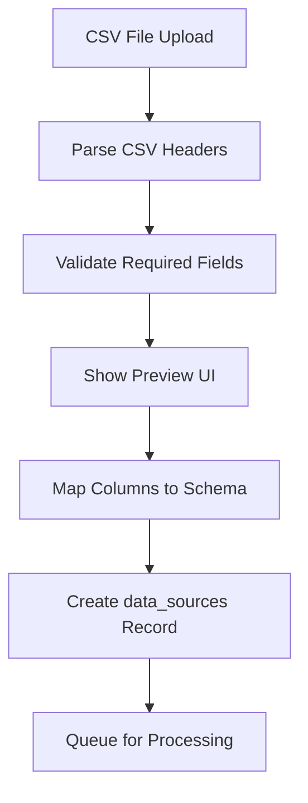
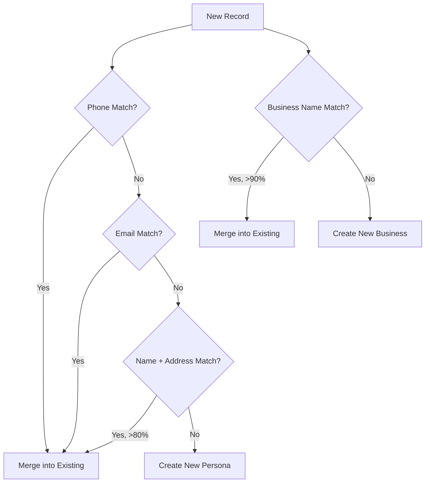
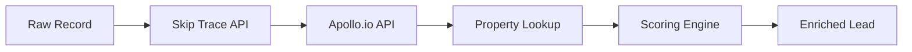
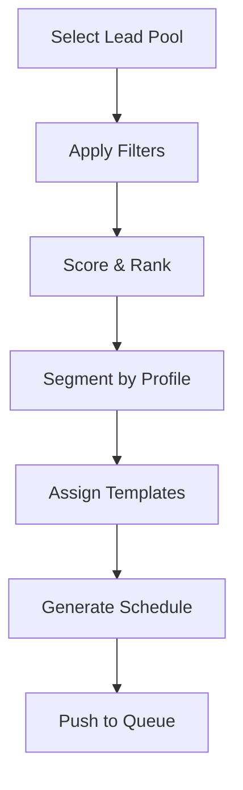
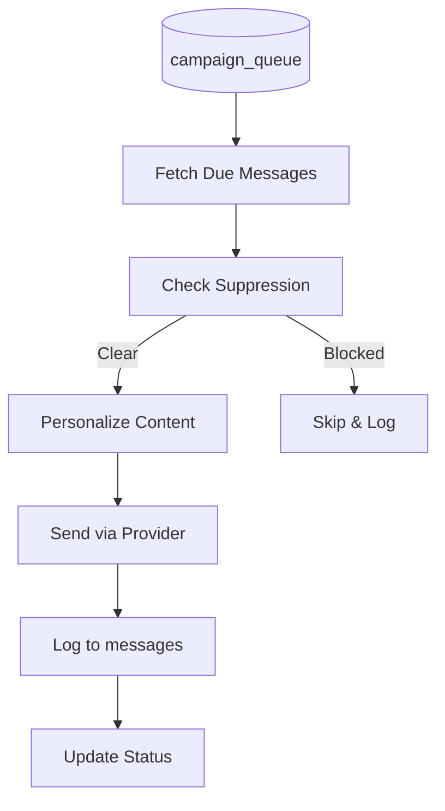
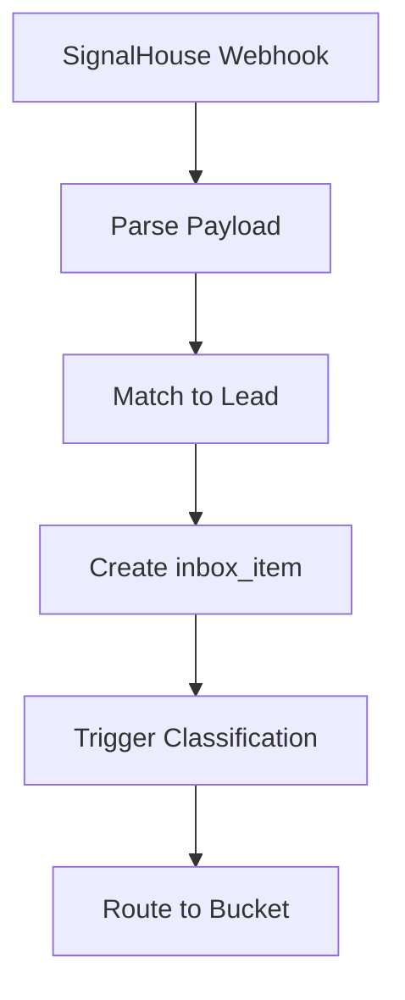
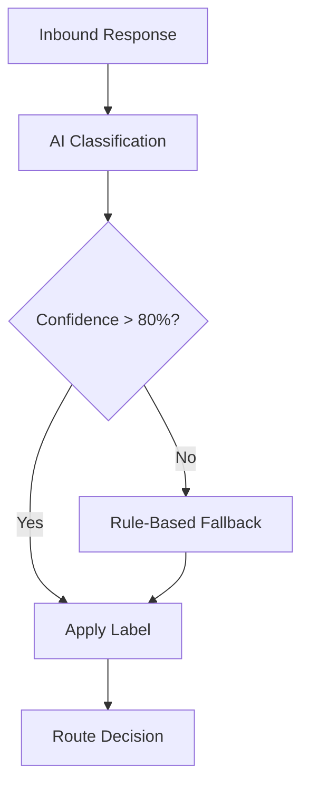
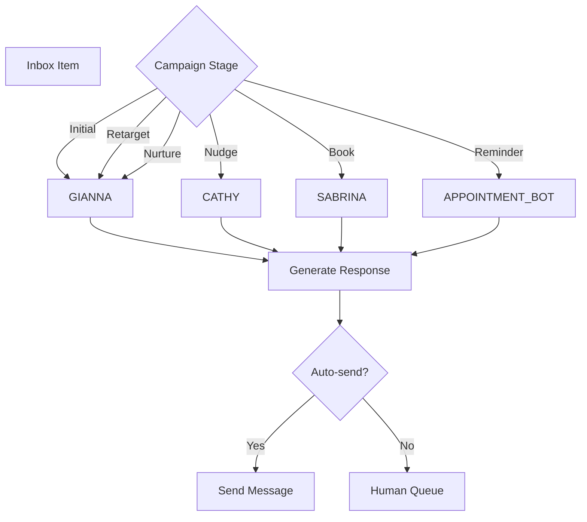
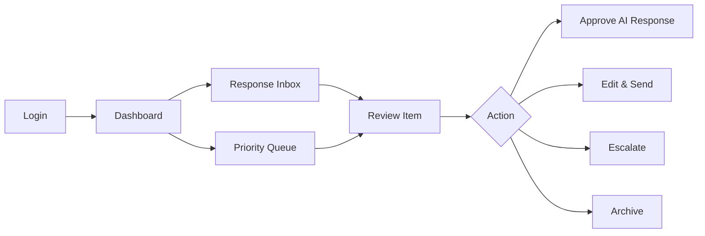
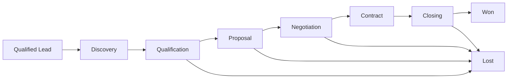

# USDataBiz Operational Journey SOP

**Generated:** 2024-12-30
**System:** OutreachGlobal / Nextier Platform
**Purpose:** End-to-end operational lifecycle from CSV ingestion to deal closeout

---

## Overview

This document maps the complete operational journey for USDataBiz leads from raw CSV ingestion through campaign execution, response handling, and deal closure.

```
CSV Upload → Normalization → Entity Resolution → Enrichment →
Campaign Prep → SMS Execution → Response Handling →
Classification → Prioritization → Copilot/Operator → Deal Close
```

---

## Step 1: Source Ingestion (CSV Upload)

### Entry Points

| Method | Route | Handler |
|--------|-------|---------|
| UI Upload | `/t/[team]/data/import` | File upload component |
| API Batch | `/api/enrichment/csv` | POST multipart/form-data |
| Bulk Create | `/api/leads/bulk-create` | POST JSON array |

### Process Flow



### Data Tables Touched

| Table | Operation | Purpose |
|-------|-----------|---------|
| data_sources | INSERT | Track import job |
| import_lead_presets | READ | Load saved mappings |

### Required Fields (USDataBiz)

```typescript
interface USDataBizRecord {
  // Identity
  companyName: string;
  ownerFirstName: string;
  ownerLastName: string;

  // Contact
  phone?: string;
  email?: string;

  // Business Info
  sicCode?: string;
  naicsCode?: string;
  employeeCount?: number;
  annualRevenue?: number;

  // Address
  street?: string;
  city?: string;
  state?: string;
  zip?: string;
}
```

### Key Files

- [/apps/front/src/app/api/enrichment/csv/route.ts](apps/front/src/app/api/enrichment/csv/route.ts)
- [/apps/front/src/app/t/[team]/data/import/page.tsx](apps/front/src/app/t/[team]/data/import/page.tsx)

---

## Step 2: Normalization

### Process

1. **Name Normalization**
   - Trim whitespace
   - Standardize casing (Title Case for names)
   - Remove special characters
   - Split compound names

2. **Phone Normalization**
   - Strip non-numeric characters
   - Add country code if missing
   - Validate length (10-11 digits US)
   - Format to E.164

3. **Address Normalization**
   - Standardize abbreviations (St → Street)
   - Parse into components
   - Validate ZIP code format
   - Geocode for lat/lng

4. **Business Name Normalization**
   - Remove legal suffixes (LLC, Inc, Corp)
   - Standardize punctuation
   - Create normalized_name for matching

### Normalization Functions

```typescript
// Phone normalization
function normalizePhone(phone: string): string {
  const digits = phone.replace(/\D/g, '');
  if (digits.length === 10) return `+1${digits}`;
  if (digits.length === 11 && digits.startsWith('1')) return `+${digits}`;
  return null; // Invalid
}

// Name normalization
function normalizeName(name: string): string {
  return name
    .trim()
    .toLowerCase()
    .replace(/[^a-z\s]/g, '')
    .split(' ')
    .map(w => w.charAt(0).toUpperCase() + w.slice(1))
    .join(' ');
}
```

### Data Tables Touched

| Table | Field | Normalization |
|-------|-------|---------------|
| personas | normalized_first_name | Lower, trimmed |
| personas | normalized_last_name | Lower, trimmed |
| businesses | normalized_name | Lower, no suffixes |
| persona_phones | normalized_number | E.164 format |
| persona_emails | normalized_address | Lower, trimmed |

---

## Step 3: Entity Resolution (Deduplication)

### Matching Strategy



### Match Confidence Scores

| Match Type | Confidence | Action |
|------------|------------|--------|
| Exact phone | 100% | Auto-merge |
| Exact email | 95% | Auto-merge |
| Name + full address | 90% | Auto-merge |
| Name + ZIP | 70% | Flag for review |
| Name only | 50% | Create new |
| Business name exact | 95% | Auto-merge |
| Business name fuzzy | 80% | Flag for review |

### Merge Process

```typescript
async function mergePersonas(survivor: Persona, merged: Persona) {
  // 1. Copy phones/emails not in survivor
  await copyMissingPhones(survivor.id, merged.id);
  await copyMissingEmails(survivor.id, merged.id);

  // 2. Update confidence scores
  await updateConfidenceScore(survivor.id);

  // 3. Log merge history
  await db.insert(personaMergeHistory).values({
    survivorId: survivor.id,
    mergedId: merged.id,
    matchScore: calculateScore(survivor, merged),
    mergedAt: new Date()
  });

  // 4. Soft delete merged record
  await db.update(personas)
    .set({ isActive: false })
    .where(eq(personas.id, merged.id));
}
```

### Data Tables Touched

| Table | Operation | Purpose |
|-------|-----------|---------|
| personas | SELECT/INSERT/UPDATE | Entity resolution |
| persona_merge_history | INSERT | Audit trail |
| businesses | SELECT/INSERT/UPDATE | Business matching |

---

## Step 4: Data Enrichment

### Enrichment Pipeline



### Skip Trace Enrichment

| Provider | Data Retrieved | Cost |
|----------|----------------|------|
| RealEstateAPI | Phones, emails, addresses | ~$0.10/record |

```typescript
// Skip trace request
const skipTraceResult = await skipTrace({
  firstName: persona.firstName,
  lastName: persona.lastName,
  address: persona.address,
  city: persona.city,
  state: persona.state,
  zip: persona.zip
});

// Store results
await db.insert(skiptraceResults).values({
  teamId,
  personaId: persona.id,
  phonesFound: skipTraceResult.phones.length,
  emailsFound: skipTraceResult.emails.length,
  rawResponse: skipTraceResult
});
```

### Apollo Enrichment

| Data Type | Fields |
|-----------|--------|
| Person | Title, LinkedIn, department |
| Company | Revenue, employees, industry |
| Contact | Direct dial, work email |

### Scoring Algorithm

```typescript
function calculateLeadScore(lead: Lead): number {
  let score = 0;

  // Business fit (0-30)
  if (lead.employeeCount >= 10) score += 10;
  if (lead.annualRevenue >= 1000000) score += 20;

  // Contact quality (0-30)
  if (lead.phoneVerified) score += 15;
  if (lead.emailVerified) score += 15;

  // Decision maker (0-20)
  if (lead.isOwner) score += 20;
  if (lead.isCLevel) score += 15;

  // Engagement signals (0-20)
  if (lead.recentActivity) score += 10;
  if (lead.websiteVisits) score += 10;

  return score;
}
```

### Data Tables Touched

| Table | Operation |
|-------|-----------|
| skiptrace_jobs | INSERT (batch tracking) |
| skiptrace_results | INSERT |
| persona_phones | INSERT (new phones) |
| persona_emails | INSERT (new emails) |
| unified_lead_cards | UPDATE (scores) |

### Key Files

- [/apps/front/src/app/api/apollo/enrich/route.ts](apps/front/src/app/api/apollo/enrich/route.ts)
- [/apps/front/src/app/api/fdaily/skip-trace/route.ts](apps/front/src/app/api/fdaily/skip-trace/route.ts)
- [/apps/front/src/lib/ai-workers/campaign-workflow.ts](apps/front/src/lib/ai-workers/campaign-workflow.ts)

---

## Step 5: Campaign Preparation (LUCY Prep)

### LUCY Orchestration



### Lead Selection Criteria

```typescript
interface CampaignSelectionCriteria {
  teamId: string;
  minScore?: number;
  maxScore?: number;
  status?: LeadStatus[];
  tags?: string[];
  excludeTags?: string[];
  location?: {
    states?: string[];
    zipCodes?: string[];
    radius?: { lat: number; lng: number; miles: number };
  };
  businessType?: {
    sicCodes?: string[];
    naicsCodes?: string[];
    employeeRange?: [number, number];
    revenueRange?: [number, number];
  };
  enrichmentStatus?: 'completed' | 'pending' | 'failed';
  lastContactedBefore?: Date;
  neverContacted?: boolean;
}
```

### Template Assignment

| Segment | Template Type | AI Worker |
|---------|---------------|-----------|
| High-value owner | Premium intro | GIANNA |
| Decision maker | Business focus | GIANNA |
| Gatekeeper | Soft approach | CATHY |
| Re-engagement | Nurture | GIANNA |

### Scheduling Rules

```typescript
const schedulingRules = {
  // Time windows (local to lead)
  businessHours: { start: 9, end: 17 },
  preferredDays: ['monday', 'tuesday', 'wednesday', 'thursday'],

  // Spacing
  minTimeBetweenMessages: 24 * 60 * 60 * 1000, // 24 hours
  maxMessagesPerDay: 3,

  // Compliance
  respectDNC: true,
  checkSuppression: true,
  tcpaCompliant: true
};
```

### Data Tables Touched

| Table | Operation |
|-------|-----------|
| campaigns | INSERT |
| campaign_sequences | INSERT |
| campaign_queue | INSERT |
| scheduled_events | INSERT |

### Key Files

- [/apps/front/src/app/api/luci/orchestrate/route.ts](apps/front/src/app/api/luci/orchestrate/route.ts)
- [/apps/front/src/app/api/lucy/prepare/route.ts](apps/front/src/app/api/lucy/prepare/route.ts)

---

## Step 6: SMS Execution

### Send Pipeline



### Pre-Send Checks

```typescript
async function preSendChecks(lead: Lead, teamId: string): Promise<boolean> {
  // 1. Check suppression list
  const suppressed = await db.query.suppressionList.findFirst({
    where: and(
      eq(suppressionList.teamId, teamId),
      eq(suppressionList.phone, lead.phone)
    )
  });
  if (suppressed) return false;

  // 2. Check opt-out status
  if (lead.optedOut) return false;

  // 3. Check time window (TCPA)
  const localHour = getLocalHour(lead.timezone);
  if (localHour < 8 || localHour > 21) return false;

  // 4. Check daily limit
  const todayCount = await getTodayMessageCount(lead.id);
  if (todayCount >= 3) return false;

  return true;
}
```

### Message Personalization

```typescript
function personalizeMessage(template: string, lead: Lead): string {
  return template
    .replace('{{firstName}}', lead.firstName || 'there')
    .replace('{{lastName}}', lead.lastName || '')
    .replace('{{company}}', lead.company || 'your business')
    .replace('{{city}}', lead.city || 'your area')
    .replace('{{industry}}', lead.industry || 'your industry');
}
```

### Provider Integration

| Provider | Use Case | API |
|----------|----------|-----|
| SignalHouse | Primary SMS | REST API |
| Twilio | Backup/Voice | REST API |

### Data Tables Touched

| Table | Operation |
|-------|-----------|
| campaign_queue | UPDATE (status) |
| messages | INSERT |
| sms_messages | INSERT |
| outreach_logs | INSERT |
| campaign_executions | INSERT |

### Key Files

- [/apps/front/src/app/api/sms/batch/route.ts](apps/front/src/app/api/sms/batch/route.ts)
- [/apps/front/src/app/api/signalhouse/send/route.ts](apps/front/src/app/api/signalhouse/send/route.ts)
- [/apps/front/src/lib/signalhouse/client.ts](apps/front/src/lib/signalhouse/client.ts)

---

## Step 7: Inbound Response Handling

### Webhook Reception



### Webhook Handler

```typescript
// POST /api/signalhouse/webhook
export async function POST(request: Request) {
  const payload = await request.json();

  // Validate webhook signature
  if (!validateSignature(payload, request.headers)) {
    return Response.json({ error: 'Invalid signature' }, { status: 401 });
  }

  // Extract message data
  const { from, to, body, messageId, timestamp } = payload;

  // Match to lead by phone
  const lead = await findLeadByPhone(from);
  if (!lead) {
    await logUnmatchedMessage(payload);
    return Response.json({ status: 'unmatched' });
  }

  // Create inbox item
  const inboxItem = await db.insert(inboxItems).values({
    teamId: lead.teamId,
    leadId: lead.id,
    phoneNumber: from,
    responseText: body,
    externalId: messageId,
    createdAt: new Date(timestamp)
  }).returning();

  // Queue for classification
  await queueClassification(inboxItem[0].id);

  return Response.json({ status: 'received', id: inboxItem[0].id });
}
```

### Phone Matching Logic

```typescript
async function findLeadByPhone(phone: string): Promise<Lead | null> {
  const normalized = normalizePhone(phone);

  // Check leads table
  let lead = await db.query.leads.findFirst({
    where: eq(leads.phone, normalized)
  });

  if (lead) return lead;

  // Check lead_phone_numbers
  const lpn = await db.query.leadPhoneNumbers.findFirst({
    where: eq(leadPhoneNumbers.phone, normalized)
  });

  if (lpn) {
    lead = await db.query.leads.findFirst({
      where: eq(leads.id, lpn.leadId)
    });
  }

  return lead;
}
```

### Data Tables Touched

| Table | Operation |
|-------|-----------|
| inbox_items | INSERT |
| messages | INSERT (inbound) |
| lead_activities | INSERT |

### Key Files

- [/apps/front/src/app/api/signalhouse/webhook/route.ts](apps/front/src/app/api/signalhouse/webhook/route.ts)
- [/apps/front/src/app/api/webhook/signalhouse/route.ts](apps/front/src/app/api/webhook/signalhouse/route.ts)

---

## Step 8: Response Classification

### Classification Engine



### Classification Types

| Type | Keywords/Patterns | Action |
|------|-------------------|--------|
| STOP | stop, unsubscribe, remove | Add to suppression |
| POSITIVE | yes, interested, tell me more | Hot lead queue |
| NEGATIVE | no, not interested | Archive |
| QUESTION | ?, how, what, when, who | AI response queue |
| EMAIL_CAPTURE | email pattern detected | Gold label |
| CALLBACK_REQUEST | call me, phone | Priority callback |
| PRICE_INQUIRY | how much, cost, price | Sales queue |
| UNCLEAR | - | Human review |

### Classification Implementation

```typescript
interface ClassificationResult {
  type: ResponseType;
  confidence: number;
  extractedData?: {
    email?: string;
    phone?: string;
    preferredTime?: string;
  };
  suggestedAction: string;
  nextWorker?: AIWorker;
  nextStage?: CampaignStage;
}

async function classifyResponse(text: string): Promise<ClassificationResult> {
  // Check for stop words first
  if (STOP_PATTERNS.some(p => text.toLowerCase().includes(p))) {
    return { type: 'STOP', confidence: 100, suggestedAction: 'suppress' };
  }

  // Check for email capture
  const emailMatch = text.match(EMAIL_REGEX);
  if (emailMatch) {
    return {
      type: 'EMAIL_CAPTURE',
      confidence: 95,
      extractedData: { email: emailMatch[0] },
      suggestedAction: 'gold_label'
    };
  }

  // AI classification
  const aiResult = await classifyWithAI(text);

  return aiResult;
}
```

### Data Tables Touched

| Table | Operation |
|-------|-----------|
| inbox_items | UPDATE (classification) |
| conversation_labels | INSERT |
| suppression_list | INSERT (if STOP) |
| intelligence_log | INSERT |

### Key Files

- [/apps/front/src/lib/sms/response-mapping.ts](apps/front/src/lib/sms/response-mapping.ts)
- [/apps/front/src/lib/response-classifications.ts](apps/front/src/lib/response-classifications.ts)

---

## Step 9: Prioritization

### Priority Scoring

```typescript
function calculatePriority(inboxItem: InboxItem, lead: Lead): number {
  let priority = 0;

  // Classification weight
  const classificationWeights = {
    'POSITIVE': 100,
    'CALLBACK_REQUEST': 90,
    'PRICE_INQUIRY': 85,
    'EMAIL_CAPTURE': 80,
    'QUESTION': 60,
    'UNCLEAR': 40,
    'NEGATIVE': 10,
    'STOP': 0
  };
  priority += classificationWeights[inboxItem.classification] || 50;

  // Lead score weight
  priority += (lead.score || 0) * 0.5;

  // Recency bonus
  const hoursSinceResponse = getHoursSince(inboxItem.createdAt);
  if (hoursSinceResponse < 1) priority += 20;
  else if (hoursSinceResponse < 4) priority += 10;

  // Decision maker bonus
  if (lead.isDecisionMaker) priority += 15;

  return Math.min(priority, 200);
}
```

### Priority Buckets

| Bucket | Priority Range | SLA |
|--------|----------------|-----|
| 🔴 Urgent | 150+ | < 15 min |
| 🟠 High | 100-149 | < 1 hour |
| 🟡 Medium | 50-99 | < 4 hours |
| 🟢 Low | 0-49 | < 24 hours |

### Routing Rules

```typescript
const routingRules = {
  'STOP': { bucket: 'suppressed', autoProcess: true },
  'POSITIVE': { bucket: 'hot_leads', assignTo: 'SABRINA' },
  'CALLBACK_REQUEST': { bucket: 'callbacks', assignTo: 'human' },
  'PRICE_INQUIRY': { bucket: 'sales', assignTo: 'SABRINA' },
  'EMAIL_CAPTURE': { bucket: 'gold', assignTo: 'GIANNA' },
  'QUESTION': { bucket: 'questions', assignTo: 'GIANNA' },
  'UNCLEAR': { bucket: 'review', assignTo: 'human' },
  'NEGATIVE': { bucket: 'archive', autoProcess: true }
};
```

### Data Tables Touched

| Table | Operation |
|-------|-----------|
| inbox_items | UPDATE (priority, bucket) |
| response_buckets | READ |
| bucket_movements | INSERT |

---

## Step 10: Copilot Handling (AI Response)

### AI Worker Selection



### AI Workers

| Worker | Personality | Use Case |
|--------|-------------|----------|
| GIANNA | Warm, professional | Initial contact, nurturing |
| CATHY | Gentle, persistent | Follow-up nudges |
| SABRINA | Confident, closing | Booking appointments |
| NEVA | Supportive, helpful | Customer service |
| APPOINTMENT_BOT | Efficient, clear | Confirmations |

### Response Generation

```typescript
async function generateAIResponse(
  inboxItem: InboxItem,
  lead: Lead,
  context: ConversationContext
): Promise<GeneratedResponse> {
  const worker = selectWorker(context.stage);
  const personality = await getPersonality(worker);

  const prompt = buildPrompt({
    lead,
    conversation: context.history,
    inboundMessage: inboxItem.responseText,
    personality,
    goal: context.currentGoal
  });

  const response = await anthropic.messages.create({
    model: 'claude-3-sonnet-20240229',
    messages: [{ role: 'user', content: prompt }],
    max_tokens: 300
  });

  // Log AI decision
  await db.insert(intelligenceLog).values({
    teamId: lead.teamId,
    leadId: lead.id,
    workerId: worker,
    inputMessage: inboxItem.responseText,
    outputMessage: response.content[0].text,
    eventType: 'response_generation'
  });

  return {
    text: response.content[0].text,
    confidence: calculateConfidence(response),
    suggestedAction: determineSuggestedAction(response)
  };
}
```

### Auto-Send Rules

```typescript
const autoSendRules = {
  enabled: true,
  minConfidence: 85,
  excludeClassifications: ['CALLBACK_REQUEST', 'PRICE_INQUIRY'],
  requireReview: {
    firstMessage: true,
    highValueLead: true,
    complexQuestion: true
  },
  maxAutoSendPerLead: 3
};
```

### Data Tables Touched

| Table | Operation |
|-------|-----------|
| intelligence_log | INSERT |
| messages | INSERT (outbound) |
| inbox_items | UPDATE (processed) |
| sdr_sessions | UPDATE |

### Key Files

- [/apps/front/src/lib/gianna/gianna-service.ts](apps/front/src/lib/gianna/gianna-service.ts)
- [/apps/front/src/lib/ai-workers/digital-workers.ts](apps/front/src/lib/ai-workers/digital-workers.ts)
- [/apps/front/src/lib/campaign/contexts.ts](apps/front/src/lib/campaign/contexts.ts)

---

## Step 11: Human Operator Journey

### Operator Dashboard



### Operator Actions

| Action | Result | Tables Updated |
|--------|--------|----------------|
| Approve | Send AI response | messages, inbox_items |
| Edit | Modify and send | messages, inbox_items, intelligence_log |
| Respond | Custom response | messages, inbox_items |
| Escalate | Assign to manager | inbox_items, lead_activities |
| Archive | Close without action | inbox_items |
| Suppress | Add to DNC | suppression_list, inbox_items |
| Schedule Callback | Create task | scheduled_events, appointments |
| Convert | Create deal | deals, lead_activities |

### Operator Workflow

```typescript
// Operator reviews inbox item
async function operatorAction(
  operatorId: string,
  inboxItemId: string,
  action: OperatorAction
) {
  const inboxItem = await getInboxItem(inboxItemId);

  switch (action.type) {
    case 'approve':
      await sendMessage(inboxItem.suggestedResponse);
      await markProcessed(inboxItemId, operatorId);
      break;

    case 'edit':
      await sendMessage(action.editedResponse);
      await logHumanEdit(inboxItemId, action.editedResponse);
      await markProcessed(inboxItemId, operatorId);
      break;

    case 'schedule_callback':
      await createAppointment({
        leadId: inboxItem.leadId,
        scheduledAt: action.callbackTime,
        type: 'callback'
      });
      await markProcessed(inboxItemId, operatorId);
      break;

    case 'convert':
      await createDeal({
        leadId: inboxItem.leadId,
        stage: 'discovery',
        source: 'sms_response'
      });
      await markProcessed(inboxItemId, operatorId);
      break;
  }

  // Log activity
  await db.insert(leadActivities).values({
    teamId: inboxItem.teamId,
    leadCardId: inboxItem.leadId,
    activityType: `operator_${action.type}`,
    agent: operatorId
  });
}
```

---

## Step 12: Deal Close & Outcomes

### Deal Pipeline



### Outcome Tracking

```typescript
interface DealOutcome {
  status: 'won' | 'lost' | 'stale';
  closeDate: Date;
  dealValue?: number;
  lostReason?: string;

  // Attribution
  sourceCampaign: string;
  firstTouchWorker: string;
  closingWorker: string;
  operatorInvolved: boolean;

  // Metrics
  daysToClose: number;
  touchpointCount: number;
  responseRate: number;
}
```

### Data Tables Touched

| Table | Operation |
|-------|-----------|
| deals | INSERT/UPDATE |
| deal_activities | INSERT |
| leads | UPDATE (status) |
| intelligence_metrics | UPDATE |

---

## Failure Modes & Recovery

### Common Failures

| Failure | Detection | Recovery |
|---------|-----------|----------|
| Webhook timeout | 5xx response | Retry with backoff |
| Phone match fail | No lead found | Log to unmatched queue |
| AI timeout | Request timeout | Fallback to template |
| Classification fail | Low confidence | Route to human |
| Send failure | Provider error | Retry + alert |
| Duplicate message | Hash match | Skip processing |

### Error Handling

```typescript
async function processInboundWithRecovery(payload: WebhookPayload) {
  try {
    return await processInbound(payload);
  } catch (error) {
    // Log error
    await logError({
      type: 'inbound_processing',
      payload,
      error: error.message,
      stack: error.stack
    });

    // Determine recovery action
    if (error.code === 'LEAD_NOT_FOUND') {
      await queueForManualReview(payload);
    } else if (error.code === 'AI_TIMEOUT') {
      await processWithFallback(payload);
    } else {
      await alertOps(error);
      throw error; // Trigger webhook retry
    }
  }
}
```

### Monitoring Alerts

| Alert | Threshold | Action |
|-------|-----------|--------|
| Webhook failures | > 5% | Page on-call |
| Classification failures | > 10% | Notify team |
| Send failures | > 2% | Alert ops |
| Queue backlog | > 1000 | Scale workers |
| Response time | > 4 hours | Escalate |

---

## Metrics & KPIs

### Operational Metrics

| Metric | Target | Dashboard |
|--------|--------|-----------|
| Webhook latency | < 500ms | Real-time |
| Classification accuracy | > 90% | Daily |
| Auto-send rate | 60-80% | Daily |
| Response time (human) | < 1 hour | Real-time |
| Conversion rate | > 5% | Weekly |

### Query Examples

```sql
-- Response rate by campaign
SELECT
  c.name as campaign,
  COUNT(DISTINCT ce.lead_id) as contacted,
  COUNT(DISTINCT ii.lead_id) as responded,
  ROUND(COUNT(DISTINCT ii.lead_id)::numeric /
        NULLIF(COUNT(DISTINCT ce.lead_id), 0) * 100, 2) as response_rate
FROM campaigns c
JOIN campaign_executions ce ON ce.campaign_id = c.id
LEFT JOIN inbox_items ii ON ii.lead_id = ce.lead_id
WHERE c.team_id = 'team_xxx'
GROUP BY c.id, c.name;

-- AI performance
SELECT
  worker_id,
  COUNT(*) as total_decisions,
  SUM(CASE WHEN was_successful THEN 1 ELSE 0 END) as successful,
  ROUND(AVG(CASE WHEN was_successful THEN 1 ELSE 0 END) * 100, 2) as success_rate
FROM intelligence_log
WHERE team_id = 'team_xxx'
AND created_at > NOW() - INTERVAL '7 days'
GROUP BY worker_id;
```

---

## Appendix: Full Table Flow

```
data_sources
    ↓ (CSV import)
businesses / personas
    ↓ (entity resolution)
persona_phones / persona_emails
    ↓ (enrichment)
skiptrace_results
    ↓ (scoring)
unified_lead_cards / leads
    ↓ (campaign prep)
campaigns / campaign_sequences
    ↓ (queue)
campaign_queue / scheduled_events
    ↓ (execute)
messages / sms_messages / outreach_logs
    ↓ (webhook)
inbox_items
    ↓ (classify)
conversation_labels / intelligence_log
    ↓ (prioritize)
response_buckets / bucket_movements
    ↓ (AI response)
sdr_sessions / intelligence_log
    ↓ (human review)
lead_activities
    ↓ (convert)
deals / deal_activities
```
