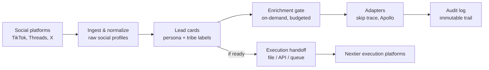

# Social XPress Engine
_A standalone Nextier product for audience-to-infrastructure (not the Nextier app)._ 

## What it is
- Market acquisition engine that turns social audience pools into structured, enriched, execution-ready lead assets.
- Audience-first: audience → recognition → tribes → structured attention → enrichment → handoff.
- Product boundary: feeds execution platforms by contract (file/API/queue) with no shared code or DB.

## What it is not
- Not a CRM, campaign tool, messaging system, call queue, deal pipeline, or module of Outreach Global.
- No outbound messaging, campaign logic, or sales workflows live here.

## Core flow (non-technical)
- Capture public social profiles.
- Normalize into lead cards with persona/tribe labels.
- Enrich on-demand (when justified) via adapters.
- Log every sensitive action.
- Hand off versioned batches to execution platforms.

### Mermaid overview (non-technical)

## Key documents
- Charter: see product doctrine and scope at [docs/social-xpress/PRODUCT_CHARTER.md](docs/social-xpress/PRODUCT_CHARTER.md).
- Architecture: service topology and data tiers at [docs/social-xpress/ARCHITECTURE.md](docs/social-xpress/ARCHITECTURE.md).
- Execution contract: batch schemas and transports at [docs/social-xpress/EXECUTION_HANDOFF_CONTRACT.md](docs/social-xpress/EXECUTION_HANDOFF_CONTRACT.md).
- Contribution guardrails: boundaries and forbidden features at [CONTRIBUTING.md](CONTRIBUTING.md).
- MVP plan: phased delivery at [docs/social-xpress/MVP_PLAN.md](docs/social-xpress/MVP_PLAN.md).

## Environments (DigitalOcean App Platform)
- Dev: [deploy/social-xpress/do-app-spec.dev.yaml](deploy/social-xpress/do-app-spec.dev.yaml)
- Staging: [deploy/social-xpress/do-app-spec.staging.yaml](deploy/social-xpress/do-app-spec.staging.yaml)
- Prod: [deploy/social-xpress/do-app-spec.prod.yaml](deploy/social-xpress/do-app-spec.prod.yaml)

## Quick mental model
- Social data (Tier 1) is PII-free. Contact data (Tier 2) only after gate. Execution data (Tier 3) is labels/readiness.
- Enrichment is explicit, budgeted, and audited. No enrichment without intent.
- Execution platforms consume artifacts; they never enrich, relabel, or rewrite lead cards.

## Run/deploy (frame)
- Containers: [deploy/social-xpress/Dockerfile.sxp-api](deploy/social-xpress/Dockerfile.sxp-api) and [deploy/social-xpress/Dockerfile.sxp-worker](deploy/social-xpress/Dockerfile.sxp-worker).
- Deploy via DigitalOcean App Platform specs per environment (above). Fill secrets before use.
