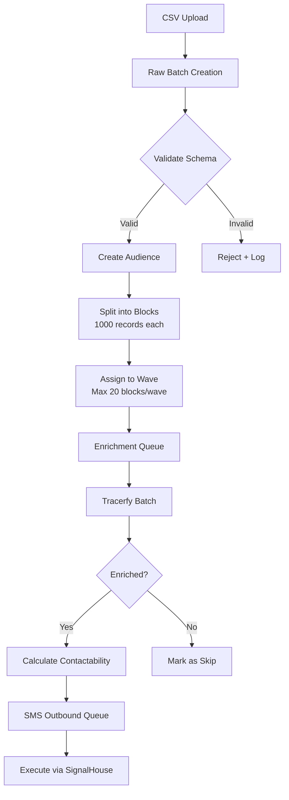
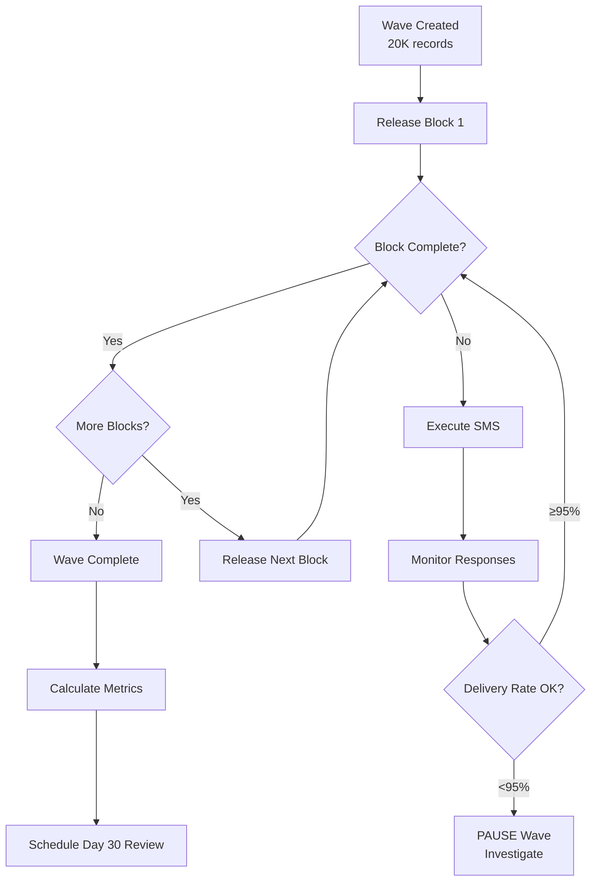
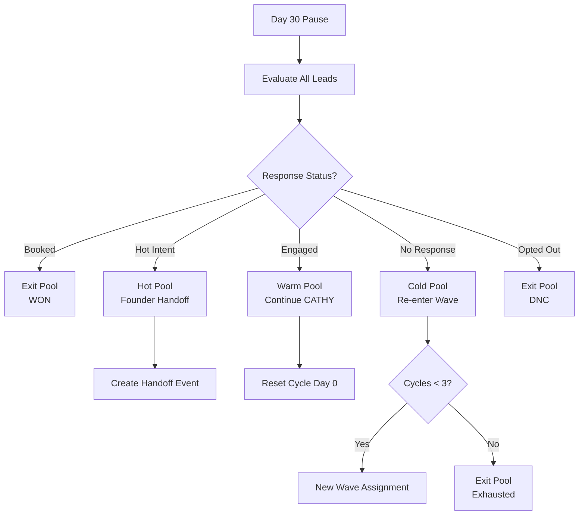
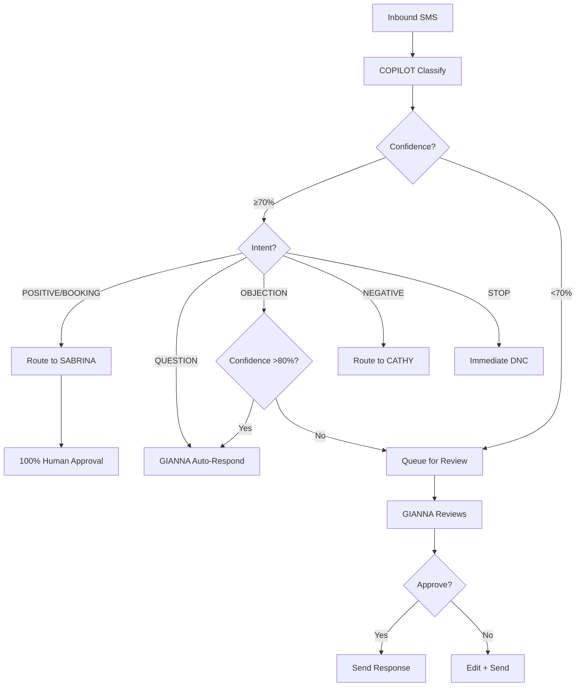
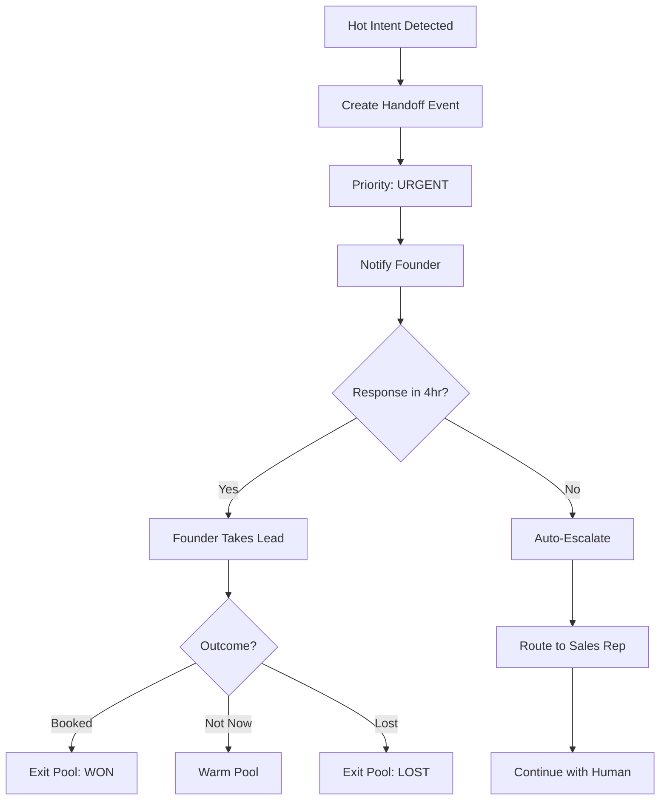

# NEXTIER AI ARCHITECTURE — Gap Analysis & Target State

> Comparing Current Implementation to Canonical Operating Model

---

## REFERENCE ARCHITECTURE COMPARISON

### Layer Analysis

| Layer | Target | Current | Gap |
|-------|--------|---------|-----|
| **Agent Shells** | GIANNA, CATHY, SABRINA, LUCI, Copilot with clear I/O | ✅ Exists | Prompts mixed with logic |
| **Orchestrator** | Central routing between agents | ❌ Missing | Direct API calls |
| **Research Spine** | Perplexity as shared service | ⚠️ Direct calls | No shared client |
| **RAG & KB** | Embeddings + vector store | ❌ Missing | Hardcoded templates |
| **Transport** | SMS, Voice, Calendly, CRM | ✅ Exists | Well integrated |
| **Observability** | Logs, metrics, costs | ❌ Minimal | Console.log only |

---

## CANONICAL OPERATING MODEL COMPARISON

### WAVES → BLOCKS → CYCLES

| Requirement | Status | Evidence |
|-------------|--------|----------|
| Operate on MILLIONS | ✅ | USbizdata integration |
| Execute in WAVES of 20K | ⚠️ Partial | Campaign batching exists |
| BLOCKS of 1,000 records | ❌ Missing | No explicit block control |
| 30-day CYCLE | ✅ | THE LOOP implemented |
| Day 0-14 initial outreach | ✅ | Cadence engine |
| Day 15-29 nurture | ✅ | CATHY nurture |
| Day 30 PAUSE → RECIRCULATE | ⚠️ Partial | No auto-recirculation |

### Predictive Cadences

| Requirement | Status | Evidence |
|-------------|--------|----------|
| Based on intent | ✅ | Classification drives routing |
| Response behavior | ✅ | Confidence thresholds |
| Persona-based | ✅ | Personality DNA system |
| Objection handling | ✅ | Stage-specific prompts |
| Time since touch | ⚠️ Partial | lastContactDate tracked |

### Inbound Manufacturing

| Requirement | Status | Evidence |
|-------------|--------|----------|
| Audience selection | ✅ | Lead sources, sectors |
| Context engineering | ✅ | Stage copilots |
| Precision outreach | ✅ | Persona templates |
| Cadence orchestration | ✅ | THE LOOP |

### AI Inbound Handling

| Requirement | Status | Evidence |
|-------------|--------|----------|
| AI reads inbound | ✅ | COPILOT classification |
| Classifies intent | ✅ | POSITIVE/NEGATIVE/etc |
| Labels context | ✅ | Stage assignment |
| Scores urgency | ✅ | HOT/WARM/COLD priority |
| Drafts reply | ✅ | generateResponse() |

### Governance

| Requirement | Status | Evidence |
|-------------|--------|----------|
| AI NEVER sends autonomously | ⚠️ Partial | GIANNA can auto-send >70% |
| GIANNA human-in-loop | ✅ | <70% → human review |
| SABRINA 100% approval | ✅ | All responses queued |
| Founder only sees hot/booked | ⚠️ Partial | No explicit handoff pipeline |

---

## GAP ANALYSIS TABLE

| Area | Implemented | Partial | Missing | Risk |
|------|-------------|---------|---------|------|
| Audience → Blocks → Waves | | ✅ | | Medium |
| 30-day pause + recirculation | | ✅ | | High |
| Predictive cadences | ✅ | | | Low |
| AI inbound triage | ✅ | | | Low |
| Auto-response governance | | ✅ | | Medium |
| GIANNA human-in-loop | ✅ | | | Low |
| SABRINA approval | ✅ | | | Low |
| Founder handoff isolation | | | ❌ | Medium |
| Cost caps per block | | | ❌ | High |
| Compliance enforcement | ✅ | | | Low |
| Tenant isolation | | ✅ | | Medium |
| Research spine shared | | | ❌ | Medium |
| Token/cost tracking | | | ❌ | High |
| AI queue management | | | ❌ | High |

---

## CANONICAL OBJECT MODEL

### DATA Objects

```typescript
// data_sources - Track where data comes from
interface DataSource {
  id: string;
  name: string;                    // "USbizdata", "Manual Import"
  type: "csv" | "api" | "manual";
  totalRecords: number;
  lastSyncAt: Date;
  status: "active" | "paused" | "exhausted";
}

// raw_batches - Imported data before processing
interface RawBatch {
  id: string;
  dataSourceId: string;
  filename?: string;
  recordCount: number;
  importedAt: Date;
  processedAt?: Date;
  status: "pending" | "processing" | "complete" | "failed";
}

// audiences - Segmented groups for targeting
interface Audience {
  id: string;
  teamId: string;
  name: string;
  criteria: AudienceCriteria;      // Filters: industry, size, location
  totalRecords: number;
  activeBlocks: number;
  status: "active" | "paused" | "complete";
}

// audience_blocks - 1K unit execution chunks
interface AudienceBlock {
  id: string;
  audienceId: string;
  waveId: string;
  blockNumber: number;             // 1-20 within wave
  recordCount: number;             // Max 1000
  cycleDay: number;                // 0-30
  cycleStartedAt: Date;
  status: "pending" | "active" | "paused" | "complete";
  metrics: BlockMetrics;
}

// enrichment_jobs - Tracerfy batch jobs
interface EnrichmentJob {
  id: string;
  blockId: string;
  provider: "tracerfy";
  recordCount: number;
  costCents: number;
  status: "pending" | "processing" | "complete" | "failed";
  completedAt?: Date;
  results: EnrichmentResult[];
}

// contactability_scores - Lead quality metrics
interface ContactabilityScore {
  leadId: string;
  phoneValid: boolean;
  emailValid: boolean;
  addressValid: boolean;
  score: number;                   // 0-100
  lastVerified: Date;
}
```

### EXECUTION Objects

```typescript
// campaigns - Outreach campaigns
interface Campaign {
  id: string;
  teamId: string;
  name: string;
  type: "sms" | "email" | "call" | "multi";
  audienceId: string;
  templateId: string;
  status: "draft" | "active" | "paused" | "complete";
  startedAt?: Date;
  completedAt?: Date;
  metrics: CampaignMetrics;
}

// sms_outbound_queue - Pending messages
interface SmsOutboundItem {
  id: string;
  campaignId: string;
  leadId: string;
  blockId: string;
  templateId: string;              // REQUIRED - no raw SMS
  scheduledFor: Date;
  status: "pending" | "sent" | "failed" | "cancelled";
  sentAt?: Date;
  signalhouseMessageId?: string;
}

// sms_inbound_messages - Received messages
interface SmsInboundMessage {
  id: string;
  from: string;                    // Phone number
  to: string;                      // Our number
  body: string;
  receivedAt: Date;
  leadId?: string;                 // Linked if found
  classification?: Classification;
  processedAt?: Date;
  processedBy?: "ai" | "human";
}
```

### INTELLIGENCE Objects

```typescript
// intent_labels - Classification results
interface IntentLabel {
  id: string;
  messageId: string;
  classification: Classification;  // POSITIVE, NEGATIVE, etc.
  confidence: number;              // 0-1
  priority: Priority;              // HOT, WARM, COLD
  model: string;                   // "gpt-4o-mini"
  createdAt: Date;
}

// copilot_suggestions - AI recommendations
interface CopilotSuggestion {
  id: string;
  leadId: string;
  messageId?: string;
  suggestedAction: string;
  suggestedResponse?: string;
  confidence: number;
  status: "pending" | "approved" | "rejected" | "expired";
  reviewedBy?: string;
  reviewedAt?: Date;
}

// cadences - Lead journey state
interface Cadence {
  id: string;
  leadId: string;
  campaignId: string;
  currentTouch: number;            // 1-10 in THE LOOP
  nextTouchAt?: Date;
  status: "active" | "paused" | "complete" | "opted_out";
  worker: "GIANNA" | "CATHY" | "SABRINA";
}
```

### GOVERNANCE Objects

```typescript
// lead_states - Lead lifecycle
interface LeadState {
  leadId: string;
  stage: LeadStage;                // data_prep, outbound_sms, hot_call_queue, etc.
  pool: "hot" | "warm" | "cold" | "exit";
  cycleCount: number;              // How many 30-day cycles
  lastActivityAt: Date;
  assignedWorker?: string;
  assignedHuman?: string;
}

// compliance_events - Audit trail
interface ComplianceEvent {
  id: string;
  leadId: string;
  type: "opt_out" | "consent" | "dnc_add" | "quiet_hours_violation";
  details: Record<string, any>;
  createdAt: Date;
  createdBy: "system" | "ai" | string;
}

// handoff_events - Human escalations
interface HandoffEvent {
  id: string;
  leadId: string;
  from: "ai" | string;             // Who escalated
  to: string;                      // User ID or "founder"
  reason: string;
  priority: "urgent" | "high" | "normal";
  status: "pending" | "accepted" | "completed";
  createdAt: Date;
  acceptedAt?: Date;
}
```

---

## FLOW DIAGRAMS

### Flow 1: Raw CSV → Audience → Blocks → Enrich → Execute



### Flow 2: 20K Wave Release → Stabilization → Pause



### Flow 3: 30-Day Recirculation



### Flow 4: AI Copilot + GIANNA Approval



### Flow 5: Founder Handoff Pipeline



---

## AI GOVERNANCE MODEL

### Where AI MAY Auto-Respond

| Scenario | Confidence | Approval |
|----------|------------|----------|
| Scheduling link requests | ≥70% | Auto-send |
| Opt-in confirmations | ≥90% | Auto-send |
| Neutral info requests | ≥70% | Auto-send |
| FAQ answers | ≥80% | Auto-send |

### Where AI MAY NOT Auto-Respond

| Scenario | Action |
|----------|--------|
| Financial/legal distress | Queue for human |
| Negotiation | Queue for human |
| Pricing questions | Queue for human |
| Emotional situations | Queue for human |
| Complaints | Queue for human |
| Regulatory mentions | Queue for human |

### Confidence Thresholds

```typescript
const AI_GOVERNANCE = {
  autoSend: {
    minConfidence: 0.70,
    maxAutoReplies: 3,             // Human after 3 auto-responses
    excludeIntents: ["STOP", "OBJECTION", "NEGATIVE"],
  },

  humanReview: {
    lowConfidence: 0.50,           // <50% = HIGH priority review
    mediumConfidence: 0.70,        // 50-70% = MEDIUM priority
  },

  founderHandoff: {
    triggerIntents: ["POSITIVE", "BOOKING"],
    triggerConfidence: 0.85,
    triggerKeywords: ["buy now", "ready to close", "how much"],
  },

  compliance: {
    stopKeywords: ["stop", "unsubscribe", "remove", "opt out"],
    dncImmediate: true,
    quietHoursStart: 21,           // 9 PM local
    quietHoursEnd: 8,              // 8 AM local
  },
};
```

### Audit Logging Requirements

Every AI decision MUST log:

```typescript
interface AiDecisionLog {
  id: string;
  timestamp: Date;

  // Context
  leadId: string;
  teamId: string;
  messageId?: string;

  // Decision
  agent: "GIANNA" | "CATHY" | "SABRINA" | "COPILOT";
  action: "classify" | "generate" | "route" | "approve";
  model: string;

  // Input/Output
  inputHash: string;               // SHA256 of input
  inputTokens: number;
  outputTokens: number;
  outputSummary: string;           // First 200 chars

  // Metrics
  latencyMs: number;
  confidence: number;
  costCents: number;

  // Governance
  autoSent: boolean;
  humanReviewed: boolean;
  humanOverride: boolean;
}
```

---

## PERPLEXITY RESEARCH SPINE

### Proposed Shared Service

```typescript
// lib/ai/research/perplexity.ts

export interface ResearchResult {
  success: boolean;
  source: "perplexity";
  model: string;
  cached: boolean;

  data: {
    companyName?: string;
    isVerified?: boolean;
    isActive?: boolean;
    confidence: number;

    details?: {
      website?: string;
      industry?: string;
      employees?: string;
      yearFounded?: number;
      description?: string;
    };

    owner?: {
      name?: string;
      title?: string;
      linkedin?: string;
    };

    citations: string[];
  };

  meta: {
    query: string;
    tokens: number;
    latencyMs: number;
    costCents: number;
  };
}

export async function searchWeb(
  query: string,
  options?: { maxTokens?: number; timeout?: number }
): Promise<ResearchResult>;

export async function researchLead(
  lead: { name?: string; company?: string; domain?: string }
): Promise<ResearchResult>;

export async function researchSegment(
  params: { industry: string; location: string; criteria: Record<string, any> }
): Promise<ResearchResult>;

export async function verifyBusiness(
  companyName: string
): Promise<ResearchResult>;
```

### Integration Points

| Agent | Usage | Priority |
|-------|-------|----------|
| LUCI | Primary consumer - enrichment | High |
| COPILOT | Context for classification | Medium |
| GIANNA | Personalization data | Low |
| CATHY | Nurture context | Low |

---

## IMPLEMENTATION ROADMAP

### Phase 1: Foundation (Week 1-2)

- [ ] Create `lib/ai/contracts.ts` with shared types
- [ ] Implement `lib/ai/research/perplexity.ts` shared service
- [ ] Add timeout + retry to all AI calls
- [ ] Create AI decision audit table

### Phase 2: Orchestration (Week 3-4)

- [ ] Build `lib/ai/orchestrator.ts` with task routing
- [ ] Migrate COPILOT to use orchestrator
- [ ] Add AI task queue (BullMQ)
- [ ] Implement token usage logging

### Phase 3: Governance (Week 5-6)

- [ ] Implement confidence-based auto-send rules
- [ ] Build founder handoff pipeline
- [ ] Add compliance event logging
- [ ] Create AI governance dashboard

### Phase 4: Scale (Week 7-8)

- [ ] Implement BLOCKS → WAVES architecture
- [ ] Add 30-day recirculation logic
- [ ] Build cost caps per block
- [ ] Performance optimization

---

*Document maintained by Claude Code. Last updated: 2026-01-15*
